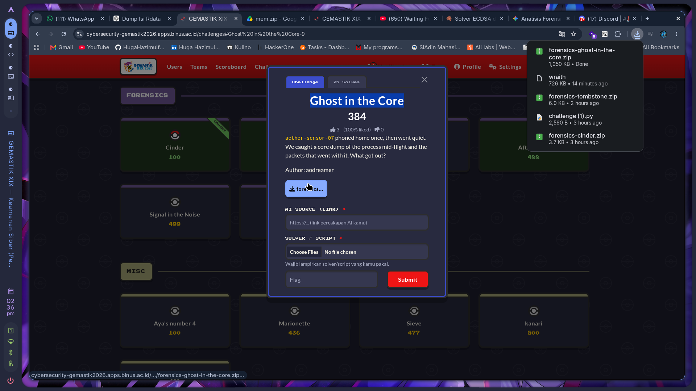
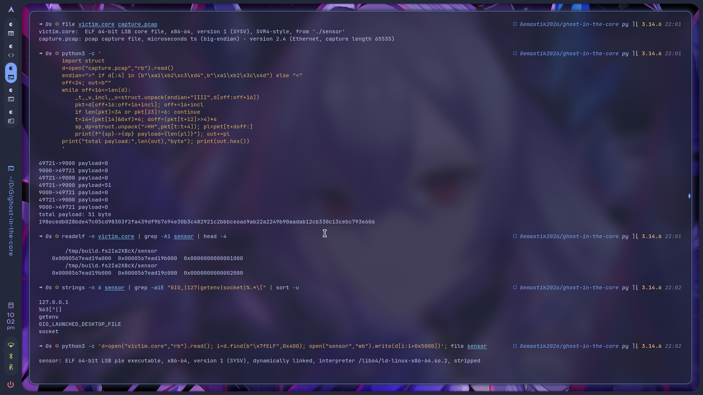
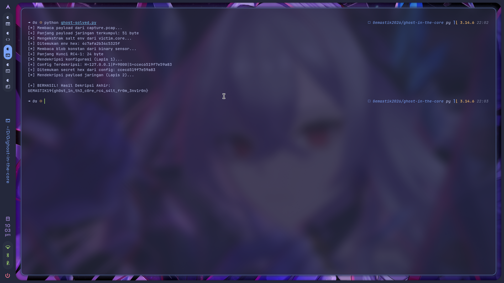

# 🏁 CTF Writeup - `GEMASTIK XIX 2026 - Keamanan Siber (Penyisihan)`

Writeup challenge **`Ghost in the Core`**.

---

# `Ghost in the Core` - forensics

|                  |                          |                |                                     |
| ---------------- | ------------------------ | -------------- | ----------------------------------- |
| 🏆 **Event**     | `GEMASTIK XIX 2026`      | 📅 **Date**    | `2026-08-24`                        |
| 🏷️ **Category** | `forensics`              | 💯 **Points**  | `384`                               |
| ⭐ **Difficulty** | ★★★★☆                    | 👤 **Author**  | `aodreamer`                         |
| 🧑‍💻 **Team**    | `DOSCOM Zero Day Scholars` (nexsus404)         | 🛠️ **Tools**  | `readelf, objdump, gdb, python (stdlib)` |
| 🤖 **AI Source** | https://share.gemini.google/v7qNRRJBIv7c | 🧩 **Solver** | [`ghost-solved.py`](ghost-solved.py) |
| 🔖 **Tags**      | `#core-dump` `#fileless` `#rc4` `#pcap` `#env-var` | | |

---

### 📝 Deskripsi Soal

> aether-sensor-07 phoned home once, then went quiet. We caught a core dump of the process
> mid-flight and the packets that went with it. What got out?
>
> Author: aodreamer

Attachment: `forensics-ghost-in-the-core.zip`, isinya `SOC_NOTE.md` + `victim.core.gz` +
`capture.pcap`. Kata SOC note-nya, proses `sensor` nyambung ke `127.0.0.1:9000`, ngirim data,
terus ngehapus buffer kerjanya, dan binary-nya nggak pernah ditulis ke disk, cuma hidup di memori.



---

### 🔍 Reconnaissance

Dua artefak yang saling melengkapi: core dump proses dan trafik keluarnya.

```bash
$ file victim.core capture.pcap
victim.core:  ELF 64-bit LSB core file, x86-64, from './sensor'
capture.pcap: pcap capture file (Ethernet)
```

Aku parse pcap-nya manual (Ethernet + IPv4 + TCP), gabungin semua payload TCP searah. Dari 7 paket,
6 di antaranya cuma handshake sama teardown, cuma **satu paket yang bawa data: 51 byte**.

```
49721->9000 payload=0     # SYN/ACK
...
49721->9000 payload=51    # ini yang harus dibuka
...
total payload: 51 byte
198ecedb028bde47c05cd98303f2fa439df9b7694e30b3c48292... (51 byte)
```



Aku cek juga konstanta kripto standar di core (`expand 32-byte k`, AES sbox), nggak ada satu pun.
Jadi cipher-nya custom atau stream cipher sederhana.

---

### 🧠 Analisis

**Carve binary yang cuma ada di memori.** SOC note nekenin binary-nya nggak pernah ke disk. Tapi
core dump itu snapshot memori proses, dan catatan `NT_FILE` di dalamnya nyimpen mapping segmen
yang di-load:

```bash
$ readelf -n victim.core | grep -A1 sensor
    /tmp/build.fs2Ia2XBcX/sensor
0x0000567ead19a000  0x0000567ead19b000  ...   (5 halaman)
```

Jadi binary-nya ada di `/tmp/build.../sensor`. Aku carve 5 halaman itu dari core lewat magic ELF
(mulai dari offset > 0x400 biar nggak ke-ambil header core-nya sendiri):

```python
d = open("victim.core","rb").read()
i = d.find(b"\x7fELF", 0x400)
open("sensor","wb").write(d[i:i+0x5000])
# -> ELF 64-bit LSB pie executable, stripped
```

`strings` sensor ngungkap perilakunya:

```
GIO_LAUNCHED_DESKTOP_FILE     <- env var yang disamarkan
%63[^|]                       <- format sscanf
127.0.0.1
getenv, socket, connect, explicit_bzero
```

`explicit_bzero` cocok sama "wiped its working buffers" di SOC note (dan itu versi memset yang
nggak dioptimasi compiler, jadi buffer-nya beneran dihapus). Yang menarik:
`GIO_LAUNCHED_DESKTOP_FILE` itu nama env var GNOME yang sah, dipakai buat nyimpen salt biar nggak
kelihatan mencurigakan. Nilainya masih nyangkut di stack core:

```python
m = re.search(rb"GIO_LAUNCHED_DESKTOP_FILE=([ -~]+)", d)
# -> 4c7afa2b34c5325f   (16 char hex)
```

**Cipher-nya RC4, dipanggil dua kali.** Di disassembly ada fungsi dengan pola KSA (loop 256
iterasi + swap) dan PRGA (`S[(S[i]+S[j]) & 0xff]`), tanpa konstanta ajaib apa pun. Itu RC4. Dan
fungsi ini dipanggil dua kali, jadi ada rantai kunci berlapis.

**Lapis 1: dekripsi config.** Argumen panjang kunci di panggilan pertama isinya `0x18` = 24, bukan
16. Setelah ditelusuri, key buffer di stack disusun dari dua sumber:

- 16 byte tetap dari `.rodata` `0x20d0`: `bb08471f75bf63ed2ae59e8d5b1cc3f2`
- 8 byte salt dari env, hasil hex-decode `4c7afa2b34c5325f`

Env var-nya emang di-hex-decode dulu, bukan dipakai apa adanya: ada cabang di disassembly yang
jalan waktu panjang env > 15 char, isinya loop baca 2 karakter hex tiap iterasi terus geser 4 bit.
Kunci 24 byte itu (`fixed(16) || salt(8)`) mendekripsi blob 37 byte di `0x2040`, hasilnya config:

```
H=127.0.0.1|P=9000|S=ccec6519f7e59a83
```

**Lapis 2: dekripsi payload.** Secret `S=ccec6519f7e59a83` dari config dipakai jadi kunci RC4 buat
51 byte payload dari pcap. Satu jebakan halus: secret-nya juga di-hex-decode dulu jadi 8 byte
(konsisten sama salt di lapis 1), bukan dipakai sebagai 16 char ASCII. Kalau dipakai ASCII langsung
hasilnya sampah dan nggak bisa di-decode UTF-8.

---

### ⚔️ Exploitation

Solver lengkapnya di [`ghost-solved.py`](ghost-solved.py), jalanin dari folder yang ada
`victim.core` sama `capture.pcap`-nya:

```bash
$ python3 ghost-solved.py
```

Cukup stdlib Python, nggak ada yang dihardcode: payload di-parse dari pcap (endianness dideteksi
dari magic number, paket kosong di-skip, payload searah digabung), salt di-regex dari core,
16 byte tetap + blob config 37 byte dibaca dari binary `sensor` yang di-carve. Offset `0x20d0` sama
`0x2040` boleh dihardcode karena itu memang offset di dalam binary-nya. Karena RC4 nggak punya tag
autentikasi, verifikasinya pakai cek hasil akhir bisa di-decode UTF-8 atau nggak.

```
salt   = hex_decode( env GIO_LAUNCHED_DESKTOP_FILE )      # 8 byte
key1   = rodata[0x20d0:+16] + salt                        # 24 byte
config = RC4(key1, rodata[0x2040:+37])                    # -> H=...|P=...|S=...
key2   = hex_decode( config["S"] )                        # 8 byte
flag   = RC4(key2, payload_51_byte)
```



<details>
<summary>Log lengkap</summary>

```text
[*] Membaca payload dari capture.pcap...
[+] Panjang payload jaringan terkumpul: 51 byte
[*] Mengekstrak salt env dari victim.core...
[+] Ditemukan env hex: 4c7afa2b34c5325f
[*] Membaca blob konstan dari binary sensor...
[+] Panjang Kunci RC4-1: 24 byte
[*] Mendekripsi konfigurasi (Lapis 1)...
[+] Config Terdekripsi: H=127.0.0.1|P=9000|S=ccec6519f7e59a83
[+] Ditemukan secret hex dari config: ccec6519f7e59a83
[*] Mendekripsi payload jaringan (Lapis 2)...

[+] BERHASIL! Hasil Dekripsi Akhir:
GEMASTIK19{gh0st_1n_th3_c0re_rc4_s4lt_fr0m_3nv1r0n}
```
</details>

---

### 🚩 Flag

```
GEMASTIK19{gh0st_1n_th3_c0re_rc4_s4lt_fr0m_3nv1r0n}
```

---

### 📒 Catatan

- Binary fileless tetap ketangkep di core dump. Mapping `NT_FILE` ngasih tahu di alamat mana, dan
  isinya bisa di-carve langsung dari segmen. "Never written to disk" bukan berarti hilang.
- Environment variable itu tempat sembunyi favorit. Nama env yang sah kayak
  `GIO_LAUNCHED_DESKTOP_FILE` nggak narik perhatian, tapi nilainya ada di stack core apa adanya.
- `explicit_bzero` beneran ngehapus buffer kerja (nggak dioptimasi compiler kayak `memset` biasa),
  tapi salt-nya bukan di buffer kerja, dia di environment. Yang dihapus bukan yang penting.
- Rantai kunci berlapis: dekripsi config dulu, baru payload. Secret exfil nggak disimpan langsung,
  tapi di dalam blob config yang sendiri terenkripsi. Telusuri sampai ke sumbernya.
- Perhatiin hex-decode versus ASCII. Salt dan secret dua-duanya string hex yang di-decode jadi byte
  sebelum dipakai jadi kunci. Pakai bentuk ASCII langsung hasilnya sampah, dan ini gampang keliru.
- RC4 dikenali dari bentuknya, bukan dari string: KSA loop 256 + swap, terus PRGA
  `S[(S[i]+S[j]) & 0xff]`. Nggak ada konstanta ajaib buat di-grep.
