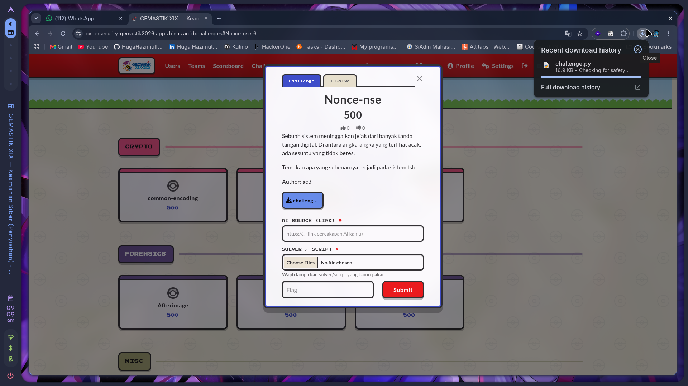
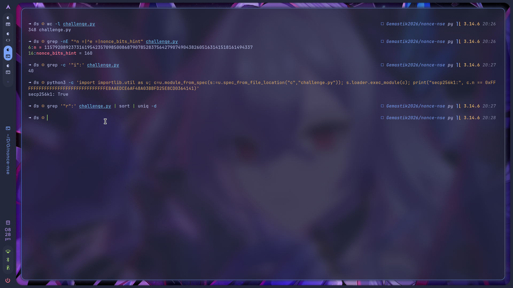
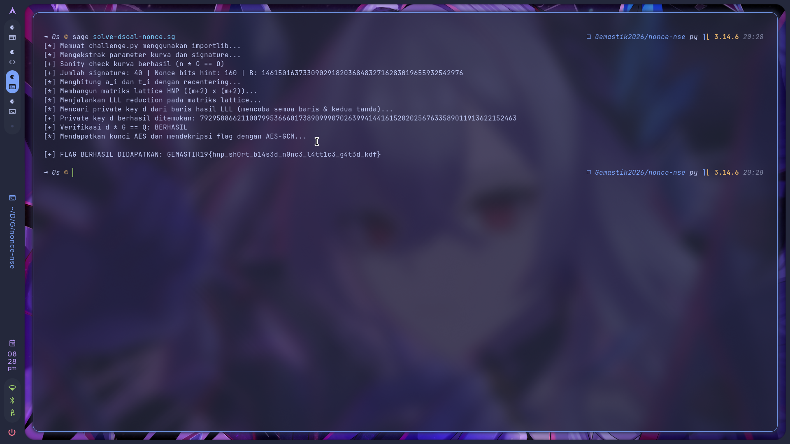

# 🏁 CTF Writeup - `GEMASTIK XIX 2026 - Keamanan Siber (Penyisihan)`

Writeup challenge **`Nonce-nse`**.

---

# `Nonce-nse` - crypto

|                  |                          |                |                                     |
| ---------------- | ------------------------ | -------------- | ----------------------------------- |
| 🏆 **Event**     | `GEMASTIK XIX 2026`      | 📅 **Date**    | `2026-08-24`                        |
| 🏷️ **Category** | `crypto`                 | 💯 **Points**  | `500`                               |
| ⭐ **Difficulty** | ★★★☆☆                    | 👤 **Author**  | `ac3`                               |
| 🧑‍💻 **Team**    | `DOSCOM Zero Day Scholars` (nexsus404)         | 🛠️ **Tools**  | `SageMath, pycryptodome`            |
| 🔖 **Tags**      | `#ecdsa` `#hnp` `#lattice` `#lll` `#secp256k1` | | |
| 🤖 **AI Source** | https://share.gemini.google/EnHFKP9tDmzz | 🧩 **Solver** | [`solve-dsoal-nonce.sg`](solve-dsoal-nonce.sg) |

---

### 📝 Deskripsi Soal

> Sebuah sistem meninggalkan jejak dari banyak tanda tangan digital. Di antara angka-angka yang
> terlihat acak, ada sesuatu yang tidak beres.
>
> Temukan apa yang sebenarnya terjadi pada sistem tsb.
>
> Author: ac3

Attachment cuma satu file: `challenge.py` (17 KB).

Judulnya main kata: `Nonce-nse` kedengeran kayak *nonsense*, dan deskripsinya nyebut "tidak beres"
pada tanda tangan digital. Dari situ aku udah nebak arahnya ke nonce ECDSA yang bermasalah.



---

### 🔍 Reconnaissance

Pertama aku intip isi filenya:

```bash
$ wc -l challenge.py
348 challenge.py

$ grep -nE "^n =|nonce_bits_hint" challenge.py
6:n = 115792089237316195423570985008687907852837564279074904382605163141518161494337
16:nonce_bits_hint = 160

$ grep -c '"i":' challenge.py
40

# n-nya sama nggak sama order secp256k1? (baca n langsung dari file)
$ python3 -c 'import importlib.util as u; c=u.module_from_spec(s:=u.spec_from_file_location("c","challenge.py")); s.loader.exec_module(c); print("secp256k1:", c.n == 0xFFFFFFFFFFFFFFFFFFFFFFFFFFFFFFFEBAAEDCE6AF48A03BBFD25E8CD0364141)'
secp256k1: True

# ada r yang kembar nggak? (nonce reuse)
$ grep '"r":' challenge.py | sort | uniq -d
                           # kosong, berarti nggak ada r yang sama
```



Isi `challenge.py` kira-kira begini:

| Bagian | Isinya |
|---|---|
| `n`, `G`, `Q` | order kurva, generator, public key |
| `nonce_bits_hint = 160` | ini petunjuk pentingnya |
| `signatures[]` | 40 tanda tangan `{i, msg, h, r, s}` |
| `flag_enc` | AES-256-GCM: `nonce`, `ciphertext`, `tag` |
| `derive_key(d)` | turunin kunci AES dari private key `d` (HKDF-SHA256) |
| `seal_flag(d, flag)` | fungsi enkripsi flag, udah disediain di file |

Dari sini ada tiga hal yang aku catat:

- Kurvanya **secp256k1**. Nilai `n`-nya persis order standar (`p = 2^256 - 2^32 - 977`,
  `y² = x³ + 7`). `Q` public key, `G` generator biasa.
- `nonce_bits_hint = 160` padahal `n` panjangnya 256 bit. Jadi tiap nonce `k` cuma 160 bit, ada
  bias 96 bit. Artinya `k` selalu jatuh di `[0, 2^160)`, nggak nyebar merata di `[1, n)`.
- Semua `r` unik, jadi ini **bukan** nonce reuse. Serangan nonce sama nggak kepake.

---

### 🧠 Analisis

Persamaan ECDSA-nya:

```
s = k⁻¹ · (h + r·d)   (mod n)
```

Aku susun ulang biar jadi linier terhadap private key `d`:

```
k = s⁻¹·h  +  s⁻¹·r·d          (mod n)
k = a      +  t   ·d           (mod n)      dengan  a = s⁻¹h ,  t = s⁻¹r
```

`a` sama `t` bisa dihitung dari data tanda tangan. `d` nggak diketahui, `k` juga nggak diketahui,
tapi `k` itu kecil (`k < B = 2^160`). Nah bentuk "cari `d` dari banyak `(a_i, t_i)` yang bikin
`a_i + t_i·d mod n` selalu kecil" itu persis **Hidden Number Problem**. Cara nyelesainnya bangun
lattice yang nyimpen vektor pendek `(k_0, ..., k_{m-1}, ...)` terus jalanin **LLL**.

**Bentuk latticenya.** Basis `(m+2) × (m+2)` buat `m = 40` tanda tangan:

```
┌                                  ┐
│ n   0  …  0        0     0       │
│ 0   n  …  0        0     0       │   m baris modulus
│ …                                │
│ t₀  t₁ … t_{m-1}   B/n   0       │   baris untuk d
│ a₀  a₁ … a_{m-1}   0     B       │   baris konstanta
└                                  ┘
```

Kombinasi `(baris_a) + d·(baris_t) − Σ cᵢ·(baris_n)` bakal ngasih vektor
`v = (k₀, ..., k_{m-1}, d·B/n, B)`. Norm-nya sekitar `B·√(m+2)`, jauh lebih pendek dari vektor acak
di lattice ini, jadi LLL bakal ketemu.

Satu trik yang aku pakai: **recentering**, ganti `aᵢ` jadi `aᵢ − B/2` biar `kᵢ` geser ke
`[−B/2, B/2)`. Norm targetnya turun sekitar setengah, jadi lebih gampang ketemu.

Soal jumlah tanda tangan, rule of thumb-nya `m ≳ n_bits / bias_bits = 256/96 ≈ 3`. Soal ngasih 40,
jadi longgar banget, LLL biasa udah cukup tanpa perlu BKZ.

**Ngambil `d`-nya.** Dari baris hasil LLL yang entri terakhirnya `±B`:

```
d = ± v[m] · n / B   (mod n)
```

Dua-duanya (positif dan negatif) dicoba, terus diverifikasi ke `d·G == Q`. Soalnya LLL ngeluarin
banyak vektor pendek, cuma satu yang bener.

Rantai sampai flag:

```
40 tanda tangan (bias nonce) --LLL--> d --derive_key (HKDF)--> kunci AES-256 --GCM--> FLAG
```

`derive_key()` udah ada di file soal, tinggal dipanggil.

---

### ⚔️ Exploitation

Solver lengkapnya di [`solve-dsoal-nonce.sg`](solve-dsoal-nonce.sg), jalanin dari folder yang sama sama `challenge.py`:

```bash
$ sage solve-dsoal-nonce.sg
```

Inti kodenya:

```python
# data dibaca langsung dari challenge.py (importlib), biar nggak salah ketik 40 signature
A, T = [], []
for sg in signatures:
    si = inverse_mod(sg["s"], n)
    A.append((si * sg["h"]) % n)      # a_i
    T.append((si * sg["r"]) % n)      # t_i
A = [(a - B/2) % n for a in A]        # recentering

M = Matrix(QQ, m+2, m+2)
for i in range(m): M[i, i] = n
for i in range(m):
    M[m,   i] = T[i]
    M[m+1, i] = A[i]
M[m, m]     = QQ(B)/QQ(n)
M[m+1, m+1] = B
L = M.LLL()

E = EllipticCurve(GF(p), [0, 7]); G_pt = E(*G); Q_pt = E(*Q)
assert n * G_pt == E(0)               # sanity check parameter kurva

for row in L:                         # coba semua baris + dua tanda
    for sign in (1, -1):
        val = sign * row[m]
        if (val * n / B) in ZZ:       # pastiin bulat dulu sebelum konversi
            d = int(ZZ(val * n / B) % n)
            if d and d * G_pt == Q_pt: found = d
```

Habis `d` ketemu, tinggal turunin kunci dan dekripsi:

```python
key  = derive_key(found)                                    # HKDF-SHA256 (dari file soal)
nonce, ct, tag = (bytes.fromhex(flag_enc[k]) for k in ("nonce","ciphertext","tag"))
flag = AES.new(key, AES.MODE_GCM, nonce=nonce).decrypt_and_verify(ct, tag)
```

Aku pakai `decrypt_and_verify` (bukan `decrypt` biasa) biar tag GCM sekalian jadi bukti kuncinya
bener.



<details>
<summary>Log lengkap</summary>

```text
[*] Memuat challenge.py menggunakan importlib...
[*] Mengekstrak parameter kurva dan signature...
[+] Jumlah signature: 40 | Nonce bits hint: 160 | B: 1461501637330902918203684832716283019655932542976
[*] Menghitung a_i dan t_i dengan recentering...
[*] Membangun matriks lattice HNP ((m+2) x (m+2))...
[*] Menjalankan LLL reduction pada matriks lattice...
[+] Sanity check kurva berhasil (n * G == O)
[*] Mencari private key d dari baris hasil LLL (mencoba semua baris & kedua tanda)...
[+] Private key d berhasil ditemukan: 79295886621100799536660173890999070263994144161520202567633589011913622152463
[+] Verifikasi d * G == Q: BERHASIL
[*] Mendapatkan kunci AES dan mendekripsi flag dengan AES-GCM...

[+] FLAG BERHASIL DIDAPATKAN: GEMASTIK19{hnp_sh0rt_b14s3d_n0nc3_l4tt1c3_g4t3d_kdf}
```

Buat mastiin, aku rekonstruksi ulang tiap nonce `k = s⁻¹(h + r·d) mod n`. Bitlength-nya
`[160, 160, 156, ..., 157]`, maksimal 160 minimal 154. Semua di bawah 160 bit, jadi tebakan
bias-nya bener.
</details>

---

### 🚩 Flag

```
GEMASTIK19{hnp_sh0rt_b14s3d_n0nc3_l4tt1c3_g4t3d_kdf}
```

---

### 📒 Catatan

- Nonce yang kependekan itu sama bahayanya sama nonce yang dipakai ulang. Bias 96 bit dari 256 aja
  udah cukup buat bocorin kunci penuh cuma dari beberapa tanda tangan (secara teori butuh ~3,
  soalnya dikasih 40).
- Sempat kepikiran ini nonce reuse, tapi habis dicek `r`-nya nggak ada yang kembar, jadi diarahin
  ke HNP + lattice.
- Verifikasinya dua lapis: `d·G == Q` buktiin `d` bener, terus tag GCM buktiin kuncinya bener.
- Polanya gampang diinget: kalau ada bocoran kecil di nilai rahasia plus banyak sampel, itu ciri
  soal lattice. Ketemu `X_bits_hint`, `msb`, `lsb`, atau "partial nonce", langsung curiga HNP/LLL.
- Di dunia nyata bug beginian beneran ada: PS3 (nonce konstan), Android SecureRandom 2013, dompet
  Bitcoin dengan RNG jelek. Mitigasinya pakai RFC 6979 (nonce deterministik) atau RNG yang beneran
  256 bit.
