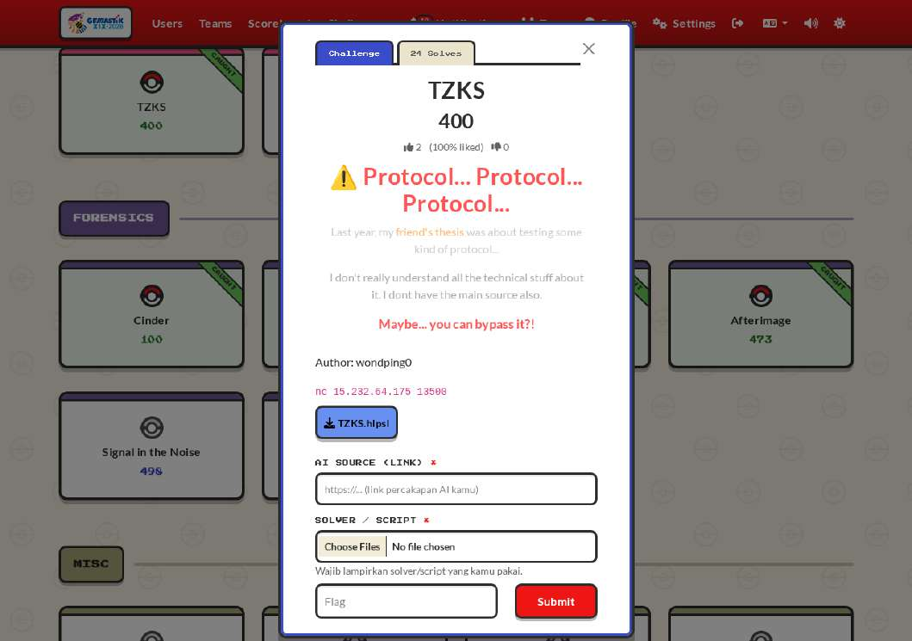

# `TZKS` — crypto

> 🏷️ **Challenge metadata**

|                  |                    |                |                        |
| ---------------- | ------------------ | -------------- | ---------------------- |
| 🏆 **Event**     | `Gemastik 2026`    | 📅 **Date**    | `2026-08-23`           |
| 🏷️ **Category** | `crypto`           | 💯 **Points**  | `499`                  |
| 🧑‍💻 **Team**    | `DOSCOM Zero Day Scholars` (x0rr-dan) | 🧩 **Solver** | [`solve.py`](solve.py) |

---

### 📝 Deskripsi Soal

> "Last year, my friend's thesis was about testing some kind of protocol... I don't really
> understand all the technical stuff about it. I dont have the main source also. Maybe... you can
> bypass it?!"

**📎 Attachment:** [`TZKS.hlpsl`](TZKS.hlpsl)



---

### 🔍 Reconnaissance

Ekstensi `.hlpsl` adalah HLPSL (High-Level Protocol Specification Language), bahasa yang dipakai
AVISPA untuk verifikasi formal protokol keamanan. Cocok dengan petunjuk soal "friend's thesis was
about testing some kind of protocol".

Empat baris komentar di atas file sudah memberi seluruh wire format:

```
{"cmd":"enroll"}                                 -> {"c0"}
{"cmd":"enroll_open","w","z1","z2"}              -> {"ok"}
{"cmd":"prove","label"}                          -> {"w","c","z","a"}
{"cmd":"auth","w"}                               -> {"c"}
{"cmd":"auth_resp","z1","z2"}                    -> {"flag"}
```

Encoding: ring elem = hex dari n koefisien big-endian 3 byte mod q, vektor = list. Server mengirim
parameter saat connect (setelah proof-of-work 20 bit):

```
n=256 q=8380451 k=4 l=4   eta=2   gamma=131072   tau=39
A: matriks 4x4 elemen ring
t: vektor 4 elemen ring
```

Ini Dilithium-like (Module-LWE), dengan `t = A*s + e`, `s` dan `e` kecil (norma <= eta = 2).
Catatan: `q = 8380451` bukan `8380417` milik Dilithium asli, dan `q mod 512 = 35`, jadi q bukan
NTT-friendly. Semua aritmetika ring harus dikerjakan manual.

---

### 🧠 Analisis

**Bug 1: `w` tidak mengikat (Fiat-Shamir rusak).** Perhatikan urutan transisi di role
`authorizer`:

```
issue. State = 0 /\ RCV(start)       =|> C0' := new() /\ SND(C0')
open.  State = 1 /\ RCV(W0'.Z1'.Z2')
          /\ add(mul(AA,Z1'), Z2') = add(W0, mul(C0,T))
```

Server mengirim `c0` lebih dulu, baru menerima `w` bersama `z1` dan `z2` dalam satu pesan. Padahal
seluruh keamanan Fiat-Shamir bergantung pada `w` yang mengikat sebelum tantangan keluar. Di sini
`w` sama sekali tidak mengikat, jadi tinggal dibalik urutan berpikirnya:

```
ambil   z1 = 0, z2 = 0
maka    w = -c0 * t
cek     A*0 + 0 == (-c0*t) + c0*t == 0     benar
```

Norma z1 dan z2 nol, jadi lolos juga kalau ada pengecekan batas. Terotorisasi tanpa mengetahui apa
pun. (Trik sama di tahap `auth` ditolak, karena di sana urutannya benar, `w` dikirim dulu, dan
koefisien `c*t` besarnya sekitar `q/2`, jauh di atas gamma. Jadi verifier memang mengecek norma.)

**Bug 2: nonce reuse di `prove` membocorkan witness.** Role `alice`:

```
prove. State = 0 /\ RCV(Label') =|>
       Y' := MASK(S.E.Label')              <- hanya fungsi dari label
       W' := MASK(E.S.Label')              <- idem
       U' := AGG(Label'.S)
       C' := new()                         <- selalu baru
       Z' := add(Y', mul(C', U'))
       SND(W'.C'.Z'.AGG(Label'))
```

`Y` diturunkan dari (S, E, Label) saja, tanpa unsur acak. Tapi `C` di-generate baru tiap
pemanggilan. Artinya dua proof pada label yang sama memakai nonce yang persis sama dengan tantangan
berbeda. Diverifikasi langsung ke server: `w` dan `a` identik antar dua proof label sama, `c` dan
`z` berbeda. Karena `z = y + c*u`:

```
z1 = y + c1*u
z2 = y + c2*u
----------------- kurangkan
z1 - z2 = (c1 - c2) * u
```

`y` lenyap. Tinggal selesaikan `u = (z1 - z2) / (c1 - c2)` di `R_q`. Karena q prima tapi bukan
NTT-friendly, pembagiannya dikerjakan sebagai sistem linier 256x256 memakai matriks negacyclic dari
`(c1 - c2)`:

```
M[k][j] = c[k-j]        bila k >= j
        = -c[k-j+n]     bila k < j     (karena x^n = -1)
```

`u_label = <a_label, s> = sum_{i=0}^{l-1} a_label[i] * s[i]`. Setiap label memberi 256 persamaan;
`s` punya `l*n = 4*256 = 1024` variabel. Jadi empat label sudah cukup untuk menentukan `s` secara
unik. Susun matriks 1024x1024 dari blok-blok negacyclic `a_label[i]`, selesaikan dengan eliminasi
Gauss mod q (numpy int64 cukup: `q < 2^23`, hasil kali `< 2^46`).

Verifikasi tanpa perlu bertanya ke server:

```
[+] s dipulihkan, norma tak hingga = 2 (eta = 2)
[+] e = t - A*s, norma tak hingga = 2 (eta = 2)
```

Kalau `s` yang dipulihkan salah, normanya tersebar acak mendekati `q/2`. Dapat tepat 2 pada keduanya
adalah bukti kuat rekonstruksinya benar.

---

### ⚔️ Exploitation

Dengan `s` dan `e` di tangan, tinggal jalankan protokol secara jujur (solver lengkap di
[`solve.py`](solve.py)):

```
pilih y1 in R^l, y2 in R^k dengan koefisien kecil
w = A*y1 + y2                  -> kirim
terima c
z1 = y1 + c*s
z2 = y2 + c*e                  -> kirim
```

Persamaan verifier terpenuhi secara identik:

```
A*z1 + z2 = A*y1 + c*A*s + y2 + c*e = (A*y1 + y2) + c*(A*s + e) = w + c*t
```

Batas norma: `||c*s|| <= tau*eta = 39*2 = 78`, jadi ambil `||y|| <= gamma - 78 - 64` supaya `||z||`
aman di bawah gamma. Hasilnya `130924 < 131072`, lolos.

```
[+] n=256 q=8380451 k=4 l=4 eta=2 gamma=131072 tau=39
[+] Terotorisasi tanpa kredensial apa pun
[+] label 0000000000000000: u = <a,s> berhasil dipulihkan
[+] label 0000000000000001: u = <a,s> berhasil dipulihkan
[+] label 0000000000000002: u = <a,s> berhasil dipulihkan
[+] label 0000000000000003: u = <a,s> berhasil dipulihkan
[+] s dipulihkan, norma tak hingga = 2 (eta = 2)
[+] e = t - A*s, norma tak hingga = 2 (eta = 2)
[+] norma tak hingga z = 130924 (batas gamma = 131072)
[+] FLAG: GEMASTIK19{r353t_th3_pr0v3r_l34k_m0dul3_lw3_w1tn3ss_th3n_1mp3rs0n4t3}
```

---

### 🚩 Flag

```
GEMASTIK19{r353t_th3_pr0v3r_l34k_m0dul3_lw3_w1tn3ss_th3n_1mp3rs0n4t3}
```

### 🔗 Referensi

- HLPSL language (AVISPA) - https://avispa-project.inrialpes.fr/
- Module-LWE / Dilithium - https://pq-crystals.org/dilithium/
- Fiat-Shamir transform - https://en.wikipedia.org/wiki/Fiat%E2%80%93Shamir_heuristic
- Negacyclic convolution - https://www.math.clemson.edu/~sgao/papers/
